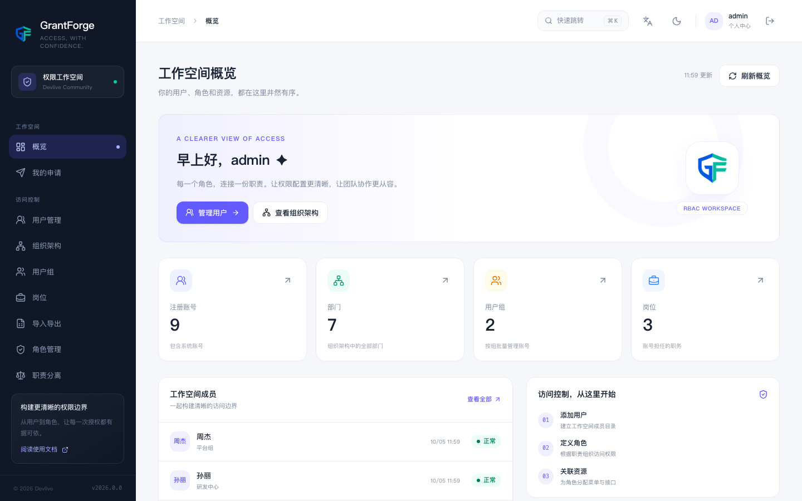

<!--
  Copyright (c) 2026 devlive-community/grantforge

  Licensed under the MIT License. See the LICENSE file in the
  project root for full license text.
-->

<div align="center">


# GrantForge

통합 권한 플랫폼 · 사용자, 역할, 메뉴, API, 데이터 행과 필드 · 외부 데이터 시스템

Language: [English](README.md) · [中文说明](README.zh-CN.md) · [繁體中文](README.zh-TW.md) · [Русский](README.ru.md) · [日本語](README.ja.md) · 한국어 · [Deutsch](README.de.md)

[](LICENSE)


[](https://grantforge.devlive.org)
[](https://ghcr.io/devlive-community/grantforge)

</div>

GrantForge(이전 이름 AuthX)는 오픈 소스(MIT) 통합 권한 플랫폼입니다. 두 가지 질문에 한곳에서 답합니다. **누가 무엇을 할 수 있는지**(기능 권한 부여)와 **누가 어떤 데이터를 볼 수 있는지**(데이터와 필드 권한 부여)입니다. 권한은 콘솔에서 정의·설명·감사되고, 애플리케이션은 표준 프로토콜로 연동하며, HDFS 같은 외부 데이터 시스템은 플러그인과 에이전트로 같은 정책 모델에 편입됩니다.

<p align="center">
  
</p>

## 기능

| 영역 | 내용 |
| --- | --- |
| 신원과 조직 | 멀티 테넌시, 부서 트리, 사용자 그룹과 직위, CSV 대량 가져오기·내보내기, LDAP / Active Directory 로그인과 동기화, OIDC 연합 로그인 |
| 계정 보안 | 세션 관리와 강제 로그아웃, 잠금이 있는 비밀번호 정책, 복구 코드가 있는 TOTP 2단계 인증, 민감한 작업의 재차 검증 |
| 기능 권한 부여 | 리소스 카탈로그(모듈, 메뉴, 페이지, 탭, 버튼, API), 역할 상속, 권한 부여 매트릭스, 부여 전 영향 분석 |
| 데이터 권한 | 행 단위 조건(본인, 소속 부서와 하위 부서, 지정 부서, 사용자 정의 조건)으로 읽기와 쓰기를 따로 제어 |
| 필드 권한 | 필드를 숨기거나 마스킹(이메일, 휴대폰 번호, 주민등록번호 등)하거나 읽기 전용으로 설정 |
| 설명 가능성과 감사 | 권한 설명(권한 부여의 출처), 권한 부여 시뮬레이션, 감사 로그 조회와 내보내기 |
| 거버넌스 | 직무 분리 제약, 승인이 있는 권한 요청, 정기 권한 검토 |
| 애플리케이션 연동 | OAuth 2.1 / OIDC 인가 서버, 권한 조회 오픈 API, Java(Spring Boot starter)와 JavaScript SDK |
| 외부 시스템 | 플러그인 서비스 타입과 정책 엔진: 데이터 서비스, 접근 정책, 에이전트와 접근 감사 |
| 제공 형태 | 실행 가능한 릴리스 하나, Docker 이미지, Compose 예제, Helm 차트, H2 / PostgreSQL / MySQL / MariaDB / Oracle / SQL Server |

현재 외부 시스템 지원에는 플러그인 프레임워크, 범용 정책 편집기, 서명된 정책 배포, 접근 감사, HDFS 서비스 타입, Hadoop 3.5.0 NameNode 에이전트가 포함됩니다. Hive 플러그인과 다른 Hadoop 버전용 에이전트는 아직 진행 중입니다.

## 동작 방식: 두 개의 평면

- **관리 평면**: GrantForge 서버(Spring Boot 4.1, Java 17 바이트코드)와 Vue 3 콘솔이 테넌트, 계정, 조직, 역할, 권한 부여, 감사, 데이터 서비스와 정책을 담당합니다.
- **데이터 평면**: 보호 대상 시스템 안에 포함된 에이전트. 에이전트는 토큰으로 Ed25519 서명된 정책 스냅샷을 받아 로컬에 캐시하고, 접근이 일어나기 전에 매번 판단하며(정책이 없으면 거부), 접근 이벤트를 감사용으로 다시 보고합니다.

직접 만든 시스템이 HDFS 패턴을 따를 필요는 없습니다. 일반 애플리케이션은 오픈 API나 Spring Boot starter로 프로세스 안에서 권한을 평가하고, 데이터베이스·파일 시스템 같은 저장소 내부의 접근을 가로막아야 하는 시스템만 `core/grantforge-agent-core`로 에이전트를 작성하면 됩니다.

## 애플리케이션 연동

- **OAuth 2.1 / OpenID Connect**: GrantForge가 인가 서버이므로 애플리케이션이 GrantForge로 사용자를 로그인시킵니다. 기존 신원 소스(LDAP / AD / OIDC)도 연동할 수 있습니다.
- **Java 애플리케이션**: `sdk/grantforge-spring-boot-starter`가 엔드포인트용 `@RequirePermission`, 데이터 엔터티용 `@GrantForgeEntity`, 플랫폼 데이터 권한을 JPA `Specification`으로 바꾸는 `GrantForgeDataScopes.scope(...)`를 제공합니다.
- **프론트엔드 애플리케이션**: `@grantforge/client`가 자신의 출처에서 OIDC + PKCE로 사용자를 로그인시키고 권한을 조회합니다.
- **오픈 API**: `/api/v1/open/me/authorization`, `/api/v1/open/me/data-access`, `/api/v1/open/catalog/data-entities`.
- **실행 가능한 예제**: `samples/shop`와 `samples/notes`가 제3자가 연동하는 방식을 그대로 보여줍니다.

## 빠른 시작

Java 17 이상이 필요합니다. 서비스는 `9999` 포트로 listen하고, 첫 시작 때 일회용 **설정 토큰**을 출력합니다. 브라우저에서 <http://127.0.0.1:9999/>를 열고 토큰을 입력한 뒤 첫 관리자를 만듭니다.

```bash
# 릴리스에서 (또는 ./mvnw clean package로 소스를 빌드하면 결과물은 dist/에 있습니다)
tar -xzf grantforge-release.tar.gz
cd grantforge
bin/startup.sh

# 또는 Docker로
docker run -p 9999:9999 ghcr.io/devlive-community/grantforge:2026.0.0

# 또는 데이터베이스와 함께 Compose로
docker compose -f deploy/compose/postgres.yml up -d

# 또는 Kubernetes에서
helm install grantforge deploy/helm/grantforge \
    --set database.url=jdbc:postgresql://postgresql:5432/grantforge \
    --set database.username=grantforge \
    --set encryptionKey=$(openssl rand -base64 32)
```

기본값은 내장 H2 파일 데이터베이스이므로 설정 없이 바로 시작할 수 있습니다. MySQL 드라이버는 GPL 라이선스 때문에 릴리스에 포함되지 않으므로 `drivers/`에 넣어야 합니다. 설치, 첫 실행 설정, 첫 권한 부여는 [문서](https://grantforge.devlive.org)에 설명되어 있습니다.

## 데이터베이스

기본값은 내장 H2 파일 데이터베이스(`${GRANTFORGE_HOME}/data`)이므로 설정 없이 바로 시작할 수 있습니다. 운영 환경에서는 환경 변수로 전환하고, 스키마는 Liquibase가 관리합니다.

| 데이터베이스 | 버전(CI에서 검증) | `GRANTFORGE_DB_URL` 예제 |
| --- | --- | --- |
| PostgreSQL | 14, 17 | `jdbc:postgresql://host:5432/grantforge` |
| MySQL | 8.0, 8.4 | `jdbc:mysql://host:3306/grantforge` (`mysql-connector-j`를 `lib/`에 추가, GPL 라이선스라 릴리스에는 없음) |
| MariaDB | 10.11, 11.4 | `jdbc:mariadb://host:3306/grantforge` |
| Oracle | 23 | `jdbc:oracle:thin:@//host:1521/FREEPDB1` |
| SQL Server | 2022 | `jdbc:sqlserver://host:1433;databaseName=grantforge;encrypt=true` |

`GRANTFORGE_DB_USER`와 `GRANTFORGE_DB_PASSWORD`도 설정해야 하고, 클러스터의 모든 인스턴스는 각자 `GRANTFORGE_ID_NODE`(0-1023)를 설정해야 합니다.

## 프로젝트 구조

Maven 루트 좌표: `org.devlive.grantforge:grantforge:2026.0.0`. Java 패키지 접두사: `org.devlive.grantforge`. 메인 클래스: `org.devlive.grantforge.server.GrantForge`.

`core/`에 서버와 공용 인프라가, `plugins/`에 서버가 로드하는 서비스 타입 플러그인이, `agents/`에 보호 대상 시스템 안에 배포되는 에이전트가 있습니다. 공용 `grantforge-agent-core` 라이브러리는 `core/`에 있고, HDFS NameNode 에이전트는 `agents/grantforge-agent-hdfs`에 있습니다.

| 모듈 | 역할 |
| --- | --- |
| `core/grantforge-server` | Spring Boot 진입점: REST API, 보안 설정, 오픈 API, 웹 콘솔 제공 |
| `core/grantforge-web` | Vue 3 / TypeScript / Tailwind CSS 콘솔 |
| `core/grantforge-common` | 오류 코드와 problem details, CSV, 엔드포인트 접근 애노테이션 |
| `core/grantforge-persistence` | 엔터티, 테넌트 필터링, TSID, Liquibase, 데이터와 필드 권한 SPI |
| `core/grantforge-audit` | 감사 이벤트 기록, 조회, 보관과 아카이브 |
| `core/grantforge-identity` | 테넌트, 계정, 부서, 그룹, 직위, 로그인과 세션, 2단계 인증, 신원 소스 |
| `core/grantforge-authz` | 리소스 카탈로그, 역할, 권한 부여, 배정과 평가, 데이터와 필드 정책, 직무 분리, 요청과 검토 |
| `core/grantforge-plugin-api` / `core/grantforge-plugin-host` | 서비스 타입 플러그인 계약과 플러그인의 로드, 격리, 호출 |
| `core/grantforge-policy-engine` | 외부 시스템용 정책 평가 엔진(Java 8 API, 에이전트에 내장 가능) |
| `core/grantforge-agent-core` | 공용 에이전트 코드: 설정, 서명된 스냅샷, 접근 판단, 감사 전송 |
| `core/grantforge-service` | 데이터 서비스, 정책 스냅샷 서명과 배포, 에이전트와 접근 감사 |
| `core/grantforge-oauth` | Spring Authorization Server 기반의 OAuth 2.1 / OIDC 서버 |
| `plugins/grantforge-plugin-hdfs` | HDFS 서비스 타입 플러그인: 정책 관리와 리소스 조회 |
| `plugins/grantforge-plugin-example` | 사용자 정의 서비스 타입을 위한 예제 플러그인 |
| `agents/grantforge-agent-hdfs` | Hadoop 3.5.0 NameNode 에이전트: 오버레이 인가와 접근 감사 |
| `sdk/grantforge-spring-boot-starter`, `sdk/grantforge-js` | 애플리케이션 연동용 Java와 JavaScript SDK |
| `script/ci`, `deploy/` | CI 검사 스크립트(로컬과 CI에서 동일)와 배포 리소스(Dockerfile, Compose, Helm) |

## 운영과 관측 가능성

- 상태 검사: `/actuator/health/liveness`, `/actuator/health/readiness`(상태만 제공하고 상세 정보는 없음, readiness는 데이터베이스에 연결되고 마이그레이션이 끝나면 200을 반환).
- 메트릭: `/actuator/prometheus`(`application="grantforge"` 라벨, 기본은 로그인 필요, 신뢰할 수 있는 네트워크에만 `GRANTFORGE_PROMETHEUS_PUBLIC=true`로 개방).
- 로그: 기본은 요청 ID가 붙은 읽기 쉬운 텍스트, `LOGGING_STRUCTURED_FORMAT_CONSOLE=ecs`(또는 `logstash`)로 JSON 로그 사용.
- 릴리스 스크립트: `bin/startup.sh`, `shutdown.sh`, `restart.sh`, `debug.sh`, `import-legacy.sh`.

## 개발과 검증

빌드에는 JDK 17 이상이 필요합니다(Java 17 바이트코드, 정책 엔진은 Java 8 대상). Error Prone과 NullAway는 JDK 21 이상에서 자동으로 켜집니다. 프론트엔드는 Vue 3.5, Tailwind CSS 4, Node.js 22.12+, pnpm 8.10.2를 사용합니다.

```sh
# Java 빌드와 단위 테스트 (콘솔 빌드는 제외)
./mvnw verify
bash script/ci/java.sh test
bash script/ci/java.sh checkstyle

# 지정한 데이터베이스에서의 영속 계층 통합 테스트 (h2를 제외하면 Docker 필요)
bash script/ci/db_integration.sh postgres:17

# 릴리스 패키지 (콘솔 빌드 포함)를 dist/에 생성
./mvnw clean package

# 프론트엔드 개발과 검사
bash script/ci/web.sh install
cd core/grantforge-web && pnpm dev
bash script/ci/web.sh lint

# 예제 애플리케이션과 SDK
cd sdk/grantforge-js && pnpm install && pnpm build
./mvnw -f samples/pom.xml package -DskipTests

# API 계약: 서버를 바꾼 뒤 openapi.json과 프론트엔드 타입을 다시 생성 (CI가 둘 다 검사)
./mvnw -DskipFrontend -pl core/grantforge-server -am test -Dtest=OpenApiContractTest \
    -Dsurefire.failIfNoSpecifiedTests=false -Dgrantforge.openapi.update=true
cd core/grantforge-web && pnpm api:generate

# 문서 사이트 (docs/, Next.js + Tailwind CSS)
bash script/ci/docs.sh install
cd docs && pnpm dev                 # http://localhost:3100
bash script/ci/docs.sh check
bash script/docs/screenshots.sh     # 실제 서비스와 예제 데이터로 스크린샷 다시 생성

# 저장소 검사 (CI가 실행하는 것과 동일)
python3 script/ci/check_license_headers.py
bash script/ci/test_ci_scripts.sh
```

## 링크

- [저장소](https://github.com/devlive-community/grantforge)
- [문서](https://grantforge.devlive.org): 빠른 시작, 사용 가이드, 연동과 기술 참조, 원본은 [`docs/`](docs/)
- [기여 방법](CONTRIBUTING.md) · [행동 강령](CODE_OF_CONDUCT.md) · [변경 기록](CHANGELOG)
