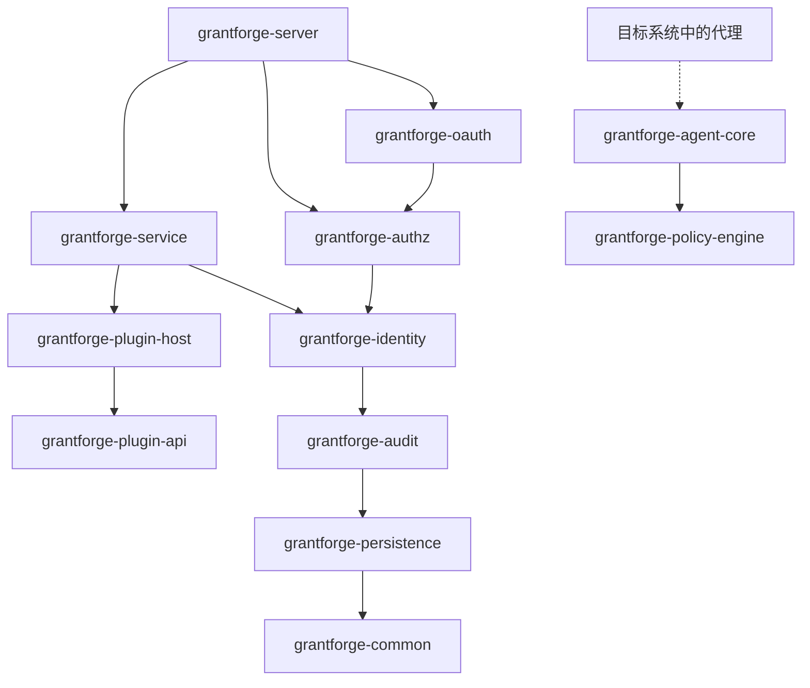
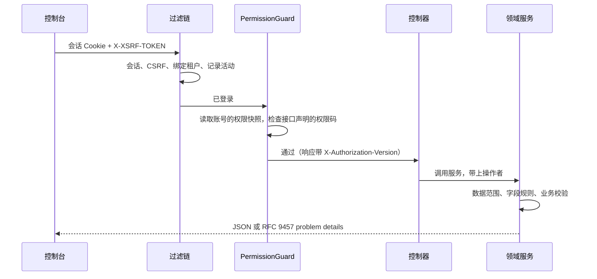

<!--
  Copyright (c) 2026 devlive-community/grantforge

  Licensed under the MIT License. See the LICENSE file in the
  project root for full license text.
-->

GrantForge 是一个 Spring Boot 4 应用（Java 17 字节码），按领域拆成多个 Maven 模块，打成一个可执行的发行包；控制台是 Vue 3 单页应用，由服务端一并提供。

## 模块

服务端与共享基础设施位于 `core/`，服务端加载的服务类型插件位于 `plugins/`，部署在目标系统中的具体代理位于 `agents/`。`core/grantforge-agent-core` 提供共享协议与运行时，`agents/grantforge-agent-hdfs` 提供 HDFS NameNode 的授权适配。

| 模块 | 职责 |
| --- | --- |
| `grantforge-common` | 错误码与 problem details 模型、CSV、接口访问注解（`@PublicEndpoint`、`@AuthenticatedEndpoint`、`@RequirePermission`、`@RequireStepUp`） |
| `grantforge-persistence` | 实体基类、租户过滤、TSID 生成、Liquibase 类型、`@SecuredEntity`/`@SecuredField` 与行/字段权限 SPI |
| `grantforge-audit` | 审计事件的记录、查询、保留与归档 |
| `grantforge-identity` | 租户、账号、部门、用户组、岗位、密码策略、登录与会话、两步验证、身份源 |
| `grantforge-authz` | 应用与资源目录、API 目录、角色、授权、继承、分配、求值、数据与字段策略、职责分离、权限申请与复核 |
| `grantforge-plugin-api` / `plugin-host` | 服务类型插件的契约，以及插件的加载、隔离与调用 |
| `grantforge-policy-engine` | 外部系统策略的求值引擎（Java 8 API，可嵌入代理） |
| `grantforge-agent-core` | 代理共享的设置、签名快照、访问判定与审计上报（位于 `core/`） |
| `grantforge-service` | 数据服务、策略、策略快照签名与分发、代理与访问审计 |
| `grantforge-oauth` | 基于 Spring Authorization Server 的 OAuth 2.1 / OIDC 服务器、令牌存储与签名密钥 |
| `grantforge-server` | 组装所有模块：REST 控制器、安全配置、开放 API、启动同步 |
| `grantforge-web` | Vue 3 + Vite + Tailwind 控制台 |
| `plugins/` | 服务端加载的服务类型插件，如 `grantforge-plugin-hdfs` |
| `agents/` | 目标系统内运行的具体代理，如 `grantforge-agent-hdfs` |
| `sdk/` | `grantforge-spring-boot-starter` 与 `@grantforge/client` |

上图是模块之间的依赖（较低层的 common、persistence 等被所有模块依赖，图中省略了这些重复的边）。策略引擎不依赖其他模块，供目标系统中的代理嵌入。每个模块的 ArchUnit 测试另外守护共同的约定：不用字段注入、不写原生 SQL、实体不出现在 API 中、所有包默认非空等。

## 一次请求

- 每个控制器方法都必须声明访问方式（公开、登录即可、需要权限码），没有声明的方法会让服务无法启动。
- 权限码同时登记为 API 资源，所以接口的授权也在资源目录里管理。
- 错误统一为 RFC 9457 problem details，带稳定的 `code`、本地化的 `detail` 与 `requestId`，见 [错误码](/architecture/errors/)。

## 技术选型

| 领域 | 选择 |
| --- | --- |
| 运行时 | Java 17 字节码，JDK 21 构建；Spring Boot 4.1、Spring Security 7、Spring Authorization Server |
| 持久化 | Hibernate 7 + Spring Data JPA；Liquibase YAML 迁移；Hibernate 只校验表结构 |
| ID | TSID（时间有序的 64 位 ID），对外以字符串传递 |
| 会话 | Spring Session JDBC，集群共享 |
| 前端 | Vue 3、Pinia、Vue Router、Tailwind CSS 4、Vite，TypeScript 严格模式 |
| 质量 | Error Prone + NullAway、Checkstyle、PMD、SpotBugs、ArchUnit、JaCoCo 覆盖率门槛、ESLint、vue-tsc |
| 测试 | JUnit 5、jqwik、Testcontainers（六种数据库）、Vitest、Playwright 全栈与示例端到端测试、JMH 与百万级基准 |
