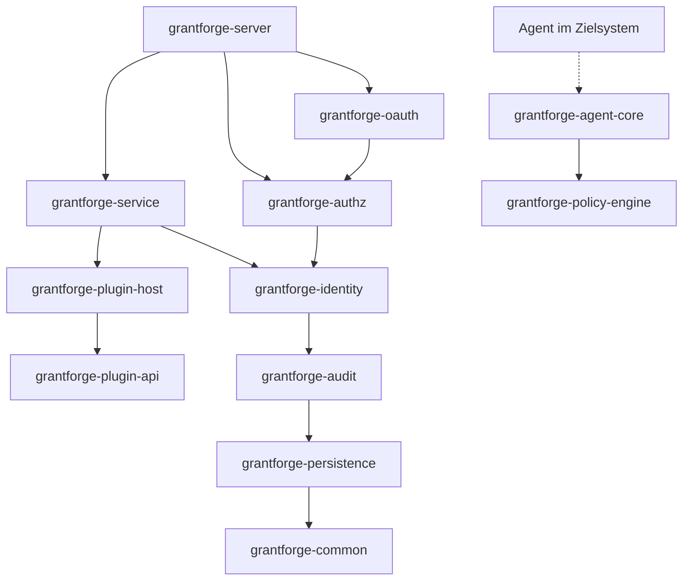
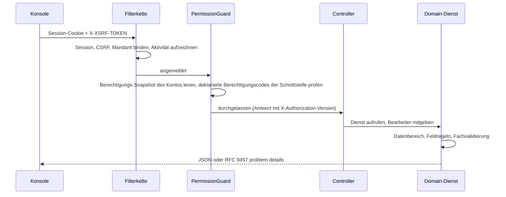

<!--
  Copyright (c) 2026 devlive-community/grantforge

  Licensed under the MIT License. See the LICENSE file in the
  project root for full license text.
-->

GrantForge ist eine Spring Boot 4-Anwendung (Java 17-Bytecode), nach Fachlichkeit in mehrere Maven-Module aufgeteilt und zu einem ausführbaren Release-Paket gebündelt; die Konsole ist eine Vue 3-Single-Page-Anwendung, die vom Server mit ausgeliefert wird.

## Module

Server und gemeinsame Infrastruktur liegen in `core/`, die vom Server geladenen Diensttyp-Plug-ins in `plugins/`, die konkreten Agenten, die in Zielsystemen bereitgestellt werden, in `agents/`. `core/grantforge-agent-core` stellt das gemeinsame Protokoll und die Laufzeit bereit, `agents/grantforge-agent-hdfs-*` den Berechtigungsadapter für den HDFS-NameNode.

| Modul | Zuständigkeit |
| --- | --- |
| `grantforge-common` | Fehlercodes und problem-details-Modell, CSV, Annotations für den Schnittstellenzugriff (`@PublicEndpoint`, `@AuthenticatedEndpoint`, `@RequirePermission`, `@RequireStepUp`) |
| `grantforge-persistence` | Entity-Basisklassen, Mandantenfilter, TSID-Erzeugung, Liquibase-Typen, `@SecuredEntity`/`@SecuredField` und das SPI für Zeilen- und Feldberechtigungen |
| `grantforge-audit` | Aufzeichnung, Abfrage, Aufbewahrung und Archivierung von Audit-Ereignissen |
| `grantforge-identity` | Mandanten, Konten, Abteilungen, Gruppen, Stellen, Passwortrichtlinien, Anmeldung und Sitzungen, Zwei-Faktor-Authentifizierung, Identitätsquellen |
| `grantforge-authz` | Anwendungs- und Ressourcenkatalog, API-Katalog, Rollen, Berechtigungen, Vererbung, Zuweisungen, Auswertung, Daten- und Feldrichtlinien, Funktionstrennung, Berechtigungsantrag und -prüfung |
| `grantforge-plugin-api` / `plugin-host` | Verträge für Diensttyp-Plug-ins sowie Laden, Isolation und Aufruf der Plug-ins |
| `grantforge-policy-engine` | Auswertungs-Engine für Richtlinien externer Systeme (Java 8-API, einbettbar in Agenten) |
| `grantforge-agent-core` | Gemeinsame Einstellungen, signierte Snapshots, Zugriffsentscheidungen und Audit-Meldungen der Agenten (liegt in `core/`) |
| `grantforge-service` | Datendienste, Richtlinien, Signatur und Verteilung von Richtlinien-Snapshots, Agenten und Zugriffs-Audits |
| `grantforge-oauth` | OAuth 2.1 / OIDC-Server auf Basis von Spring Authorization Server, Token-Speicher und Signaturschlüssel |
| `grantforge-server` | Baut alle Module zusammen: REST-Controller, Sicherheitskonfiguration, offene API, Synchronisierung beim Start |
| `grantforge-web` | Vue 3 + Vite + Tailwind-Konsole |
| `plugins/` | Vom Server geladene Diensttyp-Plug-ins, zum Beispiel `grantforge-plugin-hdfs` |
| `agents/` | Konkrete Agenten, die in Zielsystemen laufen, zum Beispiel `grantforge-agent-hdfs` |
| `sdk/` | `grantforge-spring-boot-starter` und `@grantforge/client` |

Das Diagramm oben zeigt die Abhängigkeiten zwischen den Modulen (tiefere Schichten wie common und persistence hängen an allen Modulen; diese wiederholten Kanten sind im Diagramm weggelassen). Die Policy-Engine hängt von keinem anderen Modul ab und wird von den Agenten in den Zielsystemen eingebettet. Die ArchUnit-Tests jedes Moduls wachen zusätzlich über gemeinsame Konventionen: keine Feldinjektion, kein natives SQL, keine Entities in der API, alle Pakete standardmäßig non-null und so weiter.

## Der Weg einer Anfrage

- Jede Controller-Methode muss ihre Zugriffsart deklarieren (öffentlich, jedes angemeldete Konto oder ein erforderlicher Berechtigungscode); eine Methode ohne Deklaration verhindert, dass der Server startet.
- Berechtigungscodes werden gleichzeitig als API-Ressourcen registriert, deshalb wird auch die Berechtigung einer Schnittstelle im Ressourcenkatalog verwaltet.
- Fehler sind einheitlich RFC 9457 problem details mit stabilem `code`, lokalisiertem `detail` und `requestId`, siehe [Fehlercodes](/de/reference/errors/).

## Technologieentscheidungen

| Bereich | Entscheidung |
| --- | --- |
| Laufzeit | Java 17-Bytecode, gebaut mit JDK 21; Spring Boot 4.1, Spring Security 7, Spring Authorization Server |
| Persistenz | Hibernate 7 + Spring Data JPA; Liquibase-YAML-Migrationen; Hibernate prüft nur das Tabellenschema |
| IDs | TSID (zeitgeordnete 64-Bit-IDs), nach außen immer als Zeichenkette übergeben |
| Sitzungen | Spring Session JDBC, im Cluster gemeinsam genutzt |
| Frontend | Vue 3, Pinia, Vue Router, Tailwind CSS 4, Vite, TypeScript strict mode |
| Qualität | Error Prone + NullAway, Checkstyle, PMD, SpotBugs, ArchUnit, JaCoCo-Abdeckungsschwellen, ESLint, vue-tsc |
| Tests | JUnit 5, jqwik, Testcontainers (sechs Datenbanken), Vitest, Playwright-Fullstack- und Beispiel-End-to-end-Tests, JMH und Benchmarks in Millionenhöhe |
