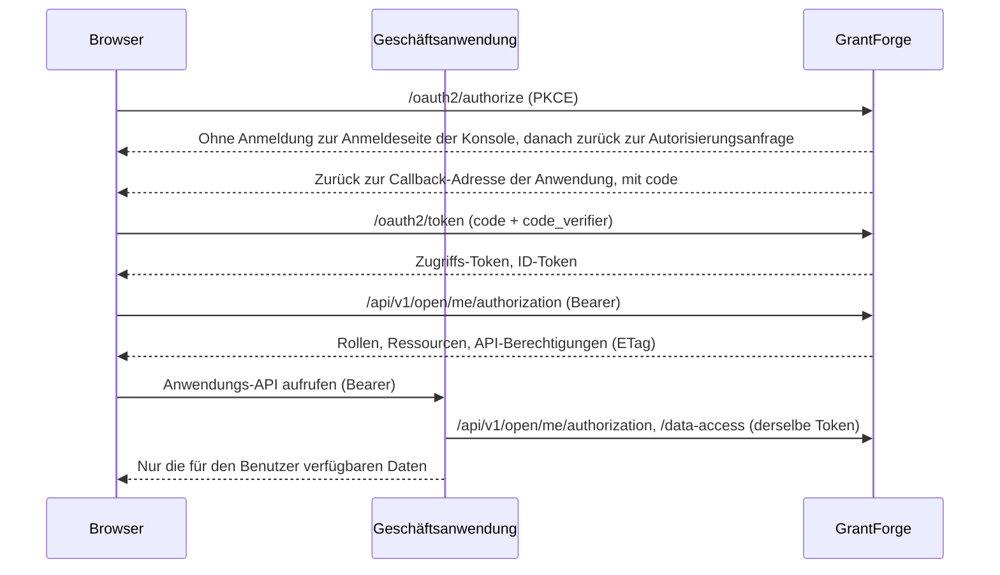

<!--
  Copyright (c) 2026 devlive-community/grantforge

  Licensed under the MIT License. See the LICENSE file in the
  project root for full license text.
-->

GrantForge tritt Geschäftsanwendungen gegenüber in zwei Identitäten auf:

- **Autorisierungsserver** (OAuth 2.1 / OpenID Connect): Der Benutzer meldet sich bei GrantForge an, die Anwendung erhält ein Zugriffs-Token und ein ID-Token.
- **Berechtigungszentrale**: Die Anwendung fragt mit demselben Token bei GrantForge nach, welche Rollen, Ressourcen (Menüs, Seiten, Schaltflächen), API-Berechtigungen und Datenbereiche dieser Benutzer in dieser Anwendung hat.

## Konzeptzuordnung

| Konzept | Wo konfiguriert | Erläuterung |
| --- | --- | --- |
| Anwendung | Plattformverwaltung → Ressourcenkatalog | Ein Geschäftssystem, zum Beispiel `shop` |
| Ressourcen | Der Ressourcenbaum der Anwendung im Ressourcenkatalog | Module, Menüs, Seiten, Schaltflächen, APIs. Seiten und Schaltflächen steuern die Oberfläche; API-Ressourcen sind die API-Berechtigungscodes (zum Beispiel `orders.read`) |
| Client | Ressourcenkatalog → „OAuth-Clients“ der Anwendung | Die Identität, mit der die Anwendung Benutzer anmeldet und Token abruft. Browser-Anwendungen nutzen den **öffentlichen Client**, Server-Anwendungen den **vertraulichen Client** |
| scope | Client-Einstellungen | `openid`, `profile` und `email` dienen der Anmeldung; `permissions` erlaubt dem Token, Berechtigungen abzufragen; `catalog` erlaubt der Anwendung, Datenentitäten unter eigener Identität zu deklarieren |
| Rollen und Berechtigungen | Zugriffskontrolle → Rollenverwaltung | Die Ressourcen der Anwendung werden Rollen zugewiesen, die Rollen dann Benutzern, Gruppen, Abteilungen oder Stellen |
| Datenrichtlinien | Rolle → Datenberechtigungen | Die von der Anwendung deklarierten Entitäten (`<Anwendungscode>:<Entität>`) werden wie die Entitäten der Konsole selbst konfiguriert: alle, eigener Mandant, eigene, Abteilung, bestimmte Abteilungen oder Bedingung |

Mandanten-Administratoren (Inhaber der Systemrolle) können jede Ressource einer Geschäftsanwendung an Rollen des eigenen Mandanten vergeben; bei den Berechtigungen der Konsole selbst gilt weiterhin, dass nur vergeben werden kann, was man selbst besitzt.

## Ablauf

## Integrationsschritte

1. Lege unter **Plattformverwaltung → Ressourcenkatalog** eine neue Anwendung an und richte ihre Seiten, Schaltflächen und API-Ressourcen ein.
2. Registriere einen Client für die Anwendung: Wähle für Browser-Anwendungen „öffentlich“ und für Server-Anwendungen „vertraulich“; trage als Callback-Adresse den Anmelde-Callback der Anwendung ein; wähle mindestens die Scopes `openid` und `permissions`. Das Geheimnis eines vertraulichen Clients wird nur einmal angezeigt.
3. Lege unter **Zugriffskontrolle → Rollenverwaltung** Rollen an, vergib Berechtigungen und weise die Rollen Benutzern zu.
4. Binde das SDK in die Anwendung ein: für Java siehe [Java SDK](/de/integration/java/), für Browser siehe [JavaScript SDK](/de/integration/javascript/); zu den Protokolldetails siehe [OAuth 2.1 und OpenID Connect](/de/integration/oauth/) und [offene API für Berechtigungsabfragen](/de/integration/open-api/).

Das Verzeichnis `samples/` im Repository enthält zwei vollständige Beispiele (Shop und Notizen), abgedeckt von End-to-End-Tests, siehe [Beispielanwendungen](/de/integration/samples/).
