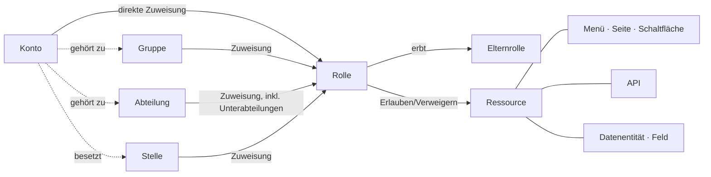

<!--
  Copyright (c) 2026 devlive-community/grantforge

  Licensed under the MIT License. See the LICENSE file in the
  project root for full license text.
-->

Das Modell von GrantForge lässt sich in einem Satz zusammenfassen: **Konten erhalten durch Zuweisungen Rollen, Rollen tragen Berechtigungen auf Ressourcen, und bei der Auswertung werden diese Berechtigungen zu den effektiven Berechtigungen des Kontos zusammengeführt.**

## Mandanten

Mandanten sind die Grenze der Datenisolierung: Jeder Mandant hat eigene Konten, Organisationen, Rollen und Berechtigungen, die füreinander nicht sichtbar sind. Der erste bei der Initialisierung erzeugte Mandant ist der **Plattform-Mandant**; seine Administratoren können außerdem andere Mandanten, den Ressourcenkatalog und den Autorisierungsserver verwalten. Wenn du nur eine Organisation bedienst, kannst du allein mit diesem einen Mandanten arbeiten.

## Konten und Organisation

- **Konto**: das Subjekt der Anmeldung; Benutzernamen sind plattformweit eindeutig. Konten können lokal sein (das Passwort wird in GrantForge gespeichert) oder aus einer Identitätsquelle stammen (LDAP oder OIDC, das Passwort verwaltet die Identitätsquelle).
- **Abteilung**: eine Baumstruktur; jedes Konto hat eine Hauptabteilung und kann daneben in weiteren Abteilungen tätig sein.
- **Gruppe**: eine von der Organisationsstruktur unabhängige Sammlung von Personen, zum Beispiel eine „Rufbereitschaftsgruppe“.
- **Stelle**: eine Funktion, zum Beispiel „Finanzmanager“; ein Konto kann mehrere Stellen bekleiden.

## Ressourcen

Ressourcen sind „alles, was berechtigt werden kann“, und pro Anwendung in einem Baum organisiert:

| Typ | Erläuterung |
| --- | --- |
| Module, Menüs | Gruppierungen, die Seiten ordnen |
| Seiten, Registerkarten | eine Seite in der Konsole oder Anwendung bzw. eine Registerkarte auf einer Seite |
| Schaltflächen | eine Aktion auf einer Seite, zum Beispiel „Benutzer löschen“ |
| APIs | eine REST-Schnittstelle, zum Beispiel `api:GET:/api/v1/users` |
| Datenentitäten, Felder | Geschäftsentitäten, deren Zeilenbereich eingeschränkt werden kann, sowie Felder darin, die sich ausblenden oder maskieren lassen |

Ressourcen können voneinander **abhängen**: Eine Schaltfläche benötigt die API, die sie aufruft, und eine Seite die APIs, von denen sie Daten lädt. Wenn du eine Seite oder Schaltfläche berechtigst, werden die Abhängigkeiten automatisch mit einbezogen. So wird vermieden, dass eine Schaltfläche sichtbar ist, ihr Klick aber mit „keine Berechtigung“ fehlschlägt.

Die GrantForge-Konsole ist selbst eine Anwendung: Ihre Seiten, Schaltflächen und APIs werden beim Start automatisch im Ressourcenkatalog registriert, deshalb entscheiden auch hier Rollen über die Berechtigungen.

## Rollen, Berechtigungen und Zuweisungen

- **Rolle**: der Name für eine Menge von Berechtigungen. **Systemrollen** (Mandantenadministrator, Plattformadministrator) werden mit dem Mandanten erzeugt, decken ganze Module ab und lassen sich nicht ändern; alle übrigen sind benutzerdefinierte Rollen.
- **Berechtigung**: das „Erlauben“ oder „Verweigern“ einer Ressource für eine Rolle. Verweigern hat Vorrang vor Erlauben.
- **Vererbung**: eine Rolle kann alle Berechtigungen anderer Rollen erben; Vererbungszyklen sind nicht erlaubt.
- **Zuweisung**: eine Rolle wird an ein Konto, eine Gruppe, eine Abteilung (wahlweise einschließlich Unterabteilungen) oder eine Stelle vergeben; Beginn und Ende der Gültigkeit können gesetzt werden.

## Auswertung

Wenn eine Berechtigung entschieden werden muss, ermittelt GrantForge alle wirksamen Rollen des Kontos (direkt zugewiesen, über Gruppe/Abteilung/Stelle erhalten oder geerbt, jeweils innerhalb ihrer Gültigkeit und mit aktivierter Rolle), führt ihre Berechtigungen zusammen und erhält damit:

- die verfügbaren Ressourcen (Seiten, Schaltflächen, APIs);
- den Zeilenbereich jeder Datenentität beim Lesen, Ändern, Löschen und Exportieren;
- die Lese- und Schreibweise jedes Feldes (sichtbar, maskiert, ausgeblendet; bearbeitbar, schreibgeschützt).

Das Ergebnis trägt eine Versionsnummer: Ändert sich an Berechtigungen, Zuweisungen oder dem Katalog irgendetwas, ändert sich die Versionsnummer, und Konsole und SDK aktualisieren daraufhin ihren Cache. Die genauen Regeln stehen unter [Berechtigungsmodell](/de/architecture/permission-model/).
