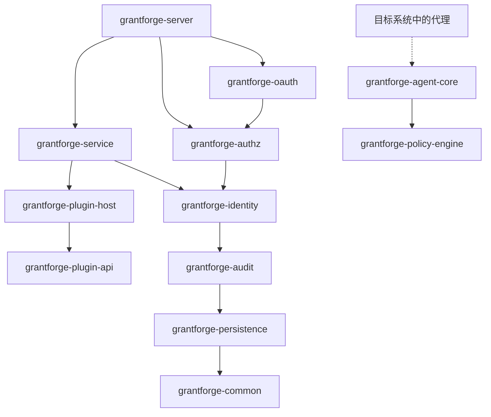
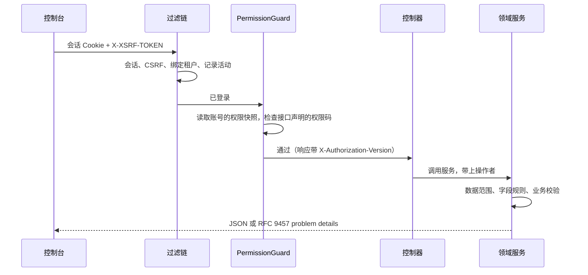

<!--
  Copyright (c) 2026 devlive-community/grantforge

  Licensed under the MIT License. See the LICENSE file in the
  project root for full license text.
-->

GrantForge is a Spring Boot 4 application (Java 17 bytecode), split by domain into multiple Maven modules and packaged into a single executable distribution; the console is a Vue 3 single-page application served by the server.

## Modules

The server and shared infrastructure live in `core/`, the service type plugins loaded by the server live in `plugins/`, and the concrete agents deployed inside target systems live in `agents/`. `core/grantforge-agent-core` provides the shared protocol and runtime, and `agents/grantforge-agent-hdfs` provides the authorization adapter for the HDFS NameNode.

| Module | Responsibility |
| --- | --- |
| `grantforge-common` | Error codes and the problem details model, CSV, endpoint access annotations (`@PublicEndpoint`, `@AuthenticatedEndpoint`, `@RequirePermission`, `@RequireStepUp`) |
| `grantforge-persistence` | Entity base classes, tenant filtering, TSID generation, Liquibase types, `@SecuredEntity`/`@SecuredField` and the row/field permission SPI |
| `grantforge-audit` | Recording, querying, retention, and archiving of audit events |
| `grantforge-identity` | Tenants, accounts, departments, user groups, positions, password policies, sign-in and sessions, two-step verification, identity sources |
| `grantforge-authz` | Application and resource catalog, API catalog, roles, grants, inheritance, assignments, evaluation, data and field policies, separation of duties, access requests and reviews |
| `grantforge-plugin-api` / `plugin-host` | Contracts for service type plugins, and plugin loading, isolation, and invocation |
| `grantforge-policy-engine` | Evaluation engine for external-system policies (Java 8 API, embeddable in agents) |
| `grantforge-agent-core` | Settings, signed snapshots, access decisions, and audit reporting shared by agents (located in `core/`) |
| `grantforge-service` | Data services, policies, policy snapshot signing and distribution, agents and access auditing |
| `grantforge-oauth` | OAuth 2.1 / OIDC server based on Spring Authorization Server, token storage, and signing keys |
| `grantforge-server` | Assembles all modules: REST controllers, security configuration, Open API, startup synchronization |
| `grantforge-web` | Vue 3 + Vite + Tailwind console |
| `plugins/` | Service type plugins loaded by the server, such as `grantforge-plugin-hdfs` |
| `agents/` | Concrete agents running inside target systems, such as `grantforge-agent-hdfs` |
| `sdk/` | `grantforge-spring-boot-starter` and `@grantforge/client` |

The diagram above shows the dependencies between modules (lower layers such as common and persistence are depended on by every module; those repeated edges are omitted from the diagram). The policy engine depends on no other module and is embedded by the agents inside target systems. Each module's ArchUnit tests additionally guard shared conventions: no field injection, no native SQL, no entities in the API, all packages non-null by default, and so on.

## Anatomy of a request

- Every controller method must declare its access mode (public, any signed-in account, or a required permission code); a method without a declaration prevents the server from starting.
- Permission codes are also registered as API resources, so endpoint authorization is managed in the resource catalog too.
- Errors are uniformly RFC 9457 problem details with a stable `code`, a localized `detail`, and a `requestId`; see [Error codes](/en/architecture/errors/).

## Technology choices

| Area | Choice |
| --- | --- |
| Runtime | Java 17 bytecode, built with JDK 21; Spring Boot 4.1, Spring Security 7, Spring Authorization Server |
| Persistence | Hibernate 7 + Spring Data JPA; Liquibase YAML migrations; Hibernate only validates the schema |
| IDs | TSIDs (time-ordered 64-bit IDs), always exchanged externally as strings |
| Sessions | Spring Session JDBC, shared across the cluster |
| Frontend | Vue 3, Pinia, Vue Router, Tailwind CSS 4, Vite, TypeScript strict mode |
| Quality | Error Prone + NullAway, Checkstyle, PMD, SpotBugs, ArchUnit, JaCoCo coverage thresholds, ESLint, vue-tsc |
| Testing | JUnit 5, jqwik, Testcontainers (six databases), Vitest, Playwright full-stack and sample end-to-end tests, JMH and million-scale benchmarks |
