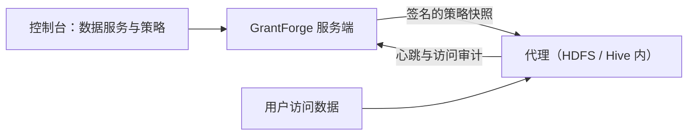

<!--
  Copyright (c) 2026 devlive-community/grantforge

  Licensed under the MIT License. See the LICENSE file in the
  project root for full license text.
-->

The "Data permissions" group manages permissions for data systems outside GrantForge. The architecture is similar to Apache Ranger: plugins define service types, administrators write policies in the console, and agents deployed inside the target systems download the policies and evaluate access locally.

> [!NOTE]
> The current release provides the plugin framework, a general policy editor, policy distribution and access auditing, the HDFS service type with a Hadoop 3.5.0 NameNode agent, and a sample plugin (`example`). The Hive plugin and agents for other Hadoop versions are still under development.

## Plugins

**Platform management → Plugins** lists the loaded service type plugins. Built-in plugins ship with the server; for any other plugin, drop it into the `plugins` directory and click "Rescan". Each plugin is loaded independently, so a failure disables only that plugin. For plugin development, see [Plugins and service types](/en/develop/plugins/).

## HDFS

The distribution ships with an HDFS plugin (`plugins/hdfs`) for the `hdfs` service type, aligned with Apache Ranger's HDFS service:

- The only resource type is a single `path`, matched by path: `/data/sales` matches itself, and when "Recursive" is checked it also matches every file and directory beneath it; exclusions are supported.
- Access types are `read`, `write` and `execute`, corresponding to the HDFS permission bits.
- The plugin connects to the cluster using Hadoop's own client. Test connection verifies that the lookup directory exists and its contents can be listed; when writing a policy, typing a path lists the subdirectories and files under the corresponding directory, with directories listed before files.
- The server-side plugin handles management and lookups; to make the policies actually constrain HDFS access, you also need to deploy the [NameNode agent](/en/external/hdfs-agent/).

| Setting | Description |
| --- | --- |
| `username` | The user for querying directories; the principal when Kerberos is used, e.g. `grantforge@EXAMPLE.COM` |
| `password` / `keytab` | With Kerberos, one of the two: the principal's password, or the path to the keytab file on the GrantForge server |
| `fs.default.name` | `hdfs://namenode:8020`, the highly available `hdfs://nameservice1`, or `webhdfs://namenode:9870` |
| `hadoop.security.authentication` | `simple` or `kerberos` |
| `hadoop.security.authorization`, `hadoop.security.auth_to_local` | Match the cluster's core-site.xml |
| `dfs.namenode.kerberos.principal` etc. | Principals of the NameNode, DataNode and Secondary NameNode, e.g. `nn/_HOST@EXAMPLE.COM` |
| `hadoop.rpc.protection` | `authentication`, `integrity` or `privacy`, matching the cluster |
| Additional Hadoop configuration | One `key=value` per line, for high availability and other settings, e.g. `dfs.nameservices=nameservice1`, `dfs.ha.namenodes.nameservice1=nn1,nn2`, `dfs.namenode.rpc-address.nameservice1.nn1=nn1:8020`, `dfs.client.failover.proxy.provider.nameservice1=org.apache.hadoop.hdfs.server.namenode.ha.ConfiguredFailoverProxyProvider` |
| `lookup.path` | The directory to query, default `/`; for example, when set to `/data`, empty input lists the contents of `/data` and relative input is completed from there. Useful for clusters where the querying user lacks permission to list the root directory |
| `lookup.max.entries` | The maximum number of entries scanned in one directory query, default `10000`, range `1..100000`; exceeding the limit returns an error so that candidates are not silently missed |

Additional Hadoop configuration overrides connection settings with the same name, and both configuration validation and sign-in use the overridden values. `fs.defaultFS` and `fs.default.name` are aliases; only one of them may be set in the additional configuration. Duplicate keys, non-cluster addresses and Kerberos configurations without credentials are rejected at save time. The cluster address takes only the cluster URI; put the subdirectories to query in `lookup.path`.

`lookup.path` limits where path candidates can be browsed; it does not replace HDFS's own access control, and symbolic links and ViewFS mounts still follow the cluster configuration. Input may omit the leading `/`, repeated `/` and `.` are allowed, and `..` and absolute paths outside the scope are rejected. Non-existent directories return no candidates; insufficient permissions and connection failures show an error.

With Kerberos, the GrantForge server needs to find the KDC: configure `/etc/krb5.conf`, or point to it with `-Djava.security.krb5.conf=`.

## Data services

**Data permissions → Data services**: A service is an instance of an external system whose permissions GrantForge manages, for example one HDFS cluster. When adding a service, choose the service type and fill in the connection details defined by the plugin's configuration items; you can **Test connection** first. Sensitive settings such as passwords are stored encrypted and are no longer shown after saving.

## Policies

**Data permissions → Policies** decide who can do what with which resources in a data service:

- **Access policies** allow or deny access;
- **Masking policies** mask fields;
- **Row filter policies** let through only a subset of rows.

The resource hierarchy (such as Hive's databases, tables and columns), the access types (such as select and update) and the conditions all come from the service type's plugin; when filling in a resource you can search for resources that actually exist in the target system. Policies apply to users, user groups or roles.

Levels that can be browsed, such as HDFS paths, have a **Browse** button: open directories level by level, see their owner, group and permissions, and choose several files or directories at once. When a lookup or browsing fails, the reason is shown (no permission, unreachable, or a directory too large) and you can retry.

## Agents

**Data permissions → Agents**: Agents are deployed inside the target systems; with their token they periodically report heartbeats and download signed policy snapshots, and they evaluate access locally. From here you issue agent tokens (shown only once) and check whether each agent has already picked up the latest policies.

## Access audits

**Data permissions → Access audits**: Every access decision reported by an agent: who did what to which resource, when and from where, whether it was allowed or denied, and which policy decided. Records are retained for 90 days by default.

