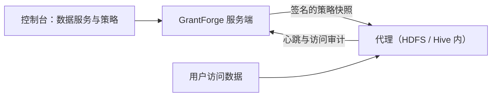

<!--
  Copyright (c) 2026 devlive-community/grantforge

  Licensed under the MIT License. See the LICENSE file in the
  project root for full license text.
-->

The "Data permissions" group manages permissions for data systems outside GrantForge. The architecture is similar to Apache Ranger: plugins define service types, administrators write policies in the console, and agents deployed inside the target systems download the policies and evaluate access locally.

> [!NOTE]
> The current release provides the plugin framework, a general policy editor, policy distribution and access auditing, the HDFS service type with numbered NameNode agents for Hadoop 2.7, 2.10, 3.2, 3.3, 3.4 and 3.5, and a sample plugin (`example`). See the [Apache Hadoop HDFS NameNode agent](/en/external/hdfs-agent/) for verified combinations. The Hive plugin is still under development.

## Plugins

**Platform management → Plugins** lists the loaded service type plugins. Built-in plugins ship with the server; for any other plugin, drop it into the `plugins` directory and click "Rescan". Each plugin is loaded independently, so a failure disables only that plugin. For plugin development, see [Plugins and service types](/en/develop/plugins/).

## HDFS

The distribution ships with the HDFS service type plug-in; installation, connection settings, directory browsing and path policies are described under [Apache Hadoop HDFS](/en/plugins/hdfs/).

## Data services

**Data permissions → Data services**: A service is an instance of an external system whose permissions GrantForge manages, for example one HDFS cluster. When adding a service, choose the service type and fill in the connection details defined by the plugin's configuration items; you can **Test connection** first. Sensitive settings such as passwords are stored encrypted and are no longer shown after saving.

## Policies

**Data permissions → Policies** decide who can do what with which resources in a data service:

- **Access policies** allow or deny access;
- **Masking policies** mask fields;
- **Row filter policies** let through only a subset of rows.

The resource hierarchy (such as Hive's databases, tables and columns), the access types (such as select and update) and the conditions all come from the service type's plugin; when filling in a resource you can search for resources that actually exist in the target system. Policies apply to users, user groups or roles.

Levels that can be browsed, such as HDFS paths, have a **Browse** button: open directories level by level, see their owner, group and permissions, and choose several files or directories at once. When a lookup or browsing fails, the reason is shown (no permission, unreachable, or a directory too large) and you can retry.

## Agents

**Data permissions → Agents**: Agents are deployed inside the target systems; with their token they periodically report heartbeats and download signed policy snapshots, and they evaluate access locally. From here you issue agent tokens (shown only once) and check whether each agent has already picked up the latest policies.

## Access audits

**Data permissions → Access audits**: Every access decision reported by an agent: who did what to which resource, when and from where, whether it was allowed or denied, and which policy decided. Records are retained for 90 days by default.

