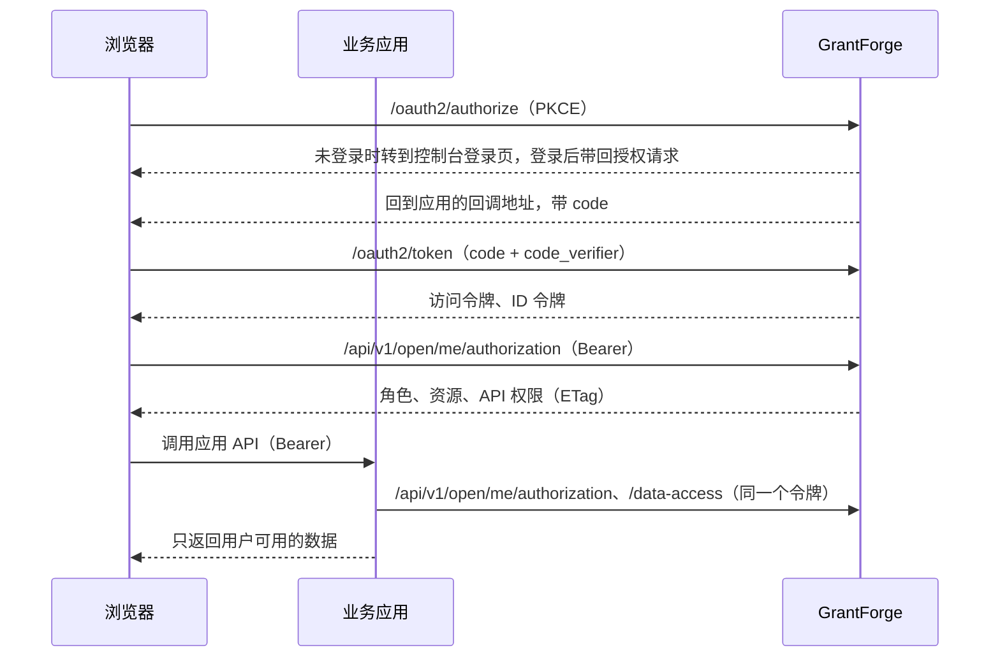

<!--
  Copyright (c) 2026 devlive-community/grantforge

  Licensed under the MIT License. See the LICENSE file in the
  project root for full license text.
-->

GrantForge plays two roles for business applications:

- **Authorization server** (OAuth 2.1 / OpenID Connect): users sign in at GrantForge, and the application receives access tokens and ID tokens.
- **Permission center**: using the same token, the application asks GrantForge which roles, resources (menus, pages, buttons), API permissions, and data scopes this user has within it.

## Concept mapping

| Concept | Where to configure | Description |
| --- | --- | --- |
| Application | Platform management → Resource catalog | A business system, for example `shop` |
| Resource | The application's resource tree in the resource catalog | Modules, menus, pages, buttons, APIs. Pages and buttons control the UI; API resources are API permission codes (for example `orders.read`) |
| Client | Resource catalog → the application's "OAuth clients" | The identity the application uses to sign users in and obtain tokens. Browser applications use **public clients**, server-side applications use **confidential clients** |
| scope | Client settings | `openid`, `profile`, and `email` for sign-in; `permissions` lets the token query permissions; `catalog` lets the application declare data entities as itself |
| Roles and grants | Access control → Role management | Grant the application's resources to roles, then assign roles to users, groups, departments, or positions |
| Data policies | Role → Data permissions | Entities declared by the application (`<应用编码>:<实体>`) are configured just like the console's own entities: All, this tenant, own records only, department, specified departments, or by condition |

Tenant administrators (those holding the system role) can grant any resource of a business application to roles in their own tenant; permissions of the console itself can still only be granted as far as the granter holds them.

## Flow

## Integration steps

1. Create the application under **Platform management → Resource catalog**, and build its pages, buttons, and API resources.
2. Register a client for the application: choose "Public" for browser applications and "Confidential" for server-side ones; set the redirect URI to the application's sign-in callback; select at least the `openid` and `permissions` scopes. A confidential client's secret is shown only once.
3. Under **Access control → Role management**, create roles, grant resources, and assign the roles to users.
4. Integrate the SDK into your application: for Java see [Java SDK](/en/integration/java/), for browsers see [JavaScript SDK](/en/integration/javascript/); for protocol details see [OAuth 2.1 and OpenID Connect](/en/integration/oauth/) and [Open API for permission queries](/en/integration/open-api/).

The `samples/` directory in the repository contains two complete examples (a shop and a notes app), covered by end-to-end tests; see [Sample applications](/en/integration/samples/).
