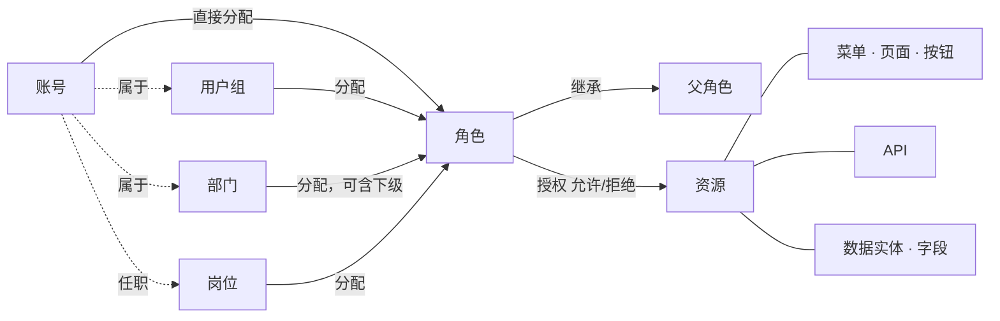

<!--
  Copyright (c) 2026 devlive-community/grantforge

  Licensed under the MIT License. See the LICENSE file in the
  project root for full license text.
-->

The GrantForge model can be summed up in one sentence: **accounts receive roles through assignments, roles hold grants on resources, and evaluation merges those grants into the account's effective permissions.**

## Tenants

Tenants are the boundary of data isolation: each tenant has its own accounts, organizations, roles, and grants, invisible to every other tenant. The first tenant created during initialization is the **platform tenant**; its administrators can also manage other tenants, the resource catalog, and the authorization server. If you serve a single organization, you can use just this one tenant.

## Accounts and Organizations

- **Account**: the sign-in principal; usernames are unique across the entire platform. Accounts can come from local storage (password kept in GrantForge) or from an identity source (LDAP or OIDC, with the password managed by that source).
- **Department**: a tree structure; every account has one primary department and may also hold appointments in other departments.
- **User group**: a collection of people independent of the org structure, for example an "on-call group".
- **Position**: a job title, for example "finance manager"; an account can hold multiple positions.

## Resources

Resources are "the things that can be granted", organized into a tree per application:

| Type | Description |
| --- | --- |
| Modules, menus | Groupings that organize pages |
| Pages, tabs | A page in the console or an application, or a tab on a page |
| Buttons | An action on a page, such as "Delete user" |
| APIs | A REST endpoint, such as `api:GET:/api/v1/users` |
| Data entities, fields | Business entities whose row scope can be restricted, and the fields within them that can be hidden or masked |

Resources can have **dependencies** on each other: a button needs the API it calls, and a page needs the APIs it loads data from. When you grant a page or button, its dependencies are pulled in automatically, so nobody ends up "seeing the button but getting a permission error when clicking it".

The GrantForge console is itself an application: its pages, buttons, and APIs are registered into the resource catalog automatically at startup, so access to the console is decided by roles too.

## Roles, Grants, and Assignments

- **Role**: a name for a set of grants. **System roles** (tenant administrator, platform administrator) are created together with the tenant, cover entire modules, and cannot be modified; everything else is a custom role.
- **Grant**: a role's "allow" or "deny" on a resource. Deny takes precedence over allow.
- **Inheritance**: a role can inherit all grants of other roles; inheritance cycles are not allowed.
- **Assignment**: giving a role to an account, user group, department (optionally including sub-departments), or position, with optional effective and expiry times.

## Evaluation

When a permission decision is needed, GrantForge collects all of the account's effective roles (assigned directly, obtained through a group/department/position, or obtained through inheritance — all within their validity period and with the role enabled), merges their grants, and produces:

- The resources available (pages, buttons, APIs);
- The row scope for each data entity when reading, updating, deleting, and exporting;
- How each field can be read and written (visible, masked, hidden; editable, read-only).

The result carries a version number: any change to grants, assignments, or the catalog bumps the version, and the console and SDKs refresh their caches accordingly. For the detailed rules, see [Permission model](/en/architecture/permission-model/).
