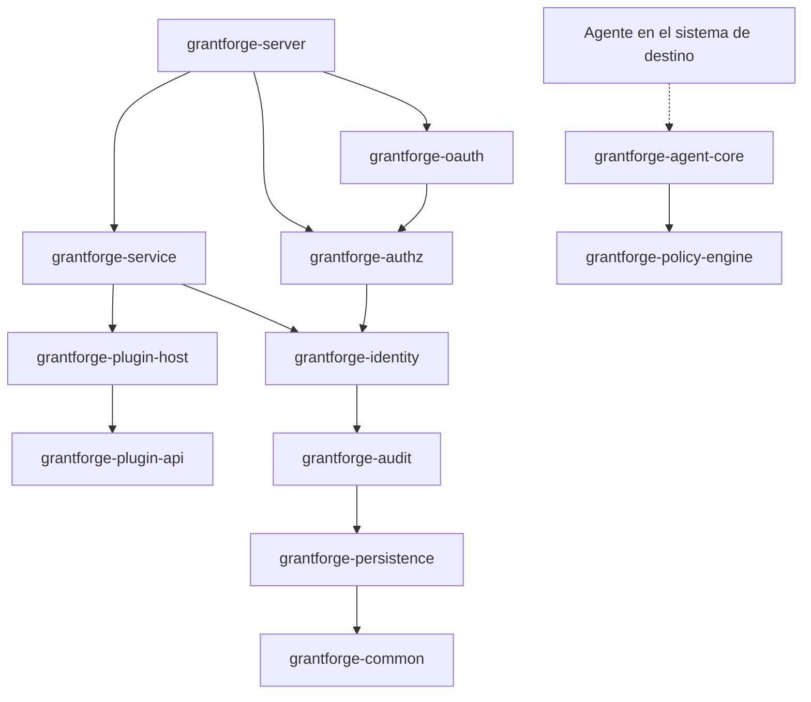
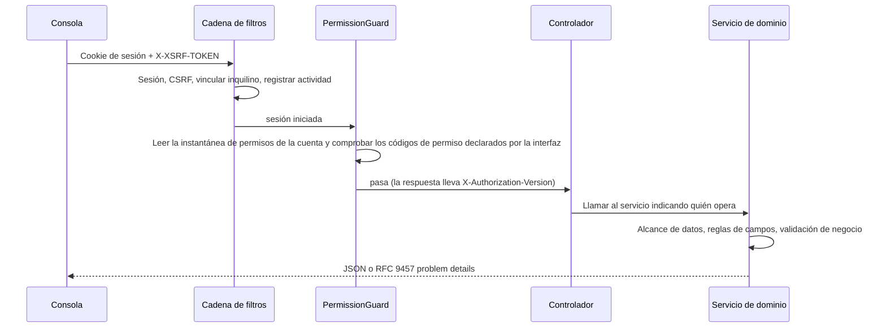

<!--
  Copyright (c) 2026 devlive-community/grantforge

  Licensed under the MIT License. See the LICENSE file in the
  project root for full license text.
-->

GrantForge es una aplicación Spring Boot 4 (código de bytes Java 17), dividida en varios módulos Maven por dominio y empaquetada en un solo paquete publicado ejecutable; la consola es una aplicación de página única Vue 3 que el servidor entrega junto con el resto.

## Módulos

El servidor y la infraestructura compartida están en `core/`, los plug-ins de tipo de servicio que carga el servidor en `plugins/`, y los agentes concretos que se despliegan en los sistemas de destino en `agents/`. `core/grantforge-agent-core` proporciona el protocolo compartido y el entorno de ejecución, y `agents/grantforge-agent-hdfs` el adaptador de autorización para el NameNode de HDFS.

| Módulo | Responsabilidad |
| --- | --- |
| `grantforge-common` | Códigos de error y modelo de problem details, CSV, anotaciones de acceso a interfaces (`@PublicEndpoint`, `@AuthenticatedEndpoint`, `@RequirePermission`, `@RequireStepUp`) |
| `grantforge-persistence` | Clase base de entidades, filtro de inquilinos, generación de TSID, tipos de Liquibase, `@SecuredEntity`/`@SecuredField` y el SPI de permisos sobre filas y campos |
| `grantforge-audit` | Registro, consulta, conservación y archivado de los eventos de auditoría |
| `grantforge-identity` | Inquilinos, cuentas, departamentos, grupos, puestos, política de contraseñas, inicio de sesión y sesiones, verificación en dos pasos, fuentes de identidad |
| `grantforge-authz` | Catálogo de aplicaciones y recursos, catálogo de API, roles, autorizaciones, herencia, asignaciones, evaluación, políticas de datos y de campos, separación de funciones, solicitudes de acceso y revisiones |
| `grantforge-plugin-api` / `plugin-host` | El contrato de los plug-ins de tipo de servicio, así como la carga, el aislamiento y la invocación de los plug-ins |
| `grantforge-policy-engine` | Motor de evaluación de políticas de sistemas externos (API de Java 8, que se puede embeber en los agentes) |
| `grantforge-agent-core` | Ajustes compartidos por los agentes, instantáneas firmadas, decisiones de acceso y notificación de auditoría (está en `core/`) |
| `grantforge-service` | Servicios de datos, políticas, firma y distribución de las instantáneas de políticas, agentes y auditoría de accesos |
| `grantforge-oauth` | Servidor OAuth 2.1 / OIDC basado en Spring Authorization Server, almacén de tokens y claves de firma |
| `grantforge-server` | Une todos los módulos: controladores REST, configuración de seguridad, API abierta, sincronización al arrancar |
| `grantforge-web` | La consola Vue 3 + Vite + Tailwind |
| `plugins/` | Plug-ins de tipo de servicio que carga el servidor, por ejemplo `grantforge-plugin-hdfs` |
| `agents/` | Agentes concretos que se ejecutan dentro de los sistemas de destino, por ejemplo `grantforge-agent-hdfs` |
| `sdk/` | `grantforge-spring-boot-starter` y `@grantforge/client` |

El diagrama anterior muestra las dependencias entre los módulos (las capas inferiores, como common y persistence, son dependencias de todos los módulos, y esas aristas repetidas se han omitido del diagrama). El motor de políticas no depende de ningún otro módulo, para que los agentes de los sistemas de destino puedan embeberlo. Las pruebas de ArchUnit de cada módulo velan además por las convenciones comunes: no usar inyección por campos, no escribir SQL nativo, no dejar que las entidades aparezcan en la API, que todos los paquetes sean no nulos por defecto, etc.

## El recorrido de una petición

- Cada método de controlador debe declarar su forma de acceso (público, con solo iniciar sesión, o con un código de permiso); un método sin declaración impide que el servidor arranque.
- Los códigos de permiso se registran a la vez como recursos de API, de modo que la autorización de una interfaz también se gestiona en el catálogo de recursos.
- Los errores se unifican como RFC 9457 problem details, con `code` estable, `detail` localizado y `requestId`; consulta los [códigos de error](/es/reference/errors/).

## Decisiones tecnológicas

| Área | Elección |
| --- | --- |
| Entorno de ejecución | Código de bytes Java 17, compilado con JDK 21; Spring Boot 4.1, Spring Security 7, Spring Authorization Server |
| Persistencia | Hibernate 7 + Spring Data JPA; migraciones YAML de Liquibase; Hibernate solo valida la estructura de las tablas |
| Identificadores | TSID (identificadores de 64 bits ordenados por tiempo), que hacia fuera se pasan siempre como cadena de texto |
| Sesiones | Spring Session JDBC, compartidas en clúster |
| Frontend | Vue 3, Pinia, Vue Router, Tailwind CSS 4, Vite, TypeScript en modo estricto |
| Calidad | Error Prone + NullAway, Checkstyle, PMD, SpotBugs, ArchUnit, umbrales de cobertura de JaCoCo, ESLint, vue-tsc |
| Pruebas | JUnit 5, jqwik, Testcontainers (seis bases de datos), Vitest, pruebas de extremo a extremo completas y de ejemplo con Playwright, JMH y pruebas comparativas a escala de un millón |
