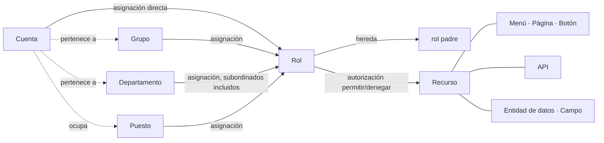

<!--
  Copyright (c) 2026 devlive-community/grantforge

  Licensed under the MIT License. See the LICENSE file in the
  project root for full license text.
-->

El modelo de GrantForge se resume en una frase: **la cuenta obtiene roles mediante asignaciones, los roles se autorizan sobre recursos, y en la evaluación esas autorizaciones se combinan en los permisos efectivos de la cuenta.**

## Inquilinos

El inquilino es la frontera de aislamiento de los datos: cada inquilino tiene sus propias cuentas, organización, roles y autorizaciones, que no son visibles para los demás. El primer inquilino que se crea en la inicialización es el **inquilino plataforma**; sus administradores pueden además gestionar otros inquilinos, el catálogo de recursos y el servidor de autorización. Si solo das servicio a una organización, puedes quedarte con ese único inquilino.

## Cuentas y organización

- **Cuenta**: el sujeto que inicia sesión; el nombre de usuario es único en toda la plataforma. Una cuenta puede ser local (la contraseña se guarda en GrantForge) o proceder de una fuente de identidad (LDAP u OIDC, en cuyo caso la contraseña la gestiona la fuente de identidad).
- **Departamento**: estructura en árbol; cada cuenta tiene un departamento principal y puede colaborar en otros departamentos.
- **Grupo**: conjunto de personas sin relación con la estructura organizativa, por ejemplo el "grupo de guardia".
- **Puesto**: un cargo, por ejemplo "responsable financiero"; una cuenta puede ocupar varios puestos.

## Recursos

Un recurso es "todo aquello que puede recibir una autorización", organizado en un árbol por aplicación:

| Tipo | Explicación |
| --- | --- |
| Módulo, menú | Agrupaciones que organizan las páginas |
| Página, etiqueta | Una página de la consola o de una aplicación, o una pestaña dentro de una página |
| Botón | Una acción sobre una página, por ejemplo "Eliminar usuario" |
| API | Una interfaz REST, por ejemplo `api:GET:/api/v1/users` |
| Entidad de datos, campo | Una entidad de negocio cuyo rango de filas se puede limitar, así como los campos de esa entidad que se pueden ocultar o enmascarar |

Entre los recursos puede haber **dependencias**: un botón necesita la API que llama, y una página necesita las API de las que carga datos. Al autorizar una página o un botón, sus dependencias se arrastran consigo, lo que evita "ver el botón y obtener un error de falta de permiso al pulsarlo".

La propia consola de GrantForge también es una aplicación: sus páginas, botones y API se registran automáticamente en el catálogo de recursos al arrancar, de modo que los permisos de la consola también los deciden los roles.

## Roles, autorizaciones y asignaciones

- **Rol**: el nombre de un conjunto de autorizaciones. Los **roles de sistema** (administrador del inquilino, administrador de la plataforma) se crean junto con el inquilino, cubren módulos completos y no se pueden modificar; el resto son roles personalizados.
- **Autorización**: un rol "permite" o "denega" un recurso. La denegación prevalece sobre el permiso.
- **Herencia**: un rol puede heredar todas las autorizaciones de otros roles; las relaciones de herencia no pueden formar ciclos.
- **Asignación**: entrega el rol a una cuenta, a un grupo, a un departamento (opcionalmente con los departamentos subordinados) o a un puesto; se pueden fijar las fechas de entrada en vigor y de caducidad.

## Evaluación

Cuando hace falta determinar un permiso, GrantForge encuentra todos los roles efectivos de la cuenta (los asignados directamente, los obtenidos por grupo, departamento o puesto, y los obtenidos por herencia, siempre que estén vigentes y que el rol esté habilitado), combina sus autorizaciones y obtiene:

- los recursos utilizables (páginas, botones, API);
- el rango de filas de cada entidad de datos en la lectura, la modificación, la eliminación y la exportación;
- la forma de leer y escribir cada campo (visible, enmascarado, oculto; editable, solo lectura).

El resultado lleva un número de versión: cualquier cambio en las autorizaciones, las asignaciones o el catálogo hace que ese número cambie, y la consola y el SDK refrescan su caché en consecuencia. Las reglas detalladas están en el [modelo de permisos](/es/architecture/permission-model/).
