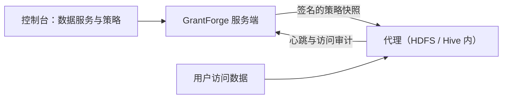

<!--
  Copyright (c) 2026 devlive-community/grantforge

  Licensed under the MIT License. See the LICENSE file in the
  project root for full license text.
-->

“数据权限”分组管理 GrantForge 以外的数据系统的权限，架构类似 Apache Ranger：插件定义服务类型，管理员在控制台写策略，部署在目标系统里的代理下载策略并在本地判定访问。

> [!NOTE]
> 当前版本提供插件框架、通用策略编辑器、策略分发与访问审计、HDFS 服务类型和 Hadoop 3.5.0 NameNode 代理，以及示例插件（`example`）。Hive 插件和其他 Hadoop 版本的代理仍在开发中。

## 插件

**平台管理 → 插件** 列出已加载的服务类型插件。内置插件随服务端提供，其他插件放入 `plugins` 目录后点击“重新扫描”即可；每个插件独立加载，出错只停用它自己。插件开发见 [插件与服务类型](/develop/plugins/)。

## HDFS

发行包自带 HDFS 插件（`plugins/hdfs`），服务类型 `hdfs`，与 Apache Ranger 的 HDFS 服务一致：

- 资源只有一级 `path`，按路径匹配：`/data/sales` 匹配它本身，勾选“递归”后也匹配其下的全部文件与目录；支持排除。
- 访问类型 `read`、`write`、`execute`，与 HDFS 的权限位对应。
- 插件用 Hadoop 自己的客户端连接集群，测试连接检查查询目录存在且可以列出内容，写策略时输入路径会列出对应目录下的子目录与文件，目录排在文件前面。
- 服务端插件负责管理与查询；要让策略约束 HDFS 访问，还需部署 [Apache Hadoop HDFS NameNode 代理](/external/hdfs-agent/)。

| 配置 | 说明 |
| --- | --- |
| `username` | 查询目录用的用户；Kerberos 时为 principal，如 `grantforge@EXAMPLE.COM` |
| `password` / `keytab` | Kerberos 时二选一：principal 的密码，或 GrantForge 服务器上 keytab 文件的路径 |
| `fs.default.name` | `hdfs://namenode:8020`、高可用的 `hdfs://nameservice1`，或 `webhdfs://namenode:9870` |
| `hadoop.security.authentication` | `simple` 或 `kerberos` |
| `hadoop.security.authorization`、`hadoop.security.auth_to_local` | 与集群的 core-site.xml 一致 |
| `dfs.namenode.kerberos.principal` 等 | NameNode、DataNode、Secondary NameNode 的 principal，如 `nn/_HOST@EXAMPLE.COM` |
| `hadoop.rpc.protection` | `authentication`、`integrity` 或 `privacy`，与集群一致 |
| 附加 Hadoop 配置 | 每行一个 `key=value`，用于高可用等其他配置，例如 `dfs.nameservices=nameservice1`、`dfs.ha.namenodes.nameservice1=nn1,nn2`、`dfs.namenode.rpc-address.nameservice1.nn1=nn1:8020`、`dfs.client.failover.proxy.provider.nameservice1=org.apache.hadoop.hdfs.server.namenode.ha.ConfiguredFailoverProxyProvider` |
| `lookup.path` | 查询目录，默认 `/`；例如设为 `/data` 后，空输入列出 `/data` 的内容，相对输入从这里开始补全。适用于查询用户没有根目录列出权限的集群 |
| `lookup.max.entries` | 一次目录查询最多扫描的条目数，默认 `10000`，范围 `1..100000`；超过上限返回错误，避免静默遗漏候选 |

附加 Hadoop 配置覆盖同名连接设置，配置校验与登录均使用覆盖后的值。`fs.defaultFS` 和 `fs.default.name` 是别名，附加配置中只能设置其中一个；重复键、非集群地址和无凭据的 Kerberos 配置会在保存时被拒绝。集群地址只填写集群 URI，需要查询的子目录放在 `lookup.path`。

`lookup.path` 限制路径候选的浏览范围，不替代 HDFS 自身的访问控制；符号链接和 ViewFS 挂载仍遵循集群配置。输入中可省略开头的 `/`，允许重复 `/` 与 `.`，拒绝 `..` 和范围之外的绝对路径。不存在的目录返回空候选，权限不足和连接失败会显示错误。

使用 Kerberos 时，GrantForge 服务器需要能找到 KDC：配置 `/etc/krb5.conf`，或用 `-Djava.security.krb5.conf=` 指定。

## 数据服务

**数据权限 → 数据服务**：一个服务是 GrantForge 管理权限的一个外部系统实例，例如一个 HDFS 集群。添加服务时选择服务类型，按插件定义的配置项填写连接信息，可以先 **测试连接**。密码等敏感配置加密保存，保存后不再显示。

## 策略

**数据权限 → 策略** 决定谁能对数据服务中的哪些资源做什么：

- **访问策略**允许或拒绝访问；
- **脱敏策略**遮盖字段；
- **行过滤策略**只放出部分行。

资源层级（如 Hive 的库、表、列）、访问类型（如 select、update）和条件都来自服务类型的插件；填写资源时可以查找目标系统中实际存在的资源。策略的对象是用户、用户组或角色。

支持目录浏览的层级（如 HDFS 路径）旁有 **浏览** 按钮：可以逐级打开目录，查看所有者、组与权限，并一次选择多个文件或目录。查找或浏览失败时会显示具体原因（例如没有权限、无法连接或目录过大），可以重试。

## 代理

**数据权限 → 代理**：代理部署在目标系统内部，凭令牌定期上报心跳并下载签名的策略快照，在本地判定访问。这里签发代理令牌（只显示一次）、查看各代理是否已用上最新策略。

## 访问审计

**数据权限 → 访问审计**：代理上报的每一次访问判定：谁在何时从哪里对哪个资源做了什么，被允许还是拒绝，由哪条策略决定。记录默认保留 90 天。

