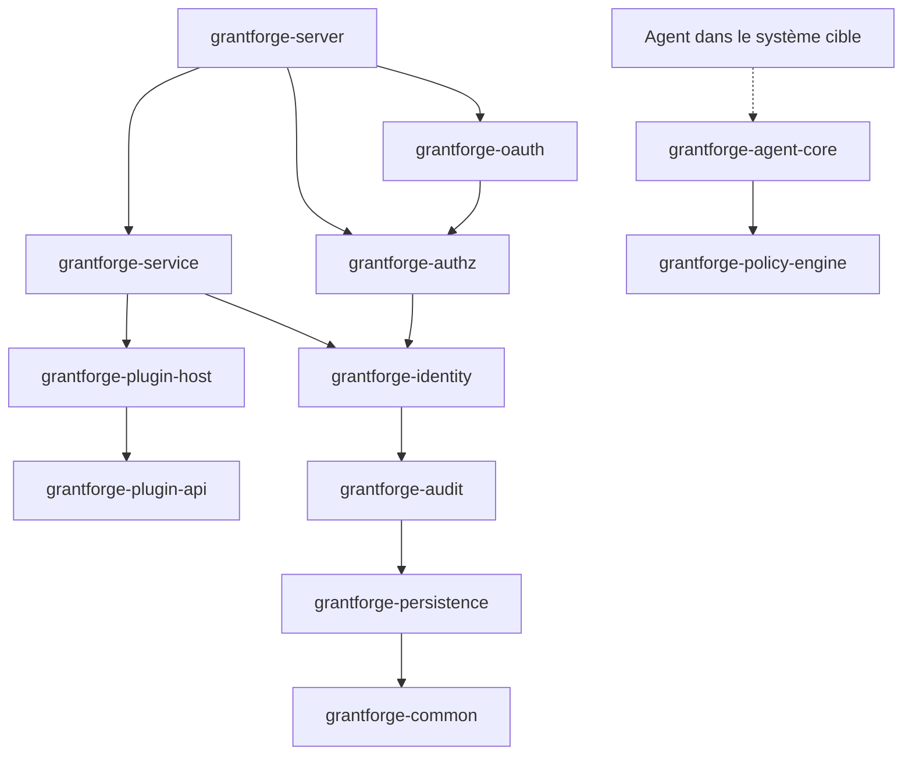
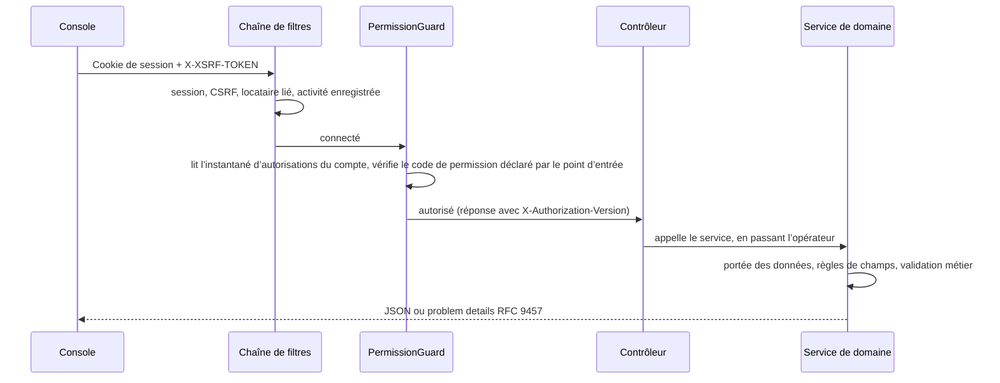

<!--
  Copyright (c) 2026 devlive-community/grantforge

  Licensed under the MIT License. See the LICENSE file in the
  project root for full license text.
-->

GrantForge est une application Spring Boot 4 (bytecode Java 17), découpée par domaines en plusieurs modules Maven et empaquetée en une version publiée exécutable unique ; la console est une application monopage Vue 3, servie par le serveur.

## Modules

Le serveur et les infrastructures partagées se trouvent dans `core/`, les plug-ins de types de service chargés par le serveur dans `plugins/`, et les agents concrets déployés dans les systèmes cibles dans `agents/`. `core/grantforge-agent-core` fournit le protocole et l’exécution partagés, et `agents/grantforge-agent-hdfs` fournit l’adaptateur d’autorisation du NameNode HDFS.

| Module | Responsabilité |
| --- | --- |
| `grantforge-common` | Codes d’erreur et modèle de problem details, CSV, annotations d’accès aux points d’entrée (`@PublicEndpoint`, `@AuthenticatedEndpoint`, `@RequirePermission`, `@RequireStepUp`) |
| `grantforge-persistence` | Classes de base des entités, filtrage par locataire, génération de TSID, types Liquibase, `@SecuredEntity`/`@SecuredField` et le SPI des autorisations sur les lignes et les champs |
| `grantforge-audit` | Enregistrement, consultation, conservation et archivage des événements d’audit |
| `grantforge-identity` | Locataires, comptes, services, groupes, postes, politiques de mot de passe, connexion et sessions, authentification à deux facteurs, sources d’identité |
| `grantforge-authz` | Catalogues d’applications et de ressources, catalogue d’API, rôles, autorisations, héritage, affectations, évaluation, politiques de données et de champs, séparation des tâches, demandes d’accès et revues |
| `grantforge-plugin-api` / `plugin-host` | Contrats des plug-ins de types de service, ainsi que chargement, isolation et appel des plug-ins |
| `grantforge-policy-engine` | Moteur d’évaluation des politiques des systèmes externes (API Java 8, intégrable dans un agent) |
| `grantforge-agent-core` | Réglages, instantanés signés, décisions d’accès et remontée d’audit partagés par les agents (se trouve dans `core/`) |
| `grantforge-service` | Services de données, politiques, signature et distribution des instantanés de politiques, agents et audit des accès |
| `grantforge-oauth` | Serveur OAuth 2.1 / OIDC fondé sur Spring Authorization Server, stockage des jetons et clés de signature |
| `grantforge-server` | Assemble tous les modules : contrôleurs REST, configuration de sécurité, API ouverte, synchronisation au démarrage |
| `grantforge-web` | Console Vue 3 + Vite + Tailwind |
| `plugins/` | Plug-ins de types de service chargés par le serveur, comme `grantforge-plugin-hdfs` |
| `agents/` | Agents concrets exécutés dans les systèmes cibles, comme `grantforge-agent-hdfs` |
| `sdk/` | `grantforge-spring-boot-starter` et `@grantforge/client` |

Le diagramme ci-dessus montre les dépendances entre modules (les couches basses comme common et persistence sont dépendance de tous les modules ; ces arêtes répétées sont omises du schéma). Le moteur de politiques ne dépend d’aucun autre module et est embarqué par les agents des systèmes cibles. Les tests ArchUnit de chaque module veillent en outre sur des conventions communes : pas d’injection par champ, pas de SQL natif, pas d’entités dans l’API, tous les paquets non nuls par défaut, etc.

## Le cheminement d’une requête

- Chaque méthode de contrôleur doit déclarer son mode d’accès (public, simple compte connecté, ou code de permission requis) ; une méthode sans déclaration empêche le serveur de démarrer.
- Les codes de permission sont aussi enregistrés comme ressources d’API : l’autorisation des points d’entrée se gère donc également dans le catalogue de ressources.
- Les erreurs sont uniformément des problem details RFC 9457, avec un `code` stable, un `detail` localisé et un `requestId` ; voir [Codes d’erreur](/fr/reference/errors/).

## Choix techniques

| Domaine | Choix |
| --- | --- |
| Runtime | Bytecode Java 17, construit avec JDK 21 ; Spring Boot 4.1, Spring Security 7, Spring Authorization Server |
| Persistance | Hibernate 7 + Spring Data JPA ; migrations YAML Liquibase ; Hibernate ne valide que la structure des tables |
| ID | TSID (identifiants 64 bits ordonnés par le temps), transmis à l’extérieur sous forme de chaînes |
| Sessions | Spring Session JDBC, partagé entre les nœuds |
| Frontend | Vue 3, Pinia, Vue Router, Tailwind CSS 4, Vite, TypeScript en mode strict |
| Qualité | Error Prone + NullAway, Checkstyle, PMD, SpotBugs, ArchUnit, seuils de couverture JaCoCo, ESLint, vue-tsc |
| Tests | JUnit 5, jqwik, Testcontainers (six bases de données), Vitest, tests de bout en bout plein pile et exemples Playwright, JMH et benchmarks à l’échelle du million |
