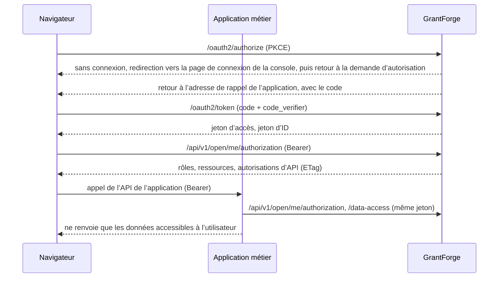

<!--
  Copyright (c) 2026 devlive-community/grantforge

  Licensed under the MIT License. See the LICENSE file in the
  project root for full license text.
-->

GrantForge joue deux rôles auprès des applications métier :

- **Serveur d’autorisation** (OAuth 2.1 / OpenID Connect) : l’utilisateur se connecte dans GrantForge et l’application reçoit un jeton d’accès et un jeton d’ID.
- **Centre de permissions** : l’application interroge GrantForge avec le même jeton pour connaître les rôles, les ressources (menus, pages, boutons), les autorisations d’API et les portées de données de cet utilisateur dans cette application.

## Correspondance des concepts

| Concept | Où le configurer | Description |
| --- | --- | --- |
| Application | Administration de la plateforme → Catalogue de ressources | un système métier, par exemple `shop` |
| Ressource | l’arborescence de ressources de l’application, dans le catalogue de ressources | modules, menus, pages, boutons, API. Les pages et les boutons pilotent l’interface ; une ressource API est le code d’une autorisation d’API (par exemple `orders.read`) |
| Client | Catalogue de ressources → « Clients OAuth » de l’application | l’identité avec laquelle l’application connecte ses utilisateurs et obtient des jetons. Les applications navigateur utilisent un **client public**, les applications serveur un **client confidentiel** |
| scope | réglages du client | `openid`, `profile`, `email` servent à la connexion ; `permissions` permet au jeton de consulter les autorisations ; `catalog` permet à l’application de déclarer des entités de données en son nom propre |
| Rôles et autorisations | Contrôle d’accès → Gestion des rôles | attribuez les ressources de l’application à des rôles, puis attribuez ces rôles à des utilisateurs, des groupes, des services ou des postes |
| Politiques de données | Rôle → Autorisations sur les données | les entités déclarées par l’application (`<code d’application>:<entité>`) se configurent comme celles de la console elle-même : tout, tout le locataire courant, uniquement la personne concernée, le service courant, des services désignés ou selon une condition |

Les administrateurs de locataire (détenteurs d’un rôle système) peuvent attribuer aux rôles de leur locataire n’importe quelle ressource des applications métier ; pour la console elle-même, ils ne peuvent toujours attribuer que les autorisations qu’ils détiennent.

## Déroulement

## Étapes d’intégration

1. Dans **Administration de la plateforme → Catalogue de ressources**, créez l’application, ainsi que ses ressources de pages, de boutons et d’API.
2. Enregistrez un client pour l’application : « public » pour une application navigateur, « confidentiel » pour une application serveur ; renseignez comme adresse de rappel l’URL de retour de connexion de l’application ; sélectionnez au moins `openid` et `permissions` comme scopes. Le secret du client confidentiel n’est affiché qu’une seule fois.
3. Dans **Contrôle d’accès → Gestion des rôles**, créez les rôles, accordez les autorisations et attribuez-les aux utilisateurs.
4. Intégrez le SDK dans l’application : voir [SDK Java](/fr/integration/java/) pour Java, [SDK JavaScript](/fr/integration/javascript/) pour le navigateur, et [OAuth 2.1 et OpenID Connect](/fr/integration/oauth/) ainsi que [API ouverte de consultation des autorisations](/fr/integration/open-api/) pour les détails du protocole.

Le dépôt contient deux exemples complets dans `samples/` (une boutique et une application de notes), couverts par des tests de bout en bout ; voir [Applications d’exemple](/fr/integration/samples/).
