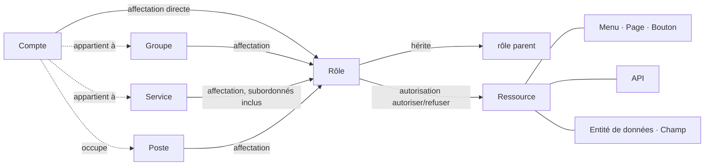

<!--
  Copyright (c) 2026 devlive-community/grantforge

  Licensed under the MIT License. See the LICENSE file in the
  project root for full license text.
-->

Le modèle de GrantForge se résume en une phrase : **un compte reçoit des rôles par affectation, les rôles portent des autorisations sur les ressources, et l’évaluation fusionne ces autorisations en les autorisations effectives du compte.**

## Locataires

Le locataire est la frontière de l’isolation des données : chaque locataire a ses propres comptes, son organisation, ses rôles et ses autorisations, invisibles aux autres. Le premier locataire créé à l’initialisation est le **locataire plateforme** ; ses administrateurs peuvent en outre gérer les autres locataires, le catalogue de ressources et le serveur d’autorisation. Si vous ne servez qu’une seule organisation, vous pouvez vous contenter de ce seul locataire.

## Comptes et organisation

- **Compte** : le sujet de connexion ; le nom d’utilisateur est unique sur toute la plateforme. Un compte peut être local (le mot de passe est conservé dans GrantForge) ou provenir d’une source d’identité (LDAP ou OIDC, le mot de passe étant géré par la source d’identité).
- **Service** : une structure arborescente ; chaque compte a un service principal et peut exercer dans d’autres services.
- **Groupe d’utilisateurs** : un ensemble de personnes sans lien avec la structure organisationnelle, par exemple un « groupe d’astreinte ».
- **Poste** : une fonction, par exemple « directeur financier » ; un compte peut occuper plusieurs postes.

## Ressources

Une ressource est « tout ce qui peut recevoir une autorisation », organisé en arbre par application :

| Type | Description |
| --- | --- |
| Modules, menus | Regroupements qui organisent les pages |
| Pages, onglets | Une page de la console ou d’une application, ou un onglet sur une page |
| Boutons | Une action sur une page, par exemple « Supprimer l’utilisateur » |
| API | Une interface REST, par exemple `api:GET:/api/v1/users` |
| Entités de données, champs | Les entités métier dont le périmètre des lignes peut être restreint, ainsi que les champs de ces entités qui peuvent être cachés ou caviardés |

Des ressources peuvent présenter des **dépendances** : un bouton a besoin de l’API qu’il appelle, et une page des API dont elle charge les données. Lorsque vous autorisez une page ou un bouton, ses dépendances sont reprises automatiquement, ce qui évite de « voir le bouton mais d’obtenir un refus d’autorisation au clic ».

La console GrantForge est elle-même une application : ses pages, ses boutons et ses API sont enregistrés automatiquement au démarrage dans le catalogue de ressources ; les autorisations de la console sont donc, elles aussi, décidées par les rôles.

## Rôles, autorisations et affectations

- **Rôle** : le nom d’un ensemble d’autorisations. Les **rôles système** (administrateur du locataire, administrateur de la plateforme) sont créés avec le locataire, couvrent des modules entiers et ne sont pas modifiables ; tous les autres sont des rôles personnalisés.
- **Autorisation** : un rôle « autorise » ou « refuse » une ressource. Le refus prime sur l’autorisation.
- **Héritage** : un rôle peut hériter de l’ensemble des autorisations d’autres rôles ; les relations d’héritage ne peuvent pas former de cycle.
- **Affectation** : le fait d’attribuer un rôle à un compte, à un groupe d’utilisateurs, à un service (éventuellement en incluant les services subordonnés) ou à un poste, avec possibilité de définir des dates d’entrée en vigueur et d’expiration.

## Évaluation

Lorsqu’une décision d’autorisation est nécessaire, GrantForge détermine tous les rôles effectifs du compte (affectation directe, obtention via un groupe, un service ou un poste, obtention par héritage, chacun dans sa période de validité et avec le rôle activé), fusionne leurs autorisations et obtient :

- les ressources utilisables (pages, boutons, API) ;
- le périmètre des lignes de chaque entité de données en lecture, modification, suppression et export ;
- le mode de lecture et d’écriture de chaque champ (visible, caviardé, caché ; modifiable, en lecture seule).

Le résultat porte un numéro de version : toute modification des autorisations, des affectations ou du catalogue fait changer la version, et la console comme le SDK rafraîchissent leur cache en conséquence. Pour les règles détaillées, voir [Modèle d’autorisations](/fr/architecture/permission-model/).
