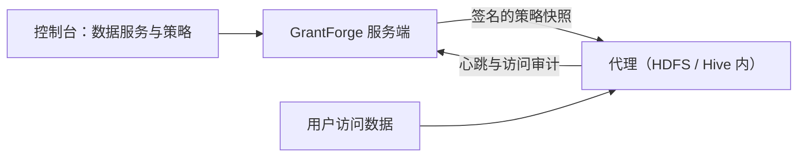

<!--
  Copyright (c) 2026 devlive-community/grantforge

  Licensed under the MIT License. See the LICENSE file in the
  project root for full license text.
-->

“数据权限”分组管理 GrantForge 以外的数据系统的权限，架构类似 Apache Ranger：插件定义服务类型，管理员在控制台写策略，部署在目标系统里的代理下载策略并在本地判定访问。

> [!NOTE]
> 当前版本提供插件框架、通用策略编辑器、策略分发与访问审计，以及一个示例插件（`example`）。HDFS 与 Hive 的官方插件和代理正在开发中。

## 插件

**平台管理 → 插件** 列出已加载的服务类型插件。内置插件随服务端提供，其他插件放入 `plugins` 目录后点击“重新扫描”即可；每个插件独立加载，出错只停用它自己。插件开发见 [插件与服务类型](/architecture/plugins/)。

## HDFS

发行包自带 HDFS 插件（`plugins/hdfs`），服务类型 `hdfs`：

- 资源只有一级 `path`，按路径匹配：`/data/sales` 匹配它本身，勾选“递归”后也匹配其下的全部文件与目录；支持排除。
- 访问类型 `read`、`write`、`execute`，与 HDFS 的权限位对应。
- 配置：WebHDFS 地址（NameNode 的 HTTP 地址，如 `http://namenode:9870`；高可用时用逗号分隔两个 NameNode，自动找到 active 的那个；也可以填 HttpFS 地址）、查询目录用的用户（默认 `hdfs`，简单认证）与超时时间。
- “测试连接”读取根目录的状态；写策略时输入路径会列出对应目录下的子目录与文件供选择。

插件通过 WebHDFS 的 REST 接口访问 HDFS，不依赖 Hadoop 客户端，适用于各个 Hadoop 版本。开启 Kerberos 的集群暂不支持测试连接与路径补全，策略仍可手工填写。

## 数据服务

**数据权限 → 数据服务**：一个服务是 GrantForge 管理权限的一个外部系统实例，例如一个 HDFS 集群。添加服务时选择服务类型，按插件定义的配置项填写连接信息，可以先 **测试连接**。密码等敏感配置加密保存，保存后不再显示。

## 策略

**数据权限 → 策略** 决定谁能对数据服务中的哪些资源做什么：

- **访问策略**允许或拒绝访问；
- **脱敏策略**遮盖字段；
- **行过滤策略**只放出部分行。

资源层级（如 Hive 的库、表、列）、访问类型（如 select、update）和条件都来自服务类型的插件；填写资源时可以查找目标系统中实际存在的资源。策略的对象是用户、用户组或角色。

## 代理

**数据权限 → 代理**：代理部署在目标系统内部，凭令牌定期上报心跳并下载签名的策略快照，在本地判定访问。这里签发代理令牌（只显示一次）、查看各代理是否已用上最新策略。

## 访问审计

**数据权限 → 访问审计**：代理上报的每一次访问判定：谁在何时从哪里对哪个资源做了什么，被允许还是拒绝，由哪条策略决定。记录默认保留 90 天。

