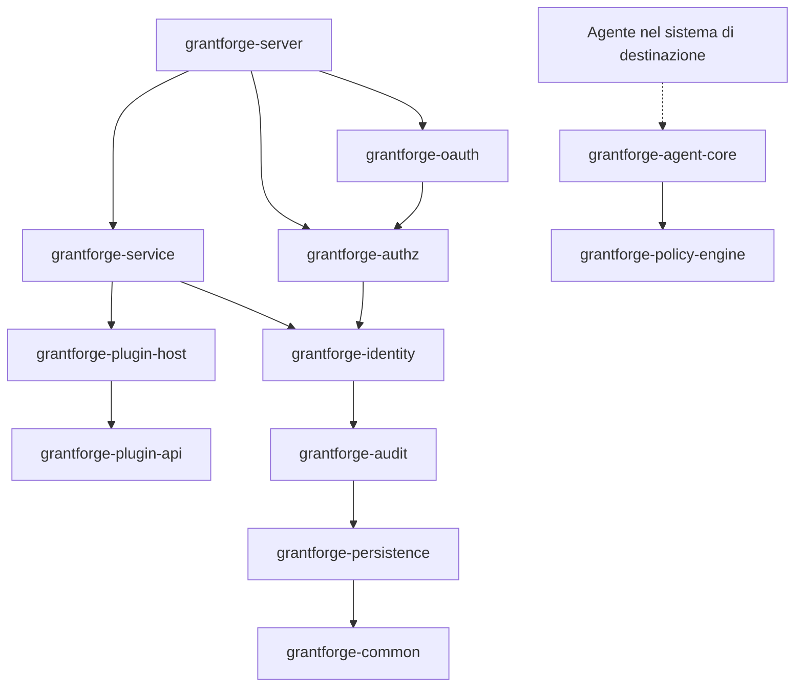
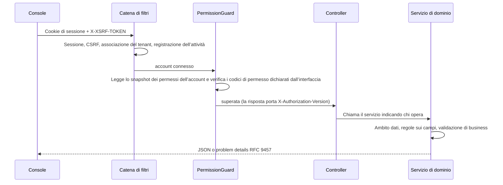

<!--
  Copyright (c) 2026 devlive-community/grantforge

  Licensed under the MIT License. See the LICENSE file in the
  project root for full license text.
-->

GrantForge è un’applicazione Spring Boot 4 (bytecode Java 17), suddivisa per dominio in più moduli Maven e impacchettata in un unico pacchetto di rilascio eseguibile; la console è un’applicazione a pagina singola Vue 3, fornita dal server insieme al resto.

## Moduli

Il server e l’infrastruttura condivisa si trovano in `core/`, i plug-in per tipi di servizio caricati dal server in `plugins/` e gli agenti concreti distribuiti nei sistemi di destinazione in `agents/`. `core/grantforge-agent-core` fornisce il protocollo condiviso e il runtime, mentre `agents/grantforge-agent-hdfs-*` fornisce l’adattatore di autorizzazione per il NameNode di HDFS.

| Modulo | Responsabilità |
| --- | --- |
| `grantforge-common` | Codici di errore e modello problem details, CSV, annotazioni di accesso alle interfacce (`@PublicEndpoint`, `@AuthenticatedEndpoint`, `@RequirePermission`, `@RequireStepUp`) |
| `grantforge-persistence` | Classe base delle entità, filtro tenant, generazione dei TSID, tipi Liquibase, `@SecuredEntity`/`@SecuredField` e SPI dei permessi su righe e campi |
| `grantforge-audit` | Registrazione, interrogazione, conservazione e archiviazione degli eventi di audit |
| `grantforge-identity` | Tenant, account, dipartimenti, gruppi di utenti, posizioni, policy delle password, accesso e sessioni, autenticazione a due fattori, fonti di identità |
| `grantforge-authz` | Catalogo di applicazioni e risorse, catalogo delle API, ruoli, autorizzazioni, ereditarietà, assegnazioni, valutazione, policy di dati e di campi, separazione dei compiti, richieste di accesso e revisioni |
| `grantforge-plugin-api` / `plugin-host` | Il contratto dei plug-in per tipi di servizio, oltre al caricamento, all’isolamento e all’invocazione dei plug-in |
| `grantforge-policy-engine` | Motore di valutazione delle policy dei sistemi esterni (API Java 8, integrabile negli agenti) |
| `grantforge-agent-core` | Impostazioni condivise degli agenti, snapshot firmate, decisioni di accesso e segnalazione di audit (si trova in `core/`) |
| `grantforge-service` | Servizi di dati, policy, firma e distribuzione delle snapshot delle policy, agenti e audit degli accessi |
| `grantforge-oauth` | Server OAuth 2.1 / OIDC basato su Spring Authorization Server, archiviazione dei token e chiavi di firma |
| `grantforge-server` | Assembla tutti i moduli: controller REST, configurazione di sicurezza, API aperta, sincronizzazione all’avvio |
| `grantforge-web` | La console Vue 3 + Vite + Tailwind |
| `plugins/` | Plug-in per tipi di servizio caricati dal server, come `grantforge-plugin-hdfs` |
| `agents/` | Agenti concreti in esecuzione nei sistemi di destinazione, come `grantforge-agent-hdfs` |
| `sdk/` | `grantforge-spring-boot-starter` e `@grantforge/client` |

Il diagramma precedente mostra le dipendenze tra i moduli (gli strati inferiori, come common e persistence, sono dipendenze di tutti i moduli e nel diagramma sono stati omessi questi archi ripetuti). Il motore delle policy non dipende da nessun altro modulo, così che gli agenti dei sistemi di destinazione possano integrarlo. I test ArchUnit di ogni modulo vigilano inoltre sulle convenzioni comuni: niente iniezione tramite campi, niente SQL nativo, le entità non compaiono nelle API, tutti i pacchetti sono non-null per impostazione predefinita, ecc.

## Il percorso di una richiesta

- Ogni metodo dei controller deve dichiarare la propria modalità di accesso (pubblico, basta l’accesso, richiede un codice di permesso); un metodo senza dichiarazione impedisce l’avvio del servizio.
- I codici di permesso sono registrati anche come risorse API, quindi l’autorizzazione di un’interfaccia si gestisce anch’essa nel catalogo delle risorse.
- Gli errori assumono una forma uniforme: problem details RFC 9457, con `code` stabile, `detail` localizzato e `requestId`; vedi [Codici di errore](/it/reference/errors/).

## Scelte tecnologiche

| Ambito | Scelta |
| --- | --- |
| Runtime | Bytecode Java 17, compilato con JDK 21; Spring Boot 4.1, Spring Security 7, Spring Authorization Server |
| Persistenza | Hibernate 7 + Spring Data JPA; migrazioni YAML di Liquibase; Hibernate si limita a validare la struttura delle tabelle |
| ID | TSID (ID a 64 bit ordinati nel tempo), trasmessi all’esterno come stringa |
| Sessioni | Spring Session JDBC, condivisa nel cluster |
| Frontend | Vue 3, Pinia, Vue Router, Tailwind CSS 4, Vite, TypeScript in modalità strict |
| Qualità | Error Prone + NullAway, Checkstyle, PMD, SpotBugs, ArchUnit, soglie di copertura di JaCoCo, ESLint, vue-tsc |
| Test | JUnit 5, jqwik, Testcontainers (sei database), Vitest, test end-to-end full-stack e degli esempi con Playwright, JMH e benchmark su scala di un milione |
