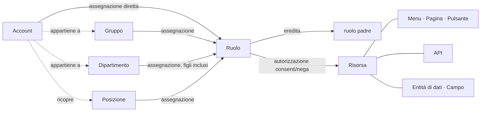

<!--
  Copyright (c) 2026 devlive-community/grantforge

  Licensed under the MIT License. See the LICENSE file in the
  project root for full license text.
-->

Il modello di GrantForge si riassume in una sola frase: **gli account ottengono i ruoli tramite assegnazioni, i ruoli concedono autorizzazioni sulle risorse e, in fase di valutazione, tali autorizzazioni vengono unite nei permessi effettivi dell’account.**

## Tenant

Il tenant è il confine di isolamento dei dati: ogni tenant ha i propri account, la propria organizzazione, i propri ruoli e le proprie autorizzazioni, non visibili agli altri. Il primo tenant creato in fase di inizializzazione è il **tenant piattaforma**; i suoi amministratori possono inoltre gestire altri tenant, il catalogo delle risorse e il server di autorizzazione. Quando si serve una sola organizzazione, è possibile utilizzare solamente questo tenant.

## Account e organizzazione

- **Account**: il soggetto che accede; il nome utente è unico nell’intera piattaforma. Un account può essere locale (la password è conservata in GrantForge) oppure provenire da una fonte di identità (LDAP o OIDC, con la password gestita dalla fonte stessa).
- **Dipartimento**: struttura ad albero; ogni account ha un dipartimento principale e può collaborare in altri dipartimenti.
- **Gruppo**: insieme di persone indipendente dalla struttura organizzativa, ad esempio il «gruppo di reperibilità».
- **Posizione**: una mansione, ad esempio «responsabile finanziario»; un account può ricoprire più posizioni.

## Risorse

Una risorsa è «ciò che può essere autorizzato», organizzata in un albero per applicazione:

| Tipo | Descrizione |
| --- | --- |
| Moduli, menu | Raggruppamenti che organizzano le pagine |
| Pagine, schede | Una pagina della console o di un’applicazione, oppure una scheda all’interno di una pagina |
| Pulsanti | Un’azione su una pagina, ad esempio «Elimina utente» |
| API | Un endpoint REST, ad esempio `api:GET:/api/v1/users` |
| Entità di dati, campi | Un’entità di business il cui ambito di righe può essere limitato, e i campi al suo interno che possono essere nascosti o mascherati |

Tra le risorse possono esserci **dipendenze**: un pulsante necessita dell’API che chiama e una pagina delle API da cui carica i dati. Quando si autorizza una pagina o un pulsante, le dipendenze vengono incluse automaticamente, per evitare il caso «si vede il pulsante, ma al clic compare un errore di permesso».

La console di GrantForge è essa stessa un’applicazione: le sue pagine, i suoi pulsanti e le sue API vengono registrati automaticamente nel catalogo delle risorse all’avvio, quindi anche l’accesso alla console è deciso dai ruoli.

## Ruoli, autorizzazioni e assegnazioni

- **Ruolo**: il nome di un insieme di autorizzazioni. I **ruoli di sistema** (amministratore del tenant, amministratore della piattaforma) vengono creati insieme al tenant, coprono moduli interi e non sono modificabili; tutti gli altri sono ruoli personalizzati.
- **Autorizzazione**: un «consenti» o «nega» del ruolo su una risorsa. Il «nega» ha la precedenza sul «consenti».
- **Ereditarietà**: un ruolo può ereditare tutte le autorizzazioni di altri ruoli; le relazioni di ereditarietà non possono formare cicli.
- **Assegnazione**: attribuisce il ruolo a un account, a un gruppo, a un dipartimento (facoltativamente includendo i dipartimenti figli) o a una posizione; è possibile impostare le date di entrata in vigore e di scadenza.

## Valutazione

Quando è necessario decidere un permesso, GrantForge individua tutti i ruoli effettivi dell’account (assegnati direttamente, ottenuti tramite gruppo, dipartimento o posizione, oppure ottenuti per ereditarietà, tutti nel periodo di validità e con il ruolo abilitato), ne unisce le autorizzazioni e ottiene:

- le risorse utilizzabili (pagine, pulsanti, API);
- l’ambito di righe di ogni entità di dati in lettura, modifica, eliminazione ed esportazione;
- il modo in cui ogni campo può essere letto e scritto (visibile, mascherato, nascosto; modificabile, in sola lettura).

Il risultato riporta un numero di versione: qualsiasi modifica ad autorizzazioni, assegnazioni o catalogo fa cambiare quel numero, e la console e gli SDK aggiornano di conseguenza la propria cache. Le regole dettagliate sono illustrate nel [modello dei permessi](/it/architecture/permission-model/).
