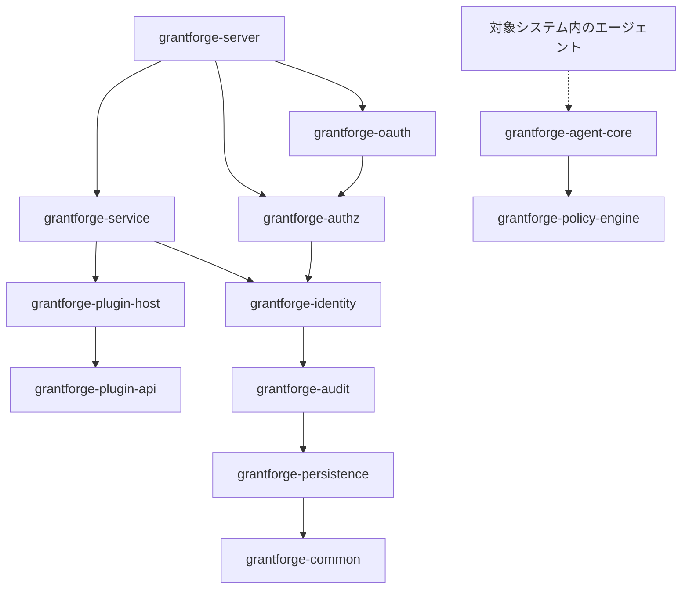
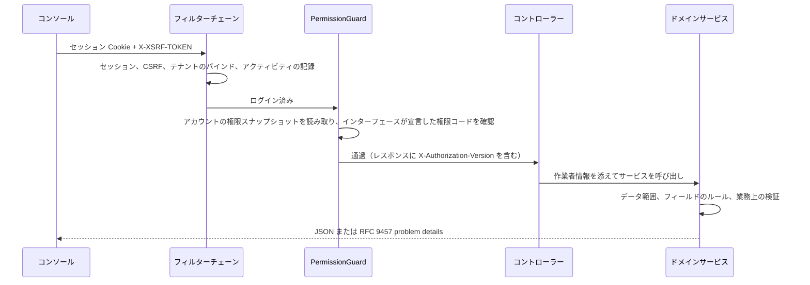

<!--
  Copyright (c) 2026 devlive-community/grantforge

  Licensed under the MIT License. See the LICENSE file in the
  project root for full license text.
-->

GrantForge は Spring Boot 4 アプリケーション（Java 17 バイトコード）であり、ドメインごとに複数の Maven モジュールへ分割され、1 つの実行可能な配布パッケージとしてビルドされます。コンソールは Vue 3 のシングルページアプリケーションで、サーバーが併せて提供します。

## モジュール

サーバーと共有インフラストラクチャは `core/` に、サーバーがロードするサービスタイプのプラグインは `plugins/` に、対象システムへデプロイされる具体的なエージェントは `agents/` にあります。`core/grantforge-agent-core` は共有プロトコルとランタイムを提供し、`agents/grantforge-agent-hdfs-*` は HDFS NameNode 向けの権限付与アダプターを提供します。

| モジュール | 役割 |
| --- | --- |
| `grantforge-common` | エラーコードと problem details モデル、CSV、インターフェースのアクセスアノテーション（`@PublicEndpoint`、`@AuthenticatedEndpoint`、`@RequirePermission`、`@RequireStepUp`） |
| `grantforge-persistence` | エンティティの基底クラス、テナントフィルター、TSID の生成、Liquibase の型、`@SecuredEntity`/`@SecuredField` と行・フィールドの権限 SPI |
| `grantforge-audit` | 監査イベントの記録、検索、保持とアーカイブ |
| `grantforge-identity` | テナント、アカウント、部門、ユーザーグループ、職位、パスワードポリシー、ログインとセッション、二段階認証、アイデンティティソース |
| `grantforge-authz` | アプリケーションとリソースカタログ、API カタログ、ロール、権限付与、継承、割り当て、評価、データとフィールドのポリシー、職務分離、権限申請と再確認 |
| `grantforge-plugin-api` / `plugin-host` | サービスタイプのプラグインのコントラクト、プラグインのロード、分離と呼び出し |
| `grantforge-policy-engine` | 外部システムのポリシーを評価するエンジン（Java 8 API、エージェントへ組み込み可能） |
| `grantforge-agent-core` | エージェントが共有する設定、署名付きスナップショット、アクセス判定と監査の報告（`core/` に配置） |
| `grantforge-service` | データサービス、ポリシー、ポリシースナップショットの署名と配布、エージェントとアクセスの監査 |
| `grantforge-oauth` | Spring Authorization Server を基盤とした OAuth 2.1 / OIDC サーバー、トークンの保存と署名鍵 |
| `grantforge-server` | すべてのモジュールを組み立てます。REST コントローラー、セキュリティ設定、オープン API、起動時の同期 |
| `grantforge-web` | Vue 3 + Vite + Tailwind のコンソール |
| `plugins/` | サーバーがロードするサービスタイプのプラグイン、例: `grantforge-plugin-hdfs` |
| `agents/` | 対象システム内で実行される具体的なエージェント、例: `grantforge-agent-hdfs` |
| `sdk/` | `grantforge-spring-boot-starter` と `@grantforge/client` |

上の図はモジュール間の依存関係です（common や persistence などの下位層はすべてのモジュールから依存されるため、図では繰り返しの辺を省略しています）。ポリシーエンジンは他のモジュールに依存せず、対象システム内のエージェントへ組み込まれます。各モジュールの ArchUnit テストは併せて共通の規約も守ります。フィールドインジェクションを使わない、ネイティブ SQL を書かない、エンティティを API に露出しない、すべてのパッケージをデフォルトで非 null にする、などです。

## リクエスト 1 件の処理の流れ

- コントローラーの各メソッドはアクセス方式（公開、ログイン済みであれば使用可能、権限コードが必要）を必ず宣言する必要があり、宣言のないメソッドがあるとサーバーは起動できません。
- 権限コードは同時に API リソースとしても登録されるため、インターフェースの権限付与もリソースカタログで管理します。
- エラーはすべて RFC 9457 problem details に統一され、安定した `code`、ローカライズされた `detail`、`requestId` を含みます。[エラーコード](/ja/reference/errors/) を参照してください。

## 技術選定

| 領域 | 選定 |
| --- | --- |
| ランタイム | Java 17 バイトコード、JDK 21 でビルド。Spring Boot 4.1、Spring Security 7、Spring Authorization Server |
| 永続化 | Hibernate 7 + Spring Data JPA。Liquibase YAML マイグレーション。Hibernate はテーブル構造のみを検証 |
| ID | TSID（時刻順の 64 ビット ID）、外部へは常に文字列として受け渡し |
| セッション | Spring Session JDBC、クラスター全体で共有 |
| フロントエンド | Vue 3、Pinia、Vue Router、Tailwind CSS 4、Vite、TypeScript の厳密モード |
| 品質 | Error Prone + NullAway、Checkstyle、PMD、SpotBugs、ArchUnit、JaCoCo のカバレッジしきい値、ESLint、vue-tsc |
| テスト | JUnit 5、jqwik、Testcontainers（6 種のデータベース）、Vitest、Playwright のフルスタックとサンプルのエンドツーエンドテスト、JMH と百万規模のベンチマーク |
