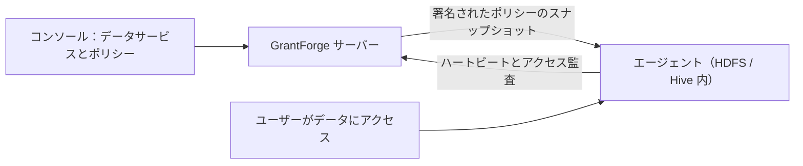

<!--
  Copyright (c) 2026 devlive-community/grantforge

  Licensed under the MIT License. See the LICENSE file in the
  project root for full license text.
-->

「データ権限」グループは GrantForge 以外のデータシステムの権限を管理します。アーキテクチャは Apache Ranger に似ており、プラグインがサービスタイプを定義し、管理者がコンソールでポリシーを作成し、対象システムにデプロイされたエージェントがポリシーをダウンロードしてローカルでアクセスを判定します。

> [!NOTE]
> 現在のバージョンでは、プラグインフレームワーク、汎用ポリシーエディター、ポリシー配布とアクセス監査、HDFS サービスタイプと Hadoop 2.7、2.10、3.2、3.3、3.4、3.5 向けの番号付き NameNode エージェント、およびサンプルプラグイン（`example`）を提供しています。検証済みの組み合わせは [Apache Hadoop HDFS NameNode エージェント](/ja/external/hdfs-agent/) を参照してください。Hive プラグインは引き続き開発中です。

## プラグイン

**プラットフォーム管理 → プラグイン** には、読み込まれたサービスタイプのプラグインが列挙されます。組み込みのプラグインはサーバーに同梱され、それ以外のプラグインは `plugins` ディレクトリに入れて「再スキャン」を押すだけです。各プラグインは独立して読み込まれるため、エラーが発生してもそのプラグインだけが無効化されます。プラグインの開発については [プラグインとサービスタイプ](/ja/develop/plugins/) を参照してください。

## HDFS

配布パッケージには HDFS サービスタイプのプラグインが含まれます。インストール、接続設定、ディレクトリーの参照、パスポリシーは [Apache Hadoop HDFS](/ja/plugins/hdfs/) を参照してください。

## データサービス

**データ権限 → データサービス**：サービスは GrantForge が権限を管理する外部システムのインスタンス 1 つであり、たとえば HDFS クラスター 1 つです。サービスを追加するときにサービスタイプを選択し、プラグインが定義した設定項目に従って接続情報を入力します。先に **接続テスト** を実行できます。パスワードなどの機密性の高い設定は暗号化して保存され、保存後は表示されません。

## ポリシー

**データ権限 → ポリシー** は、誰がデータサービス内のどのリソースに対して何ができるかを決定します。

- **アクセスポリシー**はアクセスを許可または拒否します。
- **マスキングポリシー**はフィールドを覆い隠します。
- **行フィルタポリシー**は一部の行だけを出します。

リソースの階層（Hive のデータベース、テーブル、列など）、アクセスタイプ（select、update など）、条件は、すべてサービスタイプのプラグインから提供されます。リソースを入力するときは、対象システムに実際に存在するリソースを検索できます。ポリシーの対象はユーザー、ユーザーグループ、またはロールです。

参照できるレベル（HDFS のパスなど）には **参照** ボタンがあります。ディレクトリを階層ごとに開き、所有者・グループ・権限を確認しながら、複数のファイルやディレクトリをまとめて選べます。検索や参照に失敗すると理由（権限なし、接続できない、ディレクトリが大きすぎるなど）が表示され、再試行できます。

## エージェント

**データ権限 → エージェント**：エージェントは対象システムの内部にデプロイされ、トークンで定期的にハートビートを報告し、署名されたポリシーのスナップショットをダウンロードしてローカルでアクセスを判定します。ここではエージェントトークンを発行し（一度だけ表示されます）、各エージェントが最新のポリシーを使えているかを確認します。

## アクセス監査

**データ権限 → アクセス監査**：エージェントが報告するアクセスの判定 1 件ごとに、誰がいつどこからどのリソースに対して何をしたか、許可されたか拒否されたか、どのポリシーが決定したかが記録されます。記録はデフォルトで 90 日間保持されます。

