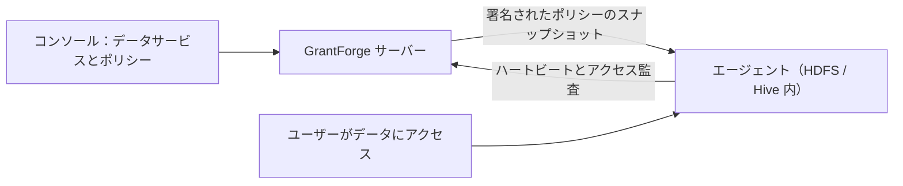

<!--
  Copyright (c) 2026 devlive-community/grantforge

  Licensed under the MIT License. See the LICENSE file in the
  project root for full license text.
-->

「データ権限」グループは GrantForge 以外のデータシステムの権限を管理します。アーキテクチャは Apache Ranger に似ており、プラグインがサービスタイプを定義し、管理者がコンソールでポリシーを作成し、対象システムにデプロイされたエージェントがポリシーをダウンロードしてローカルでアクセスを判定します。

> [!NOTE]
> 現在のバージョンでは、プラグインフレームワーク、汎用のポリシーエディター、ポリシーの配布とアクセス監査、HDFS サービスタイプと Hadoop 3.5.0 NameNode エージェント、およびサンプルプラグイン（`example`）を提供しています。Hive プラグインと他の Hadoop バージョン向けのエージェントは、まだ開発中です。

## プラグイン

**プラットフォーム管理 → プラグイン** には、読み込まれたサービスタイプのプラグインが列挙されます。組み込みのプラグインはサーバーに同梱され、それ以外のプラグインは `plugins` ディレクトリに入れて「再スキャン」を押すだけです。各プラグインは独立して読み込まれるため、エラーが発生してもそのプラグインだけが無効化されます。プラグインの開発については [プラグインとサービスタイプ](/ja/develop/plugins/) を参照してください。

## HDFS

リリースパッケージには HDFS プラグイン（`plugins/hdfs`）が含まれており、サービスタイプは `hdfs` で、Apache Ranger の HDFS サービスと同じです。

- リソースは `path` の 1 種類だけで、パスでマッチします。`/data/sales` はそれ自身とマッチし、「再帰」にチェックを入れるとその配下のすべてのファイルとディレクトリともマッチします。除外にも対応しています。
- アクセスタイプは `read`、`write`、`execute` で、HDFS の権限ビットに対応します。
- プラグインは Hadoop 自身のクライアントでクラスターに接続します。接続テストでは、参照するディレクトリが存在して内容を列挙できるかを確認します。ポリシーを作成するときにパスを入力すると、対応するディレクトリ配下のサブディレクトリとファイルが列挙され、ディレクトリがファイルより前に表示されます。
- サーバー側のプラグインが管理と参照を担当します。ポリシーで HDFS アクセスを実際に制限するには、[Apache Hadoop HDFS NameNode エージェント](/ja/external/hdfs-agent/) もデプロイする必要があります。

| 設定 | 説明 |
| --- | --- |
| `username` | ディレクトリを参照するユーザー。Kerberos の場合は principal。例：`grantforge@EXAMPLE.COM` |
| `password` / `keytab` | Kerberos の場合はどちらか一方。principal のパスワード、または GrantForge サーバー上にある keytab ファイルのパス |
| `fs.default.name` | `hdfs://namenode:8020`、高可用性の `hdfs://nameservice1`、または `webhdfs://namenode:9870` |
| `hadoop.security.authentication` | `simple` または `kerberos` |
| `hadoop.security.authorization`、`hadoop.security.auth_to_local` | クラスターの core-site.xml と同じにします |
| `dfs.namenode.kerberos.principal` など | NameNode、DataNode、Secondary NameNode の principal。例：`nn/_HOST@EXAMPLE.COM` |
| `hadoop.rpc.protection` | `authentication`、`integrity` または `privacy`。クラスターと同じにします |
| 追加の Hadoop 設定 | 1 行に `key=value` を 1 つずつ記述し、高可用性などその他の設定に使います。例：`dfs.nameservices=nameservice1`、`dfs.ha.namenodes.nameservice1=nn1,nn2`、`dfs.namenode.rpc-address.nameservice1.nn1=nn1:8020`、`dfs.client.failover.proxy.provider.nameservice1=org.apache.hadoop.hdfs.server.namenode.ha.ConfiguredFailoverProxyProvider` |
| `lookup.path` | 参照するディレクトリ。デフォルトは `/`。たとえば `/data` に設定すると、空入力では `/data` の内容が列挙され、相対入力はここから補完されます。参照ユーザーにルートディレクトリを列挙する権限がないクラスターに向いています |
| `lookup.max.entries` | 1 回のディレクトリ参照でスキャンするエントリの最大数。デフォルトは `10000`、範囲は `1..100000`。上限を超えるとエラーを返すため、候補が静かに見落とされることはありません |

追加の Hadoop 設定は同名の接続設定を上書きし、設定の検証とログインはいずれも上書き後の値を使用します。`fs.defaultFS` と `fs.default.name` は別名であり、追加設定ではどちらか一方しか設定できません。キーの重複、クラスターアドレスではないアドレス、資格情報のない Kerberos 設定は、保存時に拒否されます。クラスターアドレスにはクラスター URI のみを記述し、参照するサブディレクトリは `lookup.path` に置いてください。

`lookup.path` はパスの候補を閲覧する範囲を制限するだけで、HDFS 自身のアクセス制御を置き換えるものではありません。シンボリックリンクと ViewFS のマウントは、依然としてクラスターの設定に従います。入力では先頭の `/` を省略でき、`/` と `.` の繰り返しは許可され、`..` と範囲外の絶対パスは拒否されます。存在しないディレクトリでは空の候補が返り、権限が不足している場合や接続に失敗した場合はエラーが表示されます。

Kerberos を使う場合、GrantForge サーバーは KDC を見つけられる必要があります。`/etc/krb5.conf` を設定するか、`-Djava.security.krb5.conf=` で指定してください。

## データサービス

**データ権限 → データサービス**：サービスは GrantForge が権限を管理する外部システムのインスタンス 1 つであり、たとえば HDFS クラスター 1 つです。サービスを追加するときにサービスタイプを選択し、プラグインが定義した設定項目に従って接続情報を入力します。先に **接続テスト** を実行できます。パスワードなどの機密性の高い設定は暗号化して保存され、保存後は表示されません。

## ポリシー

**データ権限 → ポリシー** は、誰がデータサービス内のどのリソースに対して何ができるかを決定します。

- **アクセスポリシー**はアクセスを許可または拒否します。
- **マスキングポリシー**はフィールドを覆い隠します。
- **行フィルタポリシー**は一部の行だけを出します。

リソースの階層（Hive のデータベース、テーブル、列など）、アクセスタイプ（select、update など）、条件は、すべてサービスタイプのプラグインから提供されます。リソースを入力するときは、対象システムに実際に存在するリソースを検索できます。ポリシーの対象はユーザー、ユーザーグループ、またはロールです。

参照できるレベル（HDFS のパスなど）には **参照** ボタンがあります。ディレクトリを階層ごとに開き、所有者・グループ・権限を確認しながら、複数のファイルやディレクトリをまとめて選べます。検索や参照に失敗すると理由（権限なし、接続できない、ディレクトリが大きすぎるなど）が表示され、再試行できます。

## エージェント

**データ権限 → エージェント**：エージェントは対象システムの内部にデプロイされ、トークンで定期的にハートビートを報告し、署名されたポリシーのスナップショットをダウンロードしてローカルでアクセスを判定します。ここではエージェントトークンを発行し（一度だけ表示されます）、各エージェントが最新のポリシーを使えているかを確認します。

## アクセス監査

**データ権限 → アクセス監査**：エージェントが報告するアクセスの判定 1 件ごとに、誰がいつどこからどのリソースに対して何をしたか、許可されたか拒否されたか、どのポリシーが決定したかが記録されます。記録はデフォルトで 90 日間保持されます。

