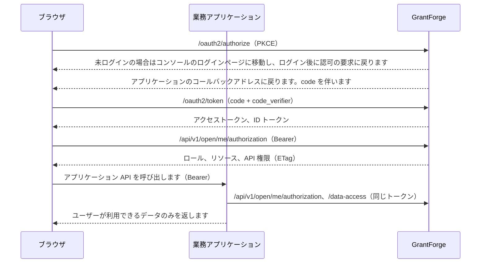

<!--
  Copyright (c) 2026 devlive-community/grantforge

  Licensed under the MIT License. See the LICENSE file in the
  project root for full license text.
-->

GrantForge は業務アプリケーションに対して 2 つの顔を持ちます。

- **認可サーバー**（OAuth 2.1 / OpenID Connect）：ユーザーは GrantForge にログインし、アプリケーションはアクセストークンと ID トークンを取得します。
- **権限センター**：アプリケーションは同じトークンで GrantForge に、このユーザーがこのアプリケーションでどのようなロール、リソース（メニュー、ページ、ボタン）、API 権限、データ範囲を持つかを問い合わせます。

## 概念の対応

| 概念 | 設定する場所 | 説明 |
| --- | --- | --- |
| アプリケーション | プラットフォーム管理 → リソースカタログ | 1 つの業務システム。例: `shop` |
| リソース | リソースカタログ内のアプリケーションのリソースツリー | モジュール、メニュー、ページ、ボタン、API。ページとボタンはインターフェースを制御し、API リソースは API 権限のコードです（例: `orders.read`） |
| クライアント | リソースカタログ → アプリケーションの「OAuth クライアント」 | アプリケーションがユーザーをログインさせ、トークンを取得するためのアイデンティティです。ブラウザアプリケーションは**公開クライアント**、サーバー側アプリケーションは**機密クライアント**を使います |
| scope | クライアントの設定 | `openid`、`profile`、`email` はログイン用です。`permissions` はトークンで権限を照会できるようにし、`catalog` はアプリケーションが自身のアイデンティティでデータエンティティを宣言できるようにします |
| ロールと権限付与 | アクセス制御 → ロール管理 | アプリケーションのリソースをロールに付与し、ロールをユーザー、ユーザーグループ、部門または職位に割り当てます |
| データポリシー | ロール → データ権限 | アプリケーションが宣言したエンティティ（`<アプリケーションコード>:<エンティティ>`）も、コンソール自身のエンティティと同じように設定します: すべて、自テナント全体、本人のみ、部門、指定部門、または条件別 |

テナント管理者（システムロールを保持する人）は、業務アプリケーションのどのリソースでも自テナントのロールに付与できます。コンソール自身の権限は、引き続き自分が持っている範囲までしか付与できません。

## 流れ

## 連携の手順

1. **プラットフォーム管理 → リソースカタログ** でアプリケーションを新規作成し、ページ、ボタン、API のリソースを用意します。
2. アプリケーションのクライアントを登録します。ブラウザアプリケーションは「公開」、サーバー側アプリケーションは「機密」を選択し、コールバックアドレスにはアプリケーションのログインコールバックを入力し、scope は少なくとも `openid` と `permissions` を選択します。機密クライアントのシークレットは一度だけ表示されます。
3. **アクセス制御 → ロール管理** でロールを作成し、権限を付与して、ユーザーに割り当てます。
4. アプリケーションに SDK を連携します。Java は [Java SDK](/ja/integration/java/)、ブラウザは [JavaScript SDK](/ja/integration/javascript/) を参照し、プロトコルの詳細は [OAuth 2.1 と OpenID Connect](/ja/integration/oauth/) と [権限照会用のオープン API](/ja/integration/open-api/) を参照してください。

リポジトリの `samples/` には 2 つの完全なサンプル（ショップとノート）があり、エンドツーエンドのテストでカバーされています。[サンプルアプリケーション](/ja/integration/samples/) を参照してください。
