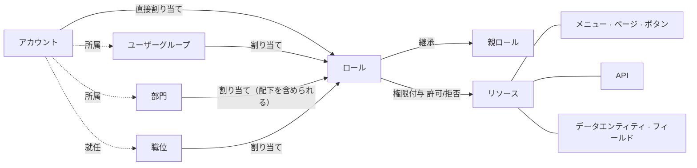

<!--
  Copyright (c) 2026 devlive-community/grantforge

  Licensed under the MIT License. See the LICENSE file in the
  project root for full license text.
-->

GrantForge のモデルは、次の 1 文にまとめられます。**アカウントは割り当てによってロールを得て、ロールはリソースに権限を付与し、評価のときにその権限付与をマージしてアカウントの有効な権限を作ります。**

## テナント

テナントはデータ分離の境界です。各テナントは自分自身のアカウント、組織、ロール、権限付与を持ち、互いに見ることはできません。初期化時に作成される最初のテナントは**プラットフォームテナント**であり、その管理者は他のテナント、リソースカタログ、認可サーバーも管理できます。1 つの組織だけにサービスを提供する場合は、このテナント 1 つだけを使えます。

## アカウントと組織

- **アカウント**：ログインの主体であり、ユーザー名はプラットフォーム全体で一意です。アカウントはローカル（パスワードは GrantForge に保存）のものと、アイデンティティソース（LDAP または OIDC。パスワードはアイデンティティソースが管理）のものがあります。
- **部門**：ツリー構造であり、各アカウントには主部門が 1 つあり、他の部門を兼務できます。
- **ユーザーグループ**：組織構造とは無関係な人の集まりです。例えば「当番グループ」などです。
- **職位**：職務です。例えば「財務マネージャー」のように、1 つのアカウントが複数の職位を担当できます。

## リソース

リソースとは「権限を付与できるもの」であり、アプリケーションごとにツリーを構成します。

| タイプ | 説明 |
| --- | --- |
| モジュール、メニュー | ページをまとめるグループ |
| ページ、タブ | コンソールまたはアプリケーション内の 1 つのページ、ページ上の 1 つのタブ |
| ボタン | ページ上の 1 つの操作。例えば「ユーザー削除」 |
| API | REST インターフェース。例: `api:GET:/api/v1/users` |
| データエンティティ、フィールド | 行の範囲を限定できる業務エンティティと、その中で非表示またはマスクにできるフィールド |

リソースの間には**依存関係**を持たせられます。ボタンは自分が呼び出す API を必要とし、ページはデータを読み込む API を必要とします。ページやボタンに権限を付与すると、依存関係も一緒に含まれるため、「ボタンは見えるのに押すと権限がないとエラーになる」という事態を防げます。

GrantForge コンソール自体も 1 つのアプリケーションです。コンソールのページ、ボタン、API は起動時にリソースカタログへ自動登録されるため、コンソールの権限もロールによって決まります。

## ロール、権限付与と割り当て

- **ロール**：権限付与のまとまりに付けた名前です。**システムロール**（テナント管理者、プラットフォーム管理者）はテナントとともに作成され、モジュール全体の権限を持ち、変更はできません。それ以外はすべてカスタムロールです。
- **権限付与**：ロールがリソースに対して行う「許可」または「拒否」です。拒否は許可より優先されます。
- **継承**：ロールは他のロールの権限付与をすべて継承できます。継承関係が循環することは認められません。
- **割り当て**：ロールをアカウント、ユーザーグループ、部門（配下の部門を含められる）または職位に渡すことです。有効開始時刻と有効終了時刻を設定できます。

## 評価

権限を判定する必要があるとき、GrantForge はアカウントのすべての有効なロール（直接割り当てられたロール、グループ・部門・職位を経由して得たロール、継承によって得たロールのうち、有効期間内にあり、ロールが有効化されているもの）を探し、それらの権限付与をマージして、次を導き出します。

- 使用可能なリソース（ページ、ボタン、API）。
- 各データエンティティを読み取り・変更・削除・エクスポートするときの行の範囲。
- 各フィールドの読み取りと書き込みの方法（表示、マスク、非表示。編集可能、読み取り専用）。

結果にはバージョン番号が付きます。権限付与、割り当て、カタログのいずれかが変化するとバージョン番号が変わり、コンソールと SDK はそれを見てキャッシュを更新します。詳細なルールは [権限モデル](/ja/architecture/permission-model/) を参照してください。
