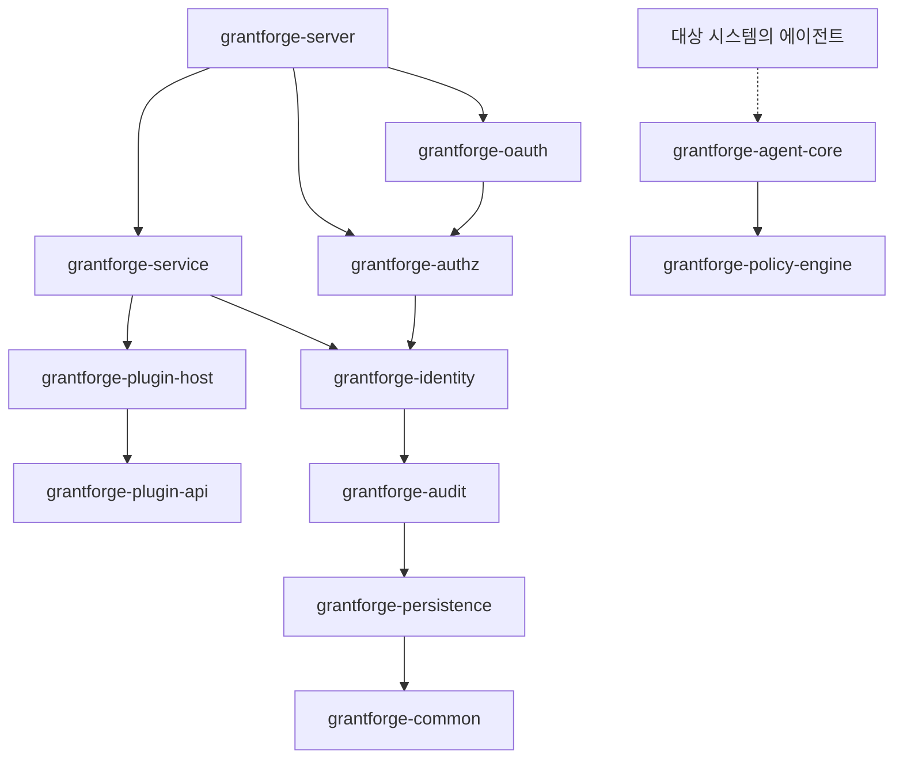
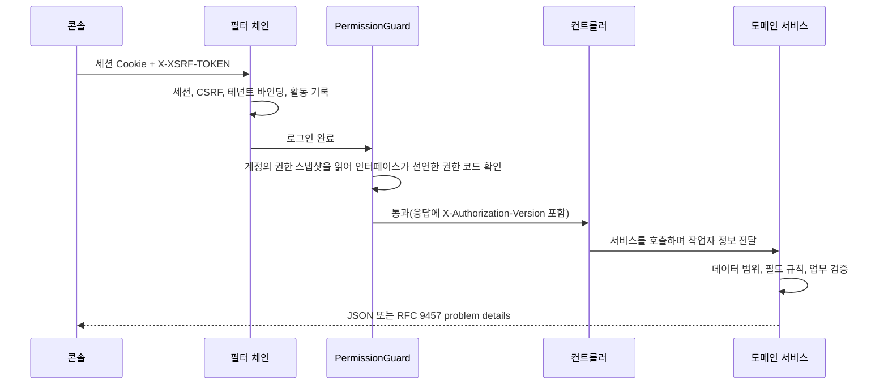

<!--
  Copyright (c) 2026 devlive-community/grantforge

  Licensed under the MIT License. See the LICENSE file in the
  project root for full license text.
-->

GrantForge는 Spring Boot 4 애플리케이션(Java 17 바이트코드)으로, 도메인별로 여러 Maven 모듈로 나뉘어 하나의 실행 가능한 배포 패키지로 빌드됩니다. 콘솔은 Vue 3 단일 페이지 애플리케이션이며 서버가 함께 제공합니다.

## 모듈

서버와 공유 인프라는 `core/`에 있고, 서버가 로드하는 서비스 타입 플러그인은 `plugins/`에, 대상 시스템에 배포되는 구체적인 에이전트는 `agents/`에 있습니다. `core/grantforge-agent-core`는 공유 프로토콜과 런타임을 제공하고, `agents/grantforge-agent-hdfs-*`는 HDFS NameNode용 권한 부여 어댑터를 제공합니다.

| 모듈 | 역할 |
| --- | --- |
| `grantforge-common` | 오류 코드와 problem details 모델, CSV, 인터페이스 접근 어노테이션(`@PublicEndpoint`, `@AuthenticatedEndpoint`, `@RequirePermission`, `@RequireStepUp`) |
| `grantforge-persistence` | 엔터티 기반 클래스, 테넌트 필터, TSID 생성, Liquibase 타입, `@SecuredEntity`/`@SecuredField`와 행/필드 권한 SPI |
| `grantforge-audit` | 감사 이벤트의 기록, 조회, 보관과 아카이브 |
| `grantforge-identity` | 테넌트, 계정, 부서, 사용자 그룹, 직위, 비밀번호 정책, 로그인과 세션, 2단계 인증, 신원 소스 |
| `grantforge-authz` | 애플리케이션과 리소스 카탈로그, API 카탈로그, 역할, 권한 부여, 상속, 배정, 평가, 데이터와 필드 정책, 직무 분리, 권한 요청과 검토 |
| `grantforge-plugin-api` / `plugin-host` | 서비스 타입 플러그인의 계약, 플러그인의 로드, 격리와 호출 |
| `grantforge-policy-engine` | 외부 시스템 정책의 평가 엔진(Java 8 API, 에이전트에 내장 가능) |
| `grantforge-agent-core` | 에이전트가 공유하는 설정, 서명된 스냅샷, 접근 판정과 감사 보고(`core/`에 위치) |
| `grantforge-service` | 데이터 서비스, 정책, 정책 스냅샷 서명과 배포, 에이전트와 접근 감사 |
| `grantforge-oauth` | Spring Authorization Server를 기반으로 한 OAuth 2.1 / OIDC 서버, 토큰 저장과 서명 키 |
| `grantforge-server` | 모든 모듈을 조립합니다. REST 컨트롤러, 보안 설정, Open API, 시작 시 동기화 |
| `grantforge-web` | Vue 3 + Vite + Tailwind 콘솔 |
| `plugins/` | 서버가 로드하는 서비스 타입 플러그인, 예: `grantforge-plugin-hdfs` |
| `agents/` | 대상 시스템 안에서 실행되는 구체적인 에이전트, 예: `grantforge-agent-hdfs` |
| `sdk/` | `grantforge-spring-boot-starter`와 `@grantforge/client` |

위 그림은 모듈 사이의 의존 관계입니다(하위 계층의 common, persistence 등은 모든 모듈이 의존하므로, 그림에서 반복되는 화살표는 생략했습니다). 정책 엔진은 다른 모듈에 의존하지 않으며 대상 시스템의 에이전트가 내장합니다. 각 모듈의 ArchUnit 테스트는 공통 규칙도 함께 지킵니다. 필드 주입 금지, 네이티브 SQL 금지, 엔터티가 API에 노출되지 않음, 모든 패키지의 기본 non-null 등입니다.

## 요청 하나의 처리 과정

- 모든 컨트롤러 메서드는 접근 방식을 선언해야 합니다(공개, 로그인만 하면 사용 가능, 권한 코드 필요). 선언하지 않은 메서드가 있으면 서버가 시작되지 않습니다.
- 권한 코드는 동시에 API 리소스로도 등록되므로, 인터페이스의 권한 부여도 리소스 카탈로그에서 관리합니다.
- 오류는 모두 RFC 9457 problem details로 통일되며, 안정적인 `code`, 지역화된 `detail`, `requestId`를 포함합니다. [오류 코드](/ko/reference/errors/)를 참고하세요.

## 기술 선택

| 영역 | 선택 |
| --- | --- |
| 런타임 | Java 17 바이트코드, JDK 21로 빌드; Spring Boot 4.1, Spring Security 7, Spring Authorization Server |
| 영속성 | Hibernate 7 + Spring Data JPA; Liquibase YAML 마이그레이션; Hibernate는 테이블 구조만 검증 |
| ID | TSID(시간 순서가 있는 64비트 ID), 외부에는 항상 문자열로 전달 |
| 세션 | Spring Session JDBC, 클러스터 간 공유 |
| 프론트엔드 | Vue 3, Pinia, Vue Router, Tailwind CSS 4, Vite, TypeScript 엄격 모드 |
| 품질 | Error Prone + NullAway, Checkstyle, PMD, SpotBugs, ArchUnit, JaCoCo 커버리지 임계값, ESLint, vue-tsc |
| 테스트 | JUnit 5, jqwik, Testcontainers(데이터베이스 6종), Vitest, Playwright 전체 스택과 예제 엔드투엔드 테스트, JMH와 백만 규모 벤치마크 |
