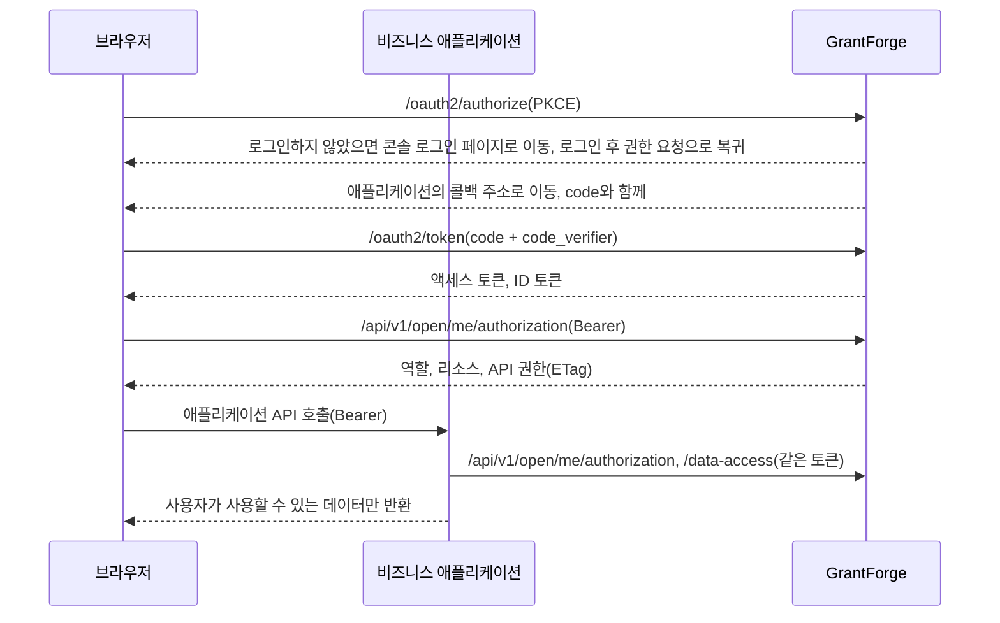

<!--
  Copyright (c) 2026 devlive-community/grantforge

  Licensed under the MIT License. See the LICENSE file in the
  project root for full license text.
-->

GrantForge는 비즈니스 애플리케이션에 두 가지 역할을 합니다.

- **권한 부여 서버**(OAuth 2.1 / OpenID Connect): 사용자는 GrantForge에서 로그인하고, 애플리케이션은 액세스 토큰과 ID 토큰을 받습니다.
- **권한 센터**: 애플리케이션은 같은 토큰으로 GrantForge에 이 사용자가 본 애플리케이션에서 어떤 역할, 리소스(메뉴, 페이지, 버튼), API 권한, 데이터 범위를 갖는지 질의합니다.

## 개념 대응

| 개념 | 설정 위치 | 설명 |
| --- | --- | --- |
| 애플리케이션 | 플랫폼 관리 → 리소스 카탈로그 | 비즈니스 시스템 하나, 예: `shop` |
| 리소스 | 리소스 카탈로그에 있는 애플리케이션의 리소스 트리 | 모듈, 메뉴, 페이지, 버튼, API. 페이지와 버튼은 인터페이스를 제어하고, API 리소스는 API 권한 코드입니다(예: `orders.read`) |
| 클라이언트 | 리소스 카탈로그 → 애플리케이션의 "OAuth 클라이언트" | 애플리케이션이 사용자를 로그인시키고 토큰을 얻는 신원. 브라우저 애플리케이션은 **공개 클라이언트**, 서버 측 애플리케이션은 **기밀 클라이언트**를 사용합니다 |
| scope | 클라이언트 설정 | `openid`, `profile`, `email`은 로그인용이며, `permissions`는 토큰으로 권한을 조회할 수 있게 하고, `catalog`는 애플리케이션이 자신의 신원으로 데이터 엔터티를 선언할 수 있게 합니다 |
| 역할과 권한 부여 | 접근 제어 → 역할 관리 | 애플리케이션의 리소스를 역할에 부여하고, 역할을 사용자, 사용자 그룹, 부서 또는 직위에 할당합니다 |
| 데이터 정책 | 역할 → 데이터 권한 | 애플리케이션이 선언한 엔터티(`<애플리케이션 코드>:<엔터티>`)도 콘솔 자체의 엔터티와 같은 방식으로 설정합니다: 전체, 본 테넌트 전체, 본인만, 부서, 지정 부서 또는 조건별 |

테넌트 관리자(시스템 역할을 가진 사람)는 비즈니스 애플리케이션의 어떤 리소스든 본인 테넌트의 역할에 부여할 수 있습니다. 콘솔 자체의 권한은 여전히 자신이 가진 부분까지만 부여할 수 있습니다.

## 흐름

## 연동 단계

1. **플랫폼 관리 → 리소스 카탈로그**에서 애플리케이션을 만들고 페이지, 버튼, API 리소스를 구성합니다.
2. 애플리케이션용 클라이언트를 등록합니다. 브라우저 애플리케이션은 "공개", 서버 측 애플리케이션은 "기밀"을 선택하고, 콜백 주소에는 애플리케이션의 로그인 콜백을 입력하며, scope는 최소한 `openid`와 `permissions`를 선택합니다. 기밀 클라이언트의 시크릿은 한 번만 표시됩니다.
3. **접근 제어 → 역할 관리**에서 역할을 만들고 권한을 부여한 뒤 사용자에게 할당합니다.
4. 애플리케이션에 SDK를 연동합니다. Java는 [Java SDK](/ko/integration/java/), 브라우저는 [JavaScript SDK](/ko/integration/javascript/)를 참고하고, 프로토콜 세부 사항은 [OAuth 2.1과 OpenID Connect](/ko/integration/oauth/)와 [권한 조회 오픈 API](/ko/integration/open-api/)를 참고하세요.

저장소의 `samples/`에는 두 개의 완전한 예제(상점과 노트)가 있고 엔드투엔드 테스트로 검증됩니다. [예제 애플리케이션](/ko/integration/samples/)을 참고하세요.
