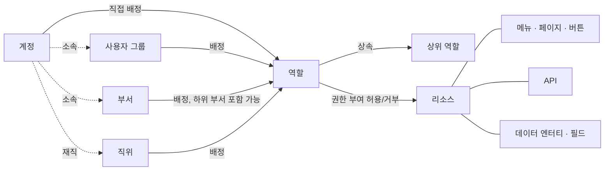

<!--
  Copyright (c) 2026 devlive-community/grantforge

  Licensed under the MIT License. See the LICENSE file in the
  project root for full license text.
-->

GrantForge의 모델은 한 문장으로 요약할 수 있습니다. **계정은 배정을 통해 역할을 얻고, 역할은 리소스에 권한을 부여하며, 평가할 때 이 권한 부여를 병합해 계정의 유효 권한을 만듭니다.**

## 테넌트

테넌트는 데이터 격리의 경계입니다. 각 테넌트는 고유한 계정, 조직, 역할, 권한 부여를 가지며 서로 볼 수 없습니다. 초기화 시 생성되는 첫 테넌트는 **플랫폼 테넌트**이며, 이 테넌트의 관리자는 다른 테넌트와 리소스 카탈로그, 권한 부여 서버도 관리할 수 있습니다. 조직 하나만 서비스할 때는 이 테넌트 하나만 사용해도 됩니다.

## 계정과 조직

- **계정**: 로그인 주체이며, 사용자명은 플랫폼 전체에서 고유합니다. 계정은 로컬(비밀번호는 GrantForge에 저장)에서 올 수도 있고, 신원 소스(LDAP 또는 OIDC, 비밀번호는 신원 소스가 관리)에서 올 수도 있습니다.
- **부서**: 트리 구조이며, 모든 계정에는 주 부서가 하나 있고 다른 부서를 겸할 수 있습니다.
- **사용자 그룹**: 조직 구조와 무관한 사람들의 모임입니다. 예를 들어 "당직 그룹"이 있습니다.
- **직위**: 직책입니다. 예를 들어 "재무 관리자"가 있으며, 한 계정이 여러 직위를 맡을 수 있습니다.

## 리소스

리소스는 "권한을 부여할 수 있는 대상"이며, 애플리케이션 단위로 트리를 이룹니다.

| 타입 | 설명 |
| --- | --- |
| 모듈, 메뉴 | 페이지를 묶는 그룹 |
| 페이지, 탭 | 콘솔 또는 애플리케이션에 있는 페이지 하나, 페이지 위의 탭 하나 |
| 버튼 | 페이지 위의 동작 하나. 예를 들어 "사용자 삭제" |
| API | REST 인터페이스 하나. 예: `api:GET:/api/v1/users` |
| 데이터 엔터티, 필드 | 행 범위를 제한할 수 있는 비즈니스 엔터티와 그 안에서 숨기거나 마스킹할 수 있는 필드 |

리소스 사이에는 **종속** 관계가 있을 수 있습니다. 버튼은 자신이 호출하는 API를 필요로 하고, 페이지는 데이터를 불러오는 API를 필요로 합니다. 페이지나 버튼에 권한을 부여할 때 종속성이 함께 따라오므로, "버튼은 보이는데 누르면 권한이 없다는 오류가 나오는" 상황을 막을 수 있습니다.

GrantForge 콘솔 자체도 하나의 애플리케이션입니다. 콘솔의 페이지, 버튼, API는 시작할 때 리소스 카탈로그에 자동으로 등록되므로, 콘솔에 대한 권한도 역할이 결정합니다.

## 역할, 권한 부여와 배정

- **역할**: 권한 부여 묶음에 붙인 이름입니다. **시스템 역할**(테넌트 관리자, 플랫폼 관리자)은 테넌트와 함께 만들어지며, 해당 모듈의 모든 권한을 가지고 수정할 수 없습니다. 그 밖의 역할은 모두 사용자 정의 역할입니다.
- **권한 부여**: 리소스에 대한 역할의 "허용" 또는 "거부"입니다. 거부가 허용보다 우선합니다.
- **상속**: 역할은 다른 역할의 권한 부여를 모두 상속할 수 있으며, 상속 관계에 순환은 허용되지 않습니다.
- **배정**: 역할을 계정, 사용자 그룹, 부서(하위 부서 포함 가능) 또는 직위에 맡기는 것입니다. 적용 시작 시각과 만료 시각을 지정할 수 있습니다.

## 평가

권한을 판단해야 할 때 GrantForge는 계정의 모든 유효 역할(직접 배정된 역할, 그룹/부서/직위를 통해 얻은 역할, 상속으로 얻은 역할 중 유효 기간 안에 있고 역할이 사용 설정된 것)을 찾아 권한 부여를 병합하고 다음을 도출합니다.

- 사용 가능한 리소스(페이지, 버튼, API);
- 각 데이터 엔터티를 읽기, 수정, 삭제, 내보내기할 때의 행 범위;
- 각 필드의 읽기와 쓰기 방식(표시, 마스킹, 숨김, 편집 가능, 읽기 전용).

결과에는 버전 번호가 붙습니다. 권한 부여, 배정, 카탈로그 중 하나라도 바뀌면 버전 번호가 바뀌고, 콘솔과 SDK는 이를 보고 캐시를 새로 고칩니다. 자세한 규칙은 [권한 모델](/ko/architecture/permission-model/)을 참고하세요.
