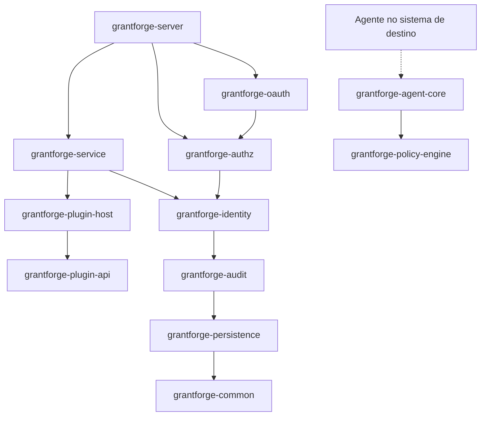
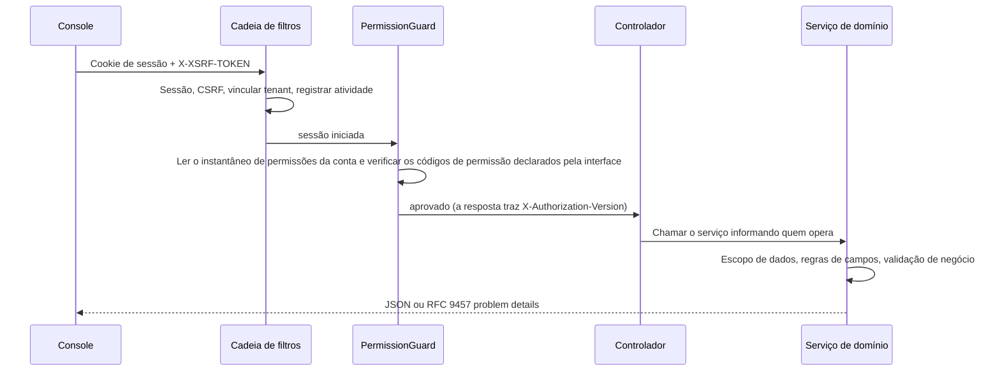

<!--
  Copyright (c) 2026 devlive-community/grantforge

  Licensed under the MIT License. See the LICENSE file in the
  project root for full license text.
-->

O GrantForge é uma aplicação Spring Boot 4 (bytecode Java 17), dividida em vários módulos Maven por domínio e empacotada em um único pacote de lançamento executável; o console é uma aplicação de página única Vue 3 que o servidor disponibiliza junto com o restante.

## Módulos

O servidor e a infraestrutura compartilhada ficam em `core/`, os plug-ins de tipo serviço carregados pelo servidor ficam em `plugins/`, e os agentes concretos que são implantados nos sistemas de destino ficam em `agents/`. O `core/grantforge-agent-core` fornece o protocolo compartilhado e o runtime, e o `agents/grantforge-agent-hdfs-*` fornece o adaptador de autorização para o NameNode do HDFS.

| Módulo | Responsabilidade |
| --- | --- |
| `grantforge-common` | Códigos de erro e modelo de problem details, CSV, anotações de acesso a interfaces (`@PublicEndpoint`, `@AuthenticatedEndpoint`, `@RequirePermission`, `@RequireStepUp`) |
| `grantforge-persistence` | Classe base das entidades, filtro de tenants, geração de TSID, tipos do Liquibase, `@SecuredEntity`/`@SecuredField` e o SPI de permissões sobre linhas e campos |
| `grantforge-audit` | Registro, consulta, retenção e arquivamento dos eventos de auditoria |
| `grantforge-identity` | Tenants, contas, departamentos, grupos, cargos, política de senhas, login e sessões, autenticação de dois fatores, fontes de identidade |
| `grantforge-authz` | Catálogo de aplicações e recursos, catálogo de API, papéis, permissões, herança, atribuições, avaliação, políticas de dados e de campos, separação de funções, solicitações de acesso e revisões |
| `grantforge-plugin-api` / `plugin-host` | O contrato dos plug-ins de tipo serviço, além do carregamento, do isolamento e da invocação dos plug-ins |
| `grantforge-policy-engine` | Motor de avaliação de políticas de sistemas externos (API Java 8, que pode ser embutido nos agentes) |
| `grantforge-agent-core` | Configurações compartilhadas pelos agentes, instantâneos assinados, decisões de acesso e envio de auditoria (fica em `core/`) |
| `grantforge-service` | Serviços de dados, políticas, assinatura e distribuição dos instantâneos de política, agentes e auditoria de acessos |
| `grantforge-oauth` | Servidor OAuth 2.1 / OIDC baseado no Spring Authorization Server, armazenamento de tokens e chaves de assinatura |
| `grantforge-server` | Reúne todos os módulos: controladores REST, configuração de segurança, API aberta, sincronização na inicialização |
| `grantforge-web` | O console Vue 3 + Vite + Tailwind |
| `plugins/` | Plug-ins de tipo serviço carregados pelo servidor, como o `grantforge-plugin-hdfs` |
| `agents/` | Agentes concretos que rodam dentro dos sistemas de destino, como o `grantforge-agent-hdfs` |
| `sdk/` | `grantforge-spring-boot-starter` e `@grantforge/client` |

O diagrama acima mostra as dependências entre os módulos (as camadas mais baixas, como common e persistence, são dependências de todos os módulos, e essas arestas repetidas foram omitidas do diagrama). O motor de políticas não depende de nenhum outro módulo, para que os agentes dos sistemas de destino possam embutí-lo. Os testes de ArchUnit de cada módulo guardam ainda as convenções comuns: não usar injeção por campos, não escrever SQL nativo, não deixar que entidades apareçam na API, que todos os pacotes sejam não nulos por padrão, entre outras.

## O caminho de uma requisição

- Todo método de controlador precisa declarar sua forma de acesso (público, apenas com sessão iniciada, ou exigindo um código de permissão); um método sem declaração impede que o servidor inicie.
- Os códigos de permissão também são registrados como recursos de API, de modo que a autorização de uma interface também é gerenciada no catálogo de recursos.
- Os erros são unificados como RFC 9457 problem details, com `code` estável, `detail` localizado e `requestId`; consulte os [códigos de erro](/pt-br/reference/errors/).

## Escolhas de tecnologia

| Área | Escolha |
| --- | --- |
| Runtime | Bytecode Java 17, compilado com JDK 21; Spring Boot 4.1, Spring Security 7, Spring Authorization Server |
| Persistência | Hibernate 7 + Spring Data JPA; migrações YAML do Liquibase; o Hibernate apenas valida a estrutura das tabelas |
| Identificadores | TSID (identificadores de 64 bits ordenados por tempo), que para fora são sempre transmitidos como texto |
| Sessões | Spring Session JDBC, compartilhadas em cluster |
| Frontend | Vue 3, Pinia, Vue Router, Tailwind CSS 4, Vite, TypeScript em modo estrito |
| Qualidade | Error Prone + NullAway, Checkstyle, PMD, SpotBugs, ArchUnit, limites de cobertura do JaCoCo, ESLint, vue-tsc |
| Testes | JUnit 5, jqwik, Testcontainers (seis bancos de dados), Vitest, testes de ponta a ponta completos e de exemplo com Playwright, JMH e benchmarks em escala de um milhão |
