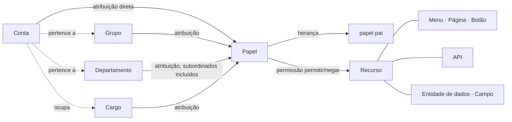

<!--
  Copyright (c) 2026 devlive-community/grantforge

  Licensed under the MIT License. See the LICENSE file in the
  project root for full license text.
-->

O modelo do GrantForge se resume em uma frase: **a conta obtém papéis por meio de atribuições, os papéis concedem permissões sobre recursos e, na avaliação, essas permissões são combinadas nas permissões efetivas da conta.**

## Tenants

O tenant é a fronteira de isolamento de dados: cada tenant tem suas próprias contas, organização, papéis e permissões, que não ficam visíveis para os demais. O primeiro tenant criado na inicialização é o **tenant plataforma**; seus administradores também podem gerenciar outros tenants, o catálogo de recursos e o servidor de autorização. Se você atende a uma única organização, pode ficar apenas com esse tenant.

## Contas e organização

- **Conta**: o sujeito que faz login; o nome de usuário é único em toda a plataforma. Uma conta pode ser local (a senha é guardada no GrantForge) ou vir de uma fonte de identidade (LDAP ou OIDC, casos em que a fonte de identidade gerencia a senha).
- **Departamento**: estrutura em árvore; cada conta tem um departamento principal e pode atuar em outros departamentos.
- **Grupo**: conjunto de pessoas sem relação com a estrutura organizacional, por exemplo o "grupo de plantão".
- **Cargo**: uma função, por exemplo "gerente financeiro"; uma conta pode ocupar vários cargos.

## Recursos

Um recurso é "tudo aquilo que pode receber uma permissão", organizado em uma árvore por aplicação:

| Tipo | Explicação |
| --- | --- |
| Módulo, menu | Agrupamentos que organizam as páginas |
| Página, aba | Uma página do console ou de uma aplicação, ou uma aba dentro de uma página |
| Botão | Uma ação sobre uma página, por exemplo "Excluir usuário" |
| API | Uma interface REST, por exemplo `api:GET:/api/v1/users` |
| Entidade de dados, campo | Uma entidade de negócio cujo intervalo de linhas pode ser limitado, assim como os campos dessa entidade que podem ser ocultados ou mascarados |

Entre os recursos pode haver **dependências**: um botão precisa da API que chama, e uma página precisa das API de onde carrega os dados. Ao conceder permissão sobre uma página ou um botão, as dependências vêm junto, o que evita "ver o botão e receber um erro de falta de permissão ao clicar".

O próprio console do GrantForge também é uma aplicação: suas páginas, botões e API são registrados automaticamente no catálogo de recursos na inicialização, de modo que as permissões do console também são decididas pelos papéis.

## Papéis, permissões e atribuições

- **Papel**: o nome de um conjunto de permissões. Os **papéis de sistema** (administrador do tenant, administrador da plataforma) são criados junto com o tenant, cobrem módulos inteiros e não podem ser modificados; os demais são papéis personalizados.
- **Permissão**: um papel "permite" ou "nega" um recurso. A negação tem precedência sobre a permissão.
- **Herança**: um papel pode herdar todas as permissões de outros papéis; as relações de herança não podem formar ciclos.
- **Atribuição**: entrega o papel a uma conta, a um grupo, a um departamento (opcionalmente com os departamentos subordinados) ou a um cargo; é possível definir as datas de início de vigência e de expiração.

## Avaliação

Quando é preciso determinar uma permissão, o GrantForge encontra todos os papéis efetivos da conta (os atribuídos diretamente, os obtidos por grupo, departamento ou cargo e os obtidos por herança, desde que estejam vigentes e que o papel esteja habilitado), combina suas permissões e obtém:

- os recursos utilizáveis (páginas, botões, API);
- o intervalo de linhas de cada entidade de dados na leitura, na alteração, na exclusão e na exportação;
- a forma de leitura e escrita de cada campo (visível, mascarado, oculto; editável, somente leitura).

O resultado traz um número de versão: qualquer mudança nas permissões, nas atribuições ou no catálogo faz esse número mudar, e o console e o SDK atualizam seu cache em consequência. As regras detalhadas estão no [modelo de permissões](/pt-br/architecture/permission-model/).
