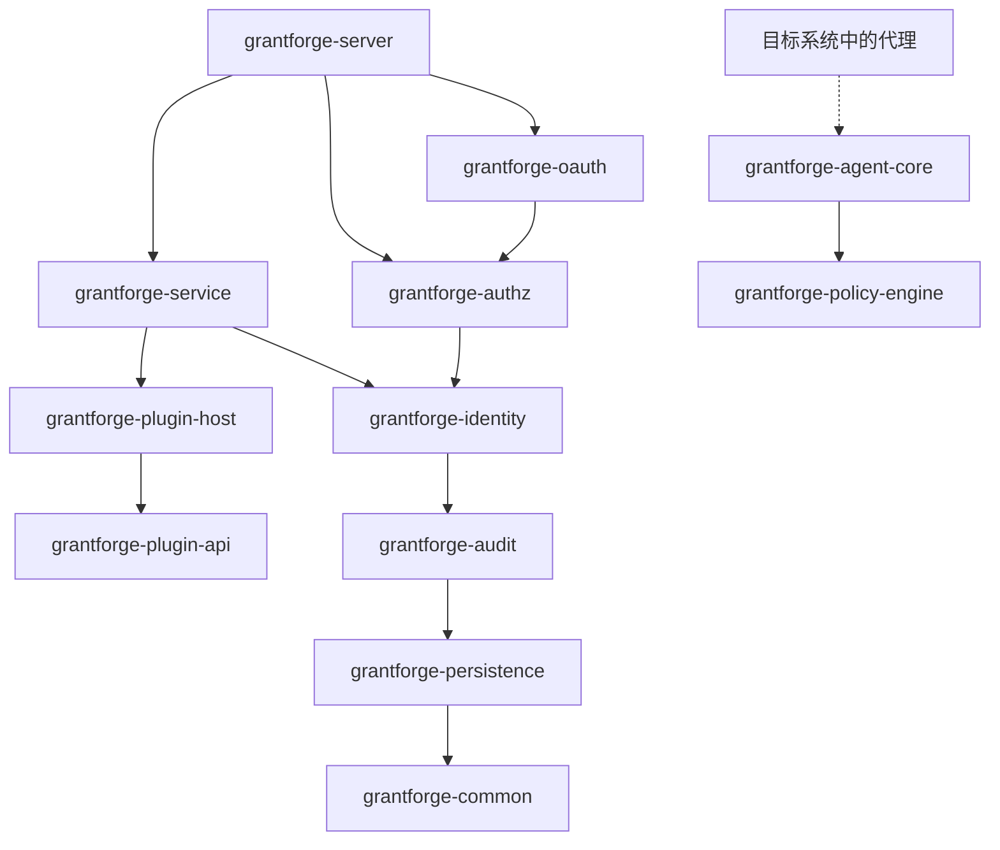
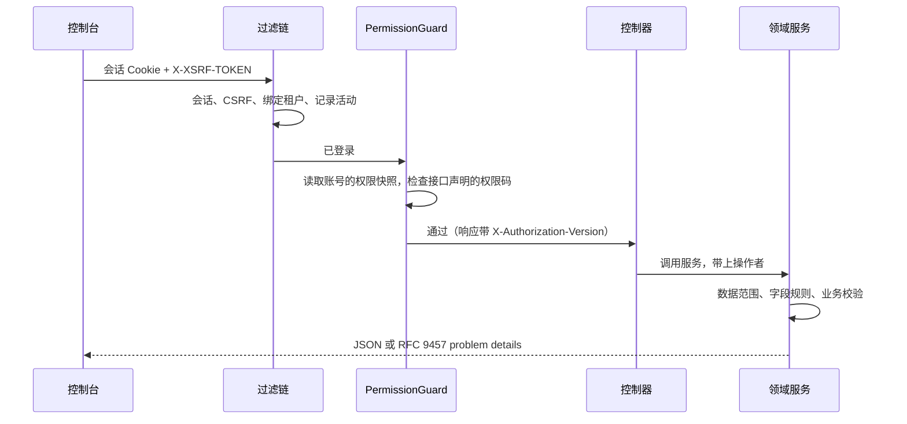

<!--
  Copyright (c) 2026 devlive-community/grantforge

  Licensed under the MIT License. See the LICENSE file in the
  project root for full license text.
-->

GrantForge — это приложение на Spring Boot 4 (байт-код Java 17), разделённое по доменам на несколько модулей Maven и собираемое в один исполняемый дистрибутив; консоль — одностраничное приложение на Vue 3, которое раздаёт сервер.

## Модули

Сервер и общая инфраструктура находятся в `core/`, плагины типов сервисов, загружаемые сервером, — в `plugins/`, а конкретные агенты, разворачиваемые внутри целевых систем, — в `agents/`. `core/grantforge-agent-core` предоставляет общий протокол и среду выполнения, а `agents/grantforge-agent-hdfs` — адаптер авторизации для NameNode HDFS.

| Модуль | Назначение |
| --- | --- |
| `grantforge-common` | Коды ошибок и модель problem details, CSV, аннотации доступа к конечным точкам (`@PublicEndpoint`, `@AuthenticatedEndpoint`, `@RequirePermission`, `@RequireStepUp`) |
| `grantforge-persistence` | Базовые классы сущностей, фильтрация по тенантам, генерация TSID, типы Liquibase, `@SecuredEntity`/`@SecuredField` и SPI прав на строки и поля |
| `grantforge-audit` | Запись, запрос, хранение и архивирование событий аудита |
| `grantforge-identity` | Тенанты, учётные записи, подразделения, группы пользователей, должности, политики паролей, вход и сессии, двухэтапная проверка, источники идентификации |
| `grantforge-authz` | Каталог приложений и ресурсов, каталог API, роли, выдачи, наследование, назначения, оценка, политики данных и полей, разделение обязанностей, запросы доступа и проверки |
| `grantforge-plugin-api` / `plugin-host` | Контракты плагинов типов сервисов, а также их загрузка, изоляция и вызов |
| `grantforge-policy-engine` | Движок оценки политик внешних систем (API для Java 8, встраивается в агенты) |
| `grantforge-agent-core` | Настройки, подписанные снимки, решения о доступе и отчётность по аудиту, общие для агентов (расположен в `core/`) |
| `grantforge-service` | Сервисы данных, политики, подпись и распространение снимков политик, агенты и аудит доступа |
| `grantforge-oauth` | Сервер OAuth 2.1 / OIDC на базе Spring Authorization Server, хранение токенов и ключи подписи |
| `grantforge-server` | Собирает все модули: REST-контроллеры, конфигурация безопасности, Open API, синхронизация при запуске |
| `grantforge-web` | Консоль на Vue 3 + Vite + Tailwind |
| `plugins/` | Плагины типов сервисов, загружаемые сервером, например `grantforge-plugin-hdfs` |
| `agents/` | Конкретные агенты, работающие внутри целевых систем, например `grantforge-agent-hdfs` |
| `sdk/` | `grantforge-spring-boot-starter` и `@grantforge/client` |

На диаграмме выше показаны зависимости между модулями (такие нижние слои, как common и persistence, используются всеми модулями — повторяющиеся рёбра опущены). Движок политики не зависит ни от какого другого модуля и встраивается агентами внутри целевых систем. Тесты ArchUnit каждого модуля дополнительно охраняют общие соглашения: нет внедрения полей, нет нативного SQL, нет сущностей в API, все пакеты по умолчанию non-null и так далее.

## Анатомия запроса

- Каждый метод контроллера обязан объявить свой режим доступа (публичный, любая вошедшая учётная запись или требуемый код права); метод без объявления не позволяет серверу запуститься.
- Коды прав также регистрируются как ресурсы API, поэтому авторизация конечных точек управляется и в каталоге ресурсов.
- Ошибки единообразно оформляются как problem details по RFC 9457 со стабильным `code`, локализованным `detail` и `requestId`; см. [Коды ошибок](/ru/reference/errors/).

## Выбор технологий

| Область | Выбор |
| --- | --- |
| Среда выполнения | Байт-код Java 17, сборка на JDK 21; Spring Boot 4.1, Spring Security 7, Spring Authorization Server |
| Персистентность | Hibernate 7 + Spring Data JPA; миграции Liquibase в YAML; Hibernate только проверяет схему |
| Идентификаторы | TSID (упорядоченные по времени 64-битные идентификаторы), снаружи всегда передаются строками |
| Сессии | Spring Session JDBC, общие для всего кластера |
| Фронтенд | Vue 3, Pinia, Vue Router, Tailwind CSS 4, Vite, строгий режим TypeScript |
| Качество | Error Prone + NullAway, Checkstyle, PMD, SpotBugs, ArchUnit, пороги покрытия JaCoCo, ESLint, vue-tsc |
| Тестирование | JUnit 5, jqwik, Testcontainers (шесть баз данных), Vitest, Playwright — сквозные и примерочные end-to-end тесты, JMH и бенчмарки масштаба в миллионы записей |
