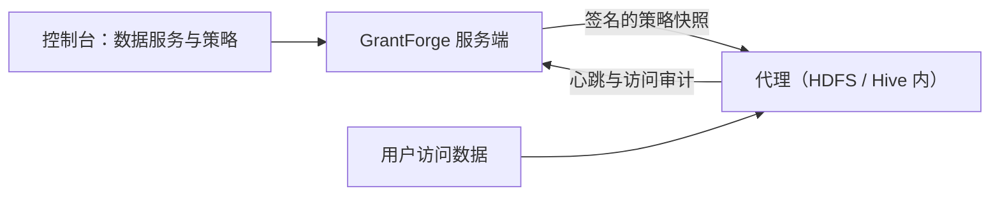

<!--
  Copyright (c) 2026 devlive-community/grantforge

  Licensed under the MIT License. See the LICENSE file in the
  project root for full license text.
-->

Группа «Права на данные» управляет правами систем данных вне GrantForge. Архитектура похожа на Apache Ranger: плагины определяют типы сервисов, администраторы описывают политики в консоли, а агенты, развёрнутые внутри целевых систем, скачивают эти политики и локально оценивают доступ.

> [!NOTE]
> Текущий релиз предоставляет фреймворк плагинов, универсальный редактор политик, распространение политик и аудит доступа, тип сервиса HDFS с агентом NameNode для Hadoop 3.5.0, а также демонстрационный плагин (`example`). Плагин Hive и агенты для других версий Hadoop ещё находятся в разработке.

## Плагины

**Управление платформой → Плагины** — список загруженных плагинов типов сервисов. Встроенные плагины поставляются вместе с сервером; любой другой плагин положите в каталог `plugins` и нажмите «Сканировать заново». Каждый плагин загружается независимо, поэтому сбой отключает только этот плагин. О разработке плагинов см. [Плагины и типы сервисов](/ru/develop/plugins/).

## HDFS

В дистрибутив входит плагин HDFS (`plugins/hdfs`) для типа сервиса `hdfs`, соответствующий сервису HDFS в Apache Ranger:

- Единственный тип ресурса — `path`, сопоставление выполняется по пути: `/data/sales` совпадает сам с собой, а при включённом «Рекурсивно» также со всеми файлами и каталогами под ним; исключения поддерживаются.
- Типы доступа — `read`, `write` и `execute`, соответствующие битам прав HDFS.
- Плагин подключается к кластеру с помощью собственного клиента Hadoop. «Тест соединения» проверяет, что запрашиваемый каталог существует и его содержимое можно перечислить; при написании политики ввод пути перечисляет подкаталоги и файлы соответствующего каталога, при этом каталоги идут перед файлами.
- Серверный плагин отвечает за администрирование и запросы; чтобы политики действительно ограничивали доступ к HDFS, необходимо также развернуть [агент NameNode](/ru/external/hdfs-agent/).

| Настройка | Описание |
| --- | --- |
| `username` | Пользователь для запроса каталогов; principal при использовании Kerberos, например `grantforge@EXAMPLE.COM` |
| `password` / `keytab` | При Kerberos одно из двух: пароль principal или путь к файлу keytab на сервере GrantForge |
| `fs.default.name` | `hdfs://namenode:8020`, высокодоступный `hdfs://nameservice1` либо `webhdfs://namenode:9870` |
| `hadoop.security.authentication` | `simple` или `kerberos` |
| `hadoop.security.authorization`, `hadoop.security.auth_to_local` | Соответствуют core-site.xml кластера |
| `dfs.namenode.kerberos.principal` и др. | Principal'ы NameNode, DataNode и Secondary NameNode, например `nn/_HOST@EXAMPLE.COM` |
| `hadoop.rpc.protection` | `authentication`, `integrity` или `privacy`, как в кластере |
| Дополнительная конфигурация Hadoop | По одному `key=value` на строку для высокодоступности и других настроек, например `dfs.nameservices=nameservice1`, `dfs.ha.namenodes.nameservice1=nn1,nn2`, `dfs.namenode.rpc-address.nameservice1.nn1=nn1:8020`, `dfs.client.failover.proxy.provider.nameservice1=org.apache.hadoop.hdfs.server.namenode.ha.ConfiguredFailoverProxyProvider` |
| `lookup.path` | Каталог для запросов, по умолчанию `/`; например, при значении `/data` пустой ввод перечисляет содержимое `/data`, а относительный ввод дополняется от него. Полезно для кластеров, где запрашивающий пользователь не имеет права перечислять корневой каталог |
| `lookup.max.entries` | Максимальное число записей, сканируемых за один запрос каталога, по умолчанию `10000`, диапазон `1..100000`; при превышении предела возвращается ошибка, чтобы кандидаты не терялись молча |

Дополнительная конфигурация Hadoop переопределяет настройки подключения с теми же именами, и проверка конфигурации, и вход в систему используют переопределённые значения. `fs.defaultFS` и `fs.default.name` — псевдонимы; в дополнительной конфигурации можно задать только один из них. Дублирующиеся ключи, адреса вне кластера и конфигурации Kerberos без учётных данных отклоняются при сохранении. В адрес кластера указывается только URI кластера; запрашиваемые подкаталоги задаются в `lookup.path`.

`lookup.path` ограничивает область просмотра кандидатов путей; он не заменяет собственный контроль доступа HDFS, а символические ссылки и монтирования ViewFS по-прежнему следуют конфигурации кластера. Во вводе можно опустить начальный `/`, повторные `/` и `.` допускаются, `..` и абсолютные пути вне области отклоняются. Для несуществующих каталогов кандидаты не возвращаются; нехватка прав и ошибки подключения показываются как ошибки.

При Kerberos серверу GrantForge нужно найти KDC: настройте `/etc/krb5.conf` либо укажите его через `-Djava.security.krb5.conf=`.

## Сервисы данных

**Права на данные → Сервисы данных**: сервис — это экземпляр внешней системы, правами которой управляет GrantForge, например один кластер HDFS. При добавлении сервиса выберите его тип и заполните данные подключения, определённые элементами конфигурации плагина; сначала можно выполнить **тест соединения**. Чувствительные настройки, такие как пароли, хранятся в зашифрованном виде и после сохранения больше не отображаются.

## Политики

**Права на данные → Политики** определяют, кто и что может делать с ресурсами сервиса данных:

- **Политики доступа** разрешают или запрещают доступ;
- **Политики маскирования** маскируют поля;
- **Политики фильтрации строк** пропускают только часть строк.

Иерархия ресурсов (например, базы данных, таблицы и столбцы в Hive), типы доступа (например, select и update) и условия поступают из плагина типа сервиса; при заполнении ресурса можно искать ресурсы, которые реально существуют в целевой системе. Политики применяются к пользователям, группам пользователей или ролям.

## Агенты

**Права на данные → Агенты**: агенты разворачиваются внутри целевых систем; используя свой токен, они периодически отправляют heartbeat-сообщения и скачивают подписанные снимки политик, а доступ оценивают локально. Здесь выпускаются токены агентов (показываются только один раз) и проверяется, уже ли каждый агент получил последние политики.

## Аудит доступа

**Права на данные → Аудит доступа**: каждое решение о доступе, сообщённое агентом: кто, что и с каким ресурсом сделал, когда и откуда, разрешено или отклонено, а также какой политикой принято решение. Записи хранятся 90 дней по умолчанию.

