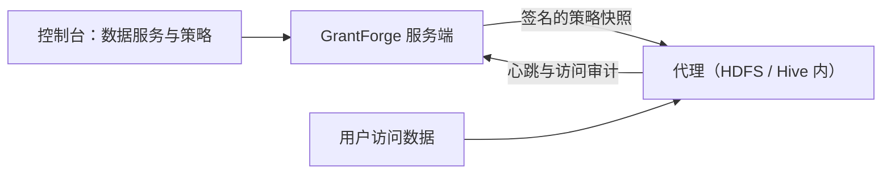

<!--
  Copyright (c) 2026 devlive-community/grantforge

  Licensed under the MIT License. See the LICENSE file in the
  project root for full license text.
-->

Группа «Права на данные» управляет правами систем данных вне GrantForge. Архитектура похожа на Apache Ranger: плагины определяют типы сервисов, администраторы описывают политики в консоли, а агенты, развёрнутые внутри целевых систем, скачивают эти политики и локально оценивают доступ.

> [!NOTE]
> Текущий релиз предоставляет фреймворк плагинов, универсальный редактор политик, распространение политик и аудит доступа, тип сервиса HDFS с нумерованными агентами NameNode для Hadoop 2.7, 2.10, 3.2, 3.3, 3.4 и 3.5, а также демонстрационный плагин (`example`). Проверенные сочетания описаны в руководстве [Агент Apache Hadoop HDFS NameNode](/ru/external/hdfs-agent/). Плагин Hive ещё находится в разработке.

## Плагины

**Управление платформой → Плагины** — список загруженных плагинов типов сервисов. Встроенные плагины поставляются вместе с сервером; любой другой плагин положите в каталог `plugins` и нажмите «Сканировать заново». Каждый плагин загружается независимо, поэтому сбой отключает только этот плагин. О разработке плагинов см. [Плагины и типы сервисов](/ru/develop/plugins/).

## HDFS

Дистрибутив содержит плагин типа сервиса HDFS; установка, настройки подключения, просмотр каталогов и политики путей описаны в разделе [Apache Hadoop HDFS](/ru/plugins/hdfs/).

## Сервисы данных

**Права на данные → Сервисы данных**: сервис — это экземпляр внешней системы, правами которой управляет GrantForge, например один кластер HDFS. При добавлении сервиса выберите его тип и заполните данные подключения, определённые элементами конфигурации плагина; сначала можно выполнить **тест соединения**. Чувствительные настройки, такие как пароли, хранятся в зашифрованном виде и после сохранения больше не отображаются.

## Политики

**Права на данные → Политики** определяют, кто и что может делать с ресурсами сервиса данных:

- **Политики доступа** разрешают или запрещают доступ;
- **Политики маскирования** маскируют поля;
- **Политики фильтрации строк** пропускают только часть строк.

Иерархия ресурсов (например, базы данных, таблицы и столбцы в Hive), типы доступа (например, select и update) и условия поступают из плагина типа сервиса; при заполнении ресурса можно искать ресурсы, которые реально существуют в целевой системе. Политики применяются к пользователям, группам пользователей или ролям.

У уровней, которые можно просматривать, например путей HDFS, есть кнопка **Обзор**: открывайте каталоги уровень за уровнем, смотрите владельца, группу и права и выбирайте сразу несколько файлов или каталогов. Если поиск или просмотр не удался, показывается причина (нет прав, недоступно или слишком большой каталог), и можно повторить попытку.

## Агенты

**Права на данные → Агенты**: агенты разворачиваются внутри целевых систем; используя свой токен, они периодически отправляют heartbeat-сообщения и скачивают подписанные снимки политик, а доступ оценивают локально. Здесь выпускаются токены агентов (показываются только один раз) и проверяется, уже ли каждый агент получил последние политики.

## Аудит доступа

**Права на данные → Аудит доступа**: каждое решение о доступе, сообщённое агентом: кто, что и с каким ресурсом сделал, когда и откуда, разрешено или отклонено, а также какой политикой принято решение. Записи хранятся 90 дней по умолчанию.

