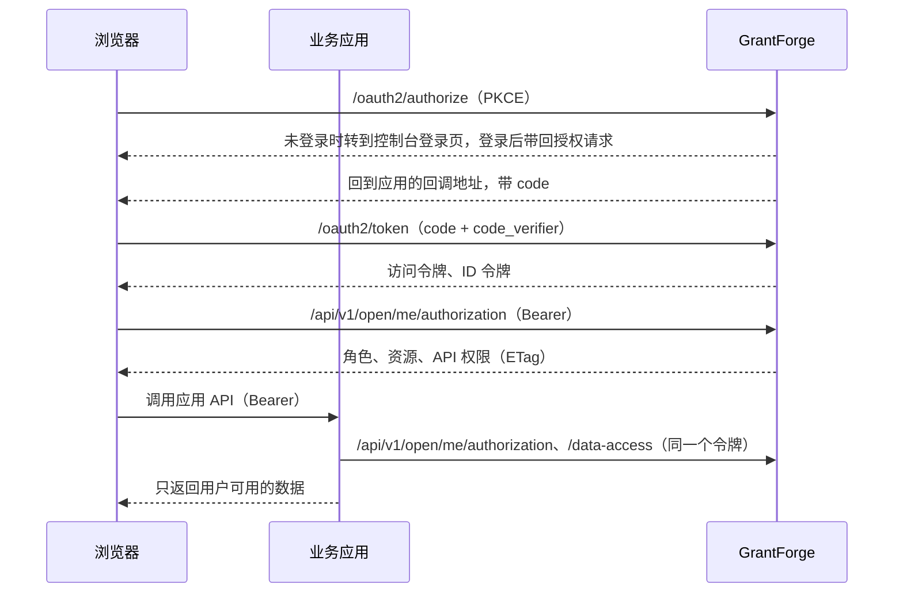

<!--
  Copyright (c) 2026 devlive-community/grantforge

  Licensed under the MIT License. See the LICENSE file in the
  project root for full license text.
-->

GrantForge выполняет для бизнес-приложений две роли:

- **Сервер авторизации** (OAuth 2.1 / OpenID Connect): пользователи входят в GrantForge, а приложение получает access token и ID token.
- **Центр прав**: используя тот же токен, приложение запрашивает у GrantForge, какими ролями, ресурсами (меню, страницы, кнопки), правами API и областями данных обладает пользователь в этом приложении.

## Соответствие понятий

| Понятие | Где настраивать | Описание |
| --- | --- | --- |
| Приложение | Управление платформой → Каталог ресурсов | Бизнес-система, например `shop` |
| Ресурс | Дерево ресурсов приложения в каталоге ресурсов | Модули, меню, страницы, кнопки, API. Страницы и кнопки управляют интерфейсом; ресурсы API — это коды прав API (например, `orders.read`) |
| Клиент | Каталог ресурсов → «OAuth-клиенты» приложения | Идентичность, которую приложение использует для входа пользователей и получения токенов. Браузерные приложения используют **публичные клиенты**, серверные — **конфиденциальные клиенты** |
| scope | Настройки клиента | `openid`, `profile` и `email` для входа; `permissions` позволяет токену запрашивать права; `catalog` позволяет приложению объявлять сущности данных от своего имени |
| Роли и выдачи | Управление доступом → Управление ролями | Выдавайте ресурсы приложения ролям, а затем назначайте роли пользователям, группам, подразделениям или должностям |
| Политики данных | Роль → Права на данные | Сущности данных, объявленные приложением (`<应用编码>:<实体>`), настраиваются так же, как собственные сущности консоли: все, всё в этом тенанте, только собственные записи, это подразделение, указанные подразделения или по условию |

Администраторы тенантов (те, у кого есть системная роль) могут выдавать роли в собственном тенанте любой ресурс бизнес-приложения; права самой консоли по-прежнему можно выдавать только в пределах того, чем владеет тот, кто их выдаёт.

## Сценарий взаимодействия

## Шаги интеграции

1. Создайте приложение в разделе **Управление платформой → Каталог ресурсов** и соберите его страницы, кнопки и ресурсы API.
2. Зарегистрируйте для приложения клиент: для браузерных приложений выберите «Публичный», для серверных — «Конфиденциальный»; в качестве redirect URI укажите адрес обратного вызова для входа в приложении; выберите как минимум скоупы `openid` и `permissions`. Секрет конфиденциального клиента показывается только один раз.
3. В разделе **Управление доступом → Управление ролями** создайте роли, выдайте им ресурсы и назначьте роли пользователям.
4. Подключите SDK к своему приложению: для Java — [Java SDK](/ru/integration/java/), для браузеров — [JavaScript SDK](/ru/integration/javascript/); детали протокола — [OAuth 2.1 и OpenID Connect](/ru/integration/oauth/) и [Открытый API запросов прав доступа](/ru/integration/open-api/).

В каталоге `samples/` репозитория лежат два полных примера (магазин и приложение для заметок), покрытые сквозными тестами; см. [Примеры приложений](/ru/integration/samples/).
