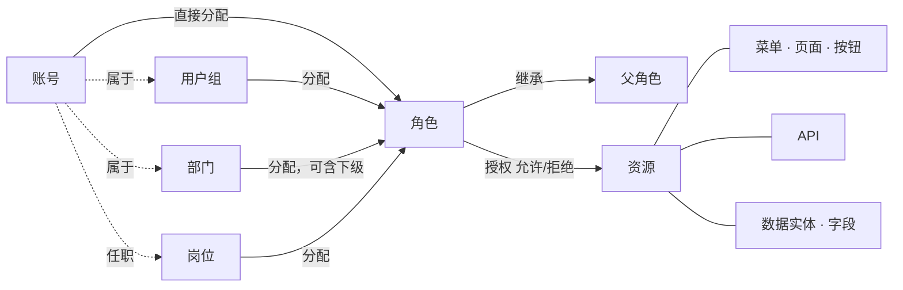

<!--
  Copyright (c) 2026 devlive-community/grantforge

  Licensed under the MIT License. See the LICENSE file in the
  project root for full license text.
-->

Модель GrantForge укладывается в одно предложение: **учётные записи получают роли через назначения, роли владеют выдачами на ресурсы, а вычисление прав объединяет эти выдачи в фактические права учётной записи.**

## Тенанты

Тенанты — это граница изоляции данных: у каждого тенанта свои учётные записи, организации, роли и выдачи, невидимые для остальных тенантов. Первый тенант, созданный при инициализации, — **платформенный тенант**; его администраторы также управляют другими тенантами, каталогом ресурсов и сервером авторизации. Если вы обслуживаете одну организацию, можно ограничиться одним тенантом.

## Учётные записи и организации

- **Учётная запись**: субъект входа в систему; имена пользователей уникальны во всей платформе. Учётные записи могут храниться локально (пароль хранится в GrantForge) или поступать из источника идентичности (LDAP или OIDC, парольом управляет этот источник).
- **Подразделение**: древовидная структура; у каждой учётной записи есть одно основное подразделение, и она может числиться также в других подразделениях.
- **Группа пользователей**: совокупность людей вне оргструктуры, например «дежурная группа».
- **Должность**: должность, например «финансовый менеджер»; у учётной записи может быть несколько должностей.

## Ресурсы

Ресурсы — это «то, что можно выдавать», организованное в дерево для каждого приложения:

| Тип | Описание |
| --- | --- |
| Модули, меню | Группировки, упорядочивающие страницы |
| Страницы, вкладки | Страница в консоли или в приложении либо вкладка на странице |
| Кнопки | Действие на странице, например «Удалить пользователя» |
| API | REST-эндпоинт, например `api:GET:/api/v1/users` |
| Сущности данных, поля | Сущности данных, у которых можно ограничить область видимости строк, и их поля, которые можно скрыть или замаскировать |

У ресурсов бывают **зависимости** друг от друга: кнопке нужен API, который она вызывает, а странице — API, из которых она загружает данные. При выдаче страницы или кнопки её зависимости подтягиваются автоматически, поэтому не возникает ситуации «кнопка видна, но по клику приходит ошибка о нехватке прав».

Консоль GrantForge сама по себе является приложением: её страницы, кнопки и API при старте автоматически регистрируются в каталоге ресурсов, поэтому доступ к консоли тоже определяется ролями.

## Роли, выдачи и назначения

- **Роль**: именованный набор выдач. **Системные роли** (администратор тенанта, администратор платформы) создаются вместе с тенантом, охватывают целые модули и не изменяются; всё остальное — пользовательские роли.
- **Выдача**: «разрешить» или «запретить» роли для ресурса. Запрет имеет приоритет над разрешением.
- **Наследование**: роль может унаследовать все выдачи других ролей; циклы наследования запрещены.
- **Назначение**: передача роли учётной записи, группе пользователей, подразделению (при желании вместе с дочерними подразделениями) или должности, с необязательными временем начала и окончания действия.

## Вычисление

Когда нужно принять решение о правах, GrantForge собирает все фактические роли учётной записи (назначенные напрямую, полученные через группу, подразделение или должность, а также полученные по наследованию — все в пределах срока действия и при включённой роли), объединяет их выдачи и формирует:

- Доступные ресурсы (страницы, кнопки, API);
- Область видимости строк для каждой сущности данных при чтении, обновлении, удалении и экспорте;
- Способ чтения и записи каждого поля (видимое, маскированное, скрытое; редактируемое, только для чтения).

Результат содержит номер версии: любое изменение выдач, назначений или каталога увеличивает версию, и консоль и SDK соответственно обновляют свои кэши. Подробные правила см. в разделе [Модель прав](/ru/architecture/permission-model/).
