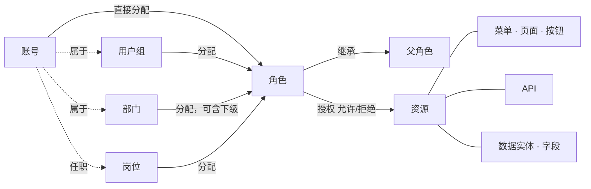

<!--
  Copyright (c) 2026 devlive-community/grantforge

  Licensed under the MIT License. See the LICENSE file in the
  project root for full license text.
-->

GrantForge 的模型可以概括为一句话：**账号经由分配获得角色，角色对资源授权，求值时把这些授权合并成账号的有效权限。**

## 租户

租户是数据隔离的边界：每个租户有自己的账号、组织、角色和授权，互不可见。初始化时创建的第一个租户是**平台租户**，它的管理员还可以管理其他租户、资源目录和授权服务器。只服务一个组织时，可以只用这一个租户。

## 账号与组织

- **账号**：登录主体，用户名在整个平台内唯一。账号可以来自本地（密码保存在 GrantForge），也可以来自身份源（LDAP 或 OIDC，密码由身份源管理）。
- **部门**：树形结构，每个账号有一个主部门，可以兼职其他部门。
- **用户组**：与组织结构无关的人员集合，例如“值班组”。
- **岗位**：职务，例如“财务经理”，一个账号可以任多个岗位。

## 资源

资源是“可以被授权的东西”，按应用组织成一棵树：

| 类型 | 说明 |
| --- | --- |
| 模块、菜单 | 组织页面的分组 |
| 页面、标签 | 控制台或应用里的一个页面、页面上的一个标签页 |
| 按钮 | 页面上的一个操作，例如“删除用户” |
| API | 一个 REST 接口，例如 `api:GET:/api/v1/users` |
| 数据实体、字段 | 可以限定行范围的业务实体，以及其中可隐藏或脱敏的字段 |

资源之间可以有**依赖**：按钮需要它调用的 API，页面需要它加载数据的 API。授权页面或按钮时，依赖会被一起带出，避免“看得到按钮、点了报无权限”。

GrantForge 控制台本身也是一个应用：它的页面、按钮和 API 在启动时自动登记到资源目录，所以控制台的权限也由角色决定。

## 角色、授权与分配

- **角色**：一组授权的名字。**系统角色**（租户管理员、平台管理员）随租户创建，权限覆盖整个模块且不可修改；其余是自定义角色。
- **授权**：角色对资源的“允许”或“拒绝”。拒绝优先于允许。
- **继承**：角色可以继承其他角色的全部授权，继承关系不能成环。
- **分配**：把角色交给账号、用户组、部门（可选包含下级部门）或岗位，可设置生效和到期时间。

## 求值

需要判断权限时，GrantForge 找出账号的全部有效角色（直接分配、经组/部门/岗位获得、经继承获得，且在有效期内、角色已启用），合并它们的授权，得出：

- 可用的资源（页面、按钮、API）；
- 每个数据实体在读、改、删、导出时的行范围；
- 每个字段的读写方式（可见、脱敏、隐藏；可编辑、只读）。

结果带有版本号：授权、分配、目录任何一项变化，版本号就会变化，控制台和 SDK 据此刷新缓存。详细规则见 [权限模型](/architecture/permission-model/)。
