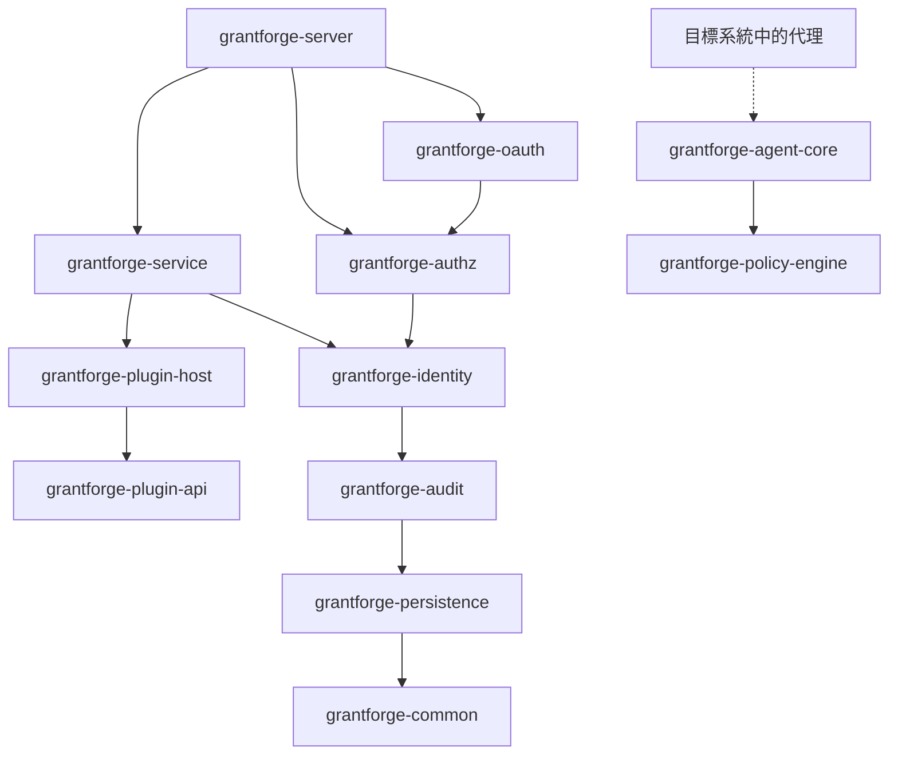
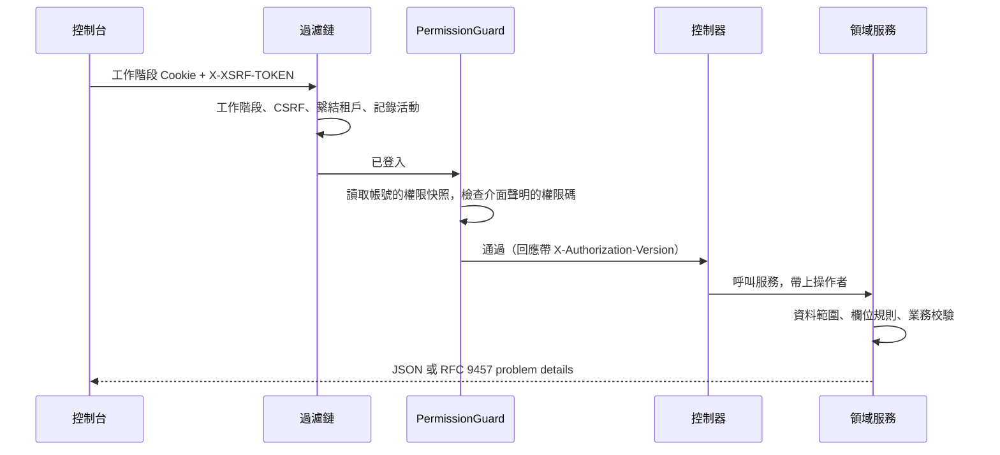

<!--
  Copyright (c) 2026 devlive-community/grantforge

  Licensed under the MIT License. See the LICENSE file in the
  project root for full license text.
-->

GrantForge 是一個 Spring Boot 4 應用程式（Java 17 位元組碼），按領域拆分成多個 Maven 模組，打包成一個可執行的發行套件；主控台是 Vue 3 單頁應用程式，由伺服器端一併提供。

## 模組

伺服器端與共享基礎設施位於 `core/`，伺服器端載入的服務型別外掛程式位於 `plugins/`，部署在目標系統中的具體代理位於 `agents/`。`core/grantforge-agent-core` 提供共享協定與執行時環境，`agents/grantforge-agent-hdfs-*` 提供 HDFS NameNode 的授權轉接。

| 模組 | 職責 |
| --- | --- |
| `grantforge-common` | 錯誤碼與 problem details 模型、CSV、介面存取註解（`@PublicEndpoint`、`@AuthenticatedEndpoint`、`@RequirePermission`、`@RequireStepUp`） |
| `grantforge-persistence` | 實體基底類別、租戶過濾、TSID 產生、Liquibase 型別、`@SecuredEntity`/`@SecuredField` 與列/欄位權限 SPI |
| `grantforge-audit` | 稽核事件的記錄、查詢、保留與封存 |
| `grantforge-identity` | 租戶、帳號、部門、使用者群組、職位、密碼政策、登入與工作階段、雙因素驗證、身分來源 |
| `grantforge-authz` | 應用程式與資源目錄、API 目錄、角色、授權、繼承、指派、求值、資料與欄位政策、職責分離、權限申請與覆核 |
| `grantforge-plugin-api` / `plugin-host` | 服務型別外掛程式的契約，以及外掛程式的載入、隔離與呼叫 |
| `grantforge-policy-engine` | 外部系統政策的求值引擎（Java 8 API，可嵌入代理） |
| `grantforge-agent-core` | 代理共享的設定、簽章快照、存取判定與稽核回報（位於 `core/`） |
| `grantforge-service` | 資料服務、政策、政策快照簽章與分發、代理與存取稽核 |
| `grantforge-oauth` | 基於 Spring Authorization Server 的 OAuth 2.1 / OIDC 伺服器、權杖儲存與簽章金鑰 |
| `grantforge-server` | 整合所有模組：REST 控制器、安全設定、開放 API、啟動同步 |
| `grantforge-web` | Vue 3 + Vite + Tailwind 主控台 |
| `plugins/` | 伺服器端載入的服務型別外掛程式，如 `grantforge-plugin-hdfs` |
| `agents/` | 目標系統內執行的具體代理，如 `grantforge-agent-hdfs` |
| `sdk/` | `grantforge-spring-boot-starter` 與 `@grantforge/client` |

上圖是模組之間的相依關係（較底層的 common、persistence 等被所有模組相依，圖中省略了這些重複的邊）。政策引擎不相依其他模組，供目標系統中的代理嵌入。每個模組的 ArchUnit 測試另外守護共同的約定：不使用欄位注入、不撰寫原生 SQL、實體不出現在 API 中、所有套件預設非空等。

## 一次請求

- 每個控制器方法都必須宣告存取方式（公開、已登入即可、需要權限碼），沒有宣告的方法會讓服務無法啟動。
- 權限碼同時登錄為 API 資源，因此介面的授權也在資源目錄裡管理。
- 錯誤統一為 RFC 9457 problem details，帶有穩定的 `code`、本地化的 `detail` 與 `requestId`，見 [錯誤碼](/zh-tw/reference/errors/)。

## 技術選型

| 領域 | 選擇 |
| --- | --- |
| 執行環境 | Java 17 位元組碼，以 JDK 21 建置；Spring Boot 4.1、Spring Security 7、Spring Authorization Server |
| 持久化 | Hibernate 7 + Spring Data JPA；Liquibase YAML 遷移；Hibernate 僅驗證資料表結構 |
| ID | TSID（依時間排序的 64 位元 ID），對外一律以字串傳遞 |
| 工作階段 | Spring Session JDBC，叢集共享 |
| 前端 | Vue 3、Pinia、Vue Router、Tailwind CSS 4、Vite，TypeScript 嚴格模式 |
| 品質 | Error Prone + NullAway、Checkstyle、PMD、SpotBugs、ArchUnit、JaCoCo 覆蓋率門檻、ESLint、vue-tsc |
| 測試 | JUnit 5、jqwik、Testcontainers（六種資料庫）、Vitest、Playwright 全端與範例端對端測試、JMH 與百萬級基準 |
