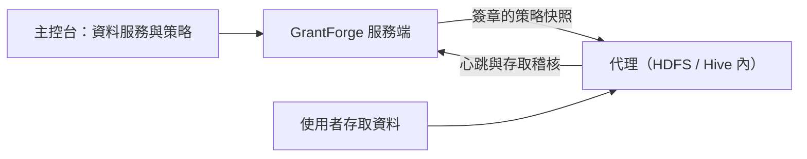

<!--
  Copyright (c) 2026 devlive-community/grantforge

  Licensed under the MIT License. See the LICENSE file in the
  project root for full license text.
-->

「資料權限」分組管理 GrantForge 以外的資料系統的權限，架構類似 Apache Ranger：外掛定義服務類型，管理員在主控台撰寫策略，部署在目標系統裡的代理下載策略並在本機判定存取。

> [!NOTE]
> 目前版本提供外掛框架、通用策略編輯器、策略分發與存取稽核、HDFS 服務類型與 Hadoop 3.5.0 NameNode 代理，以及範例外掛（`example`）。Hive 外掛與其他 Hadoop 版本的代理仍在開發中。

## 外掛

**平台管理 → 外掛** 列出已載入的服務類型外掛。內建外掛隨服務端提供，其他外掛放入 `plugins` 目錄後點擊「重新掃描」即可；每個外掛獨立載入，發生錯誤時只會停用它自己。外掛開發見 [外掛與服務類型](/zh-tw/develop/plugins/)。

## HDFS

發行包內建 HDFS 外掛（`plugins/hdfs`），服務類型 `hdfs`，與 Apache Ranger 的 HDFS 服務一致：

- 資源只有一級 `path`，依路徑比對：`/data/sales` 比對它本身，勾選「遞迴」後也比對其下的全部檔案與目錄；支援排除。
- 存取類型 `read`、`write`、`execute`，與 HDFS 的權限位元對應。
- 外掛使用 Hadoop 自身的客戶端連線叢集，測試連線會檢查查詢目錄存在且可以列出內容，撰寫策略時輸入路徑會列出對應目錄下的子目錄與檔案，目錄排在檔案前面。
- 服務端外掛負責管理與查詢；要讓策略約束 HDFS 存取，還需部署 [NameNode 代理](/zh-tw/external/hdfs-agent/)。

| 設定 | 說明 |
| --- | --- |
| `username` | 查詢目錄用的使用者；Kerberos 時為 principal，例如 `grantforge@EXAMPLE.COM` |
| `password` / `keytab` | Kerberos 時二選一：principal 的密碼，或 GrantForge 伺服器上 keytab 檔案的路徑 |
| `fs.default.name` | `hdfs://namenode:8020`、高可用性的 `hdfs://nameservice1`，或 `webhdfs://namenode:9870` |
| `hadoop.security.authentication` | `simple` 或 `kerberos` |
| `hadoop.security.authorization`、`hadoop.security.auth_to_local` | 與叢集的 core-site.xml 一致 |
| `dfs.namenode.kerberos.principal` 等 | NameNode、DataNode、Secondary NameNode 的 principal，例如 `nn/_HOST@EXAMPLE.COM` |
| `hadoop.rpc.protection` | `authentication`、`integrity` 或 `privacy`，與叢集一致 |
| 附加 Hadoop 設定 | 每行一個 `key=value`，用於高可用性等其他設定，例如 `dfs.nameservices=nameservice1`、`dfs.ha.namenodes.nameservice1=nn1,nn2`、`dfs.namenode.rpc-address.nameservice1.nn1=nn1:8020`、`dfs.client.failover.proxy.provider.nameservice1=org.apache.hadoop.hdfs.server.namenode.ha.ConfiguredFailoverProxyProvider` |
| `lookup.path` | 查詢目錄，預設 `/`；例如設為 `/data` 後，空輸入會列出 `/data` 的內容，相對輸入從這裡開始補全。適用於查詢使用者沒有根目錄列出權限的叢集 |
| `lookup.max.entries` | 一次目錄查詢最多掃描的項目數，預設 `10000`，範圍 `1..100000`；超過上限會回傳錯誤，避免靜默遺漏候選 |

附加 Hadoop 設定會覆寫同名連線設定，設定驗證與登入均使用覆寫後的值。`fs.defaultFS` 和 `fs.default.name` 是別名，附加設定中只能設置其中一個；重複鍵、非叢集位址與無憑證的 Kerberos 設定會在儲存時被拒絕。叢集位址只填寫叢集 URI，需要查詢的子目錄放在 `lookup.path`。

`lookup.path` 限制路徑候選的瀏覽範圍，不取代 HDFS 自身的存取控制；符號連結與 ViewFS 掛載仍遵循叢集設定。輸入中可省略開頭的 `/`，允許重複的 `/` 與 `.`，拒絕 `..` 與範圍之外的絕對路徑。不存在的目錄回傳空候選，權限不足與連線失敗會顯示錯誤。

使用 Kerberos 時，GrantForge 伺服器需要能找到 KDC：設定 `/etc/krb5.conf`，或用 `-Djava.security.krb5.conf=` 指定。

## 資料服務

**資料權限 → 資料服務**：一個服務是 GrantForge 管理權限的一個外部系統執行個體，例如一個 HDFS 叢集。新增服務時選擇服務類型，依外掛定義的設定項填寫連線資訊，可以先 **測試連線**。密碼等敏感設定加密儲存，儲存後不再顯示。

## 策略

**資料權限 → 策略** 決定誰能對資料服務中的哪些資源做什麼：

- **存取策略**允許或拒絕存取；
- **遮蔽策略**遮蔽欄位；
- **資料列過濾策略**只放出部分資料列。

資源層級（如 Hive 的資料庫、資料表、欄位）、存取類型（如 select、update）與條件都來自服務類型的外掛；填寫資源時可以查找目標系統中實際存在的資源。策略的對象是使用者、使用者群組或角色。

## 代理

**資料權限 → 代理**：代理部署在目標系統內部，憑權杖定期回報心跳並下載簽章的策略快照，在本機判定存取。這裡簽發代理權杖（只顯示一次）、查看各代理是否已用上最新策略。

## 存取稽核

**資料權限 → 存取稽核**：代理回報的每一次存取判定：誰在何時從哪裡對哪個資源做了什麼，被允許還是拒絕，由哪條策略決定。記錄預設保留 90 天。

