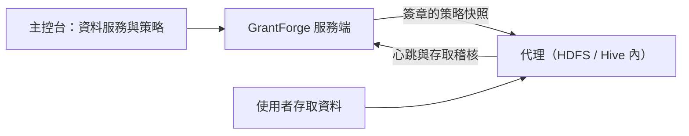

<!--
  Copyright (c) 2026 devlive-community/grantforge

  Licensed under the MIT License. See the LICENSE file in the
  project root for full license text.
-->

「資料權限」分組管理 GrantForge 以外的資料系統的權限，架構類似 Apache Ranger：外掛定義服務類型，管理員在主控台撰寫策略，部署在目標系統裡的代理下載策略並在本機判定存取。

> [!NOTE]
> 目前版本提供外掛框架、通用策略編輯器、策略分發與存取稽核、HDFS 服務類型及 Hadoop 2.7、2.10、3.2、3.3、3.4、3.5 的編號 NameNode 代理，以及範例外掛（`example`）。具體已驗證組合見 [Apache Hadoop HDFS NameNode 代理](/zh-tw/external/hdfs-agent/)。Hive 外掛仍在開發中。

## 外掛

**平台管理 → 外掛** 列出已載入的服務類型外掛。內建外掛隨服務端提供，其他外掛放入 `plugins` 目錄後點擊「重新掃描」即可；每個外掛獨立載入，發生錯誤時只會停用它自己。外掛開發見 [外掛與服務類型](/zh-tw/develop/plugins/)。

## HDFS

發行包內建 HDFS 服務類型外掛，安裝、連線設定、目錄瀏覽與路徑策略見 [Apache Hadoop HDFS](/zh-tw/plugins/hdfs/)。

## 資料服務

**資料權限 → 資料服務**：一個服務是 GrantForge 管理權限的一個外部系統執行個體，例如一個 HDFS 叢集。新增服務時選擇服務類型，依外掛定義的設定項填寫連線資訊，可以先 **測試連線**。密碼等敏感設定加密儲存，儲存後不再顯示。

## 策略

**資料權限 → 策略** 決定誰能對資料服務中的哪些資源做什麼：

- **存取策略**允許或拒絕存取；
- **遮蔽策略**遮蔽欄位；
- **資料列過濾策略**只放出部分資料列。

資源層級（如 Hive 的資料庫、資料表、欄位）、存取類型（如 select、update）與條件都來自服務類型的外掛；填寫資源時可以查找目標系統中實際存在的資源。策略的對象是使用者、使用者群組或角色。

支援目錄瀏覽的層級（如 HDFS 路徑）旁有 **瀏覽** 按鈕：可以逐級開啟目錄，檢視擁有者、群組與權限，並一次選擇多個檔案或目錄。查詢或瀏覽失敗時會顯示具體原因（例如沒有權限、無法連線或目錄過大），可以重試。

## 代理

**資料權限 → 代理**：代理部署在目標系統內部，憑權杖定期回報心跳並下載簽章的策略快照，在本機判定存取。這裡簽發代理權杖（只顯示一次）、查看各代理是否已用上最新策略。

## 存取稽核

**資料權限 → 存取稽核**：代理回報的每一次存取判定：誰在何時從哪裡對哪個資源做了什麼，被允許還是拒絕，由哪條策略決定。記錄預設保留 90 天。

