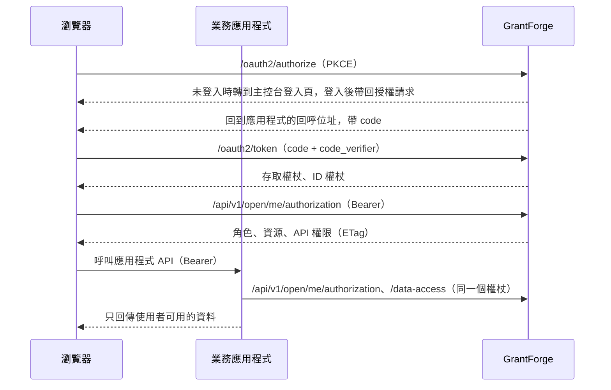

<!--
  Copyright (c) 2026 devlive-community/grantforge

  Licensed under the MIT License. See the LICENSE file in the
  project root for full license text.
-->

GrantForge 對業務應用程式有兩種身分：

- **授權伺服器**（OAuth 2.1 / OpenID Connect）：使用者在 GrantForge 登入，應用程式取得存取權杖與 ID 權杖。
- **權限中心**：應用程式用同一個權杖詢問 GrantForge，這個使用者在本應用程式裡有哪些角色、資源（選單、頁面、按鈕）、API 權限以及資料範圍。

## 概念對照

| 概念 | 在哪裡設定 | 說明 |
| --- | --- | --- |
| 應用程式 | 平台管理 → 資源目錄 | 一個業務系統，例如 `shop` |
| 資源 | 資源目錄中應用程式的資源樹 | 模組、選單、頁面、按鈕、API。頁面與按鈕控制介面，API 資源就是 API 權限代碼（例如 `orders.read`） |
| 客戶端 | 資源目錄 → 應用程式的「OAuth 客戶端」 | 應用程式登入使用者、取得權杖的身分。瀏覽器應用程式用**公開客戶端**，伺服器端應用程式用**機密客戶端** |
| scope | 客戶端設定 | `openid`、`profile`、`email` 用於登入；`permissions` 允許權杖查詢權限；`catalog` 允許應用程式以自身身分宣告資料實體 |
| 角色與授權 | 存取控制 → 角色管理 | 把應用程式的資源授給角色，再把角色分配給使用者、群組、部門或職位 |
| 資料策略 | 角色 → 資料權限 | 應用程式宣告的實體（`<應用程式編碼>:<實體編碼>`）與主控台自身的實體設定方式相同：全部、本租戶、本人、部門、指定部門或條件 |

租戶管理員（持有系統角色的人）可以把業務應用程式的任何資源授給本租戶的角色；主控台自身的權限則仍僅能授出自己擁有的部分。

## 流程

## 整合步驟

1. 在 **平台管理 → 資源目錄** 新增應用程式，並建立頁面、按鈕與 API 資源。
2. 為應用程式註冊客戶端：瀏覽器應用程式選「公開」，伺服器端應用程式選「機密」；回呼位址填應用程式的登入回呼；scope 至少選 `openid` 與 `permissions`。機密客戶端的金鑰僅顯示一次。
3. 在 **存取控制 → 角色管理** 建立角色、授予授權，再分配給使用者。
4. 應用程式串接 SDK：Java 見 [Java SDK](/zh-tw/integration/java/)，瀏覽器見 [JavaScript SDK](/zh-tw/integration/javascript/)，協定細節見 [OAuth 2.1 與 OpenID Connect](/zh-tw/integration/oauth/) 和 [權限查詢開放 API](/zh-tw/integration/open-api/)。

儲存庫中的 `samples/` 有兩個完整範例（商店與筆記），並有端對端測試涵蓋，見 [範例應用程式](/zh-tw/integration/samples/)。
