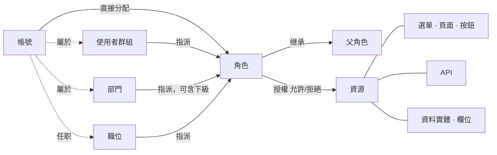

<!--
  Copyright (c) 2026 devlive-community/grantforge

  Licensed under the MIT License. See the LICENSE file in the
  project root for full license text.
-->

GrantForge 的模型可以概括為一句話：**帳號經由分配獲得角色，角色對資源授權，求值時把這些授權合併成帳號的有效權限。**

## 租戶

租戶是資料隔離的邊界：每個租戶有自己的帳號、組織、角色和授權，彼此不可見。初始化時建立的第一個租戶是**平台租戶**，它的管理員還可以管理其他租戶、資源目錄與授權伺服器。僅服務一個組織時，可以僅使用這一個租戶。

## 帳號與組織

- **帳號**：登入主體，使用者名稱在整個平台內唯一。帳號可以來自本機（密碼儲存在 GrantForge），也可以來自身分來源（LDAP 或 OIDC，密碼由身分來源管理）。
- **部門**：樹狀結構，每個帳號有一個主部門，可以兼職其他部門。
- **使用者群組**：與組織結構無關的人員集合，例如「值班組」。
- **職位**：職務，例如「財務經理」，一個帳號可以擔任多個職位。

## 資源

資源是「可以被授權的東西」，依應用程式組織成一棵樹：

| 類型 | 說明 |
| --- | --- |
| 模組、選單 | 組織頁面的分組 |
| 頁面、標籤 | 主控台或應用程式裡的一個頁面、頁面上的一個標籤頁 |
| 按鈕 | 頁面上的一個操作，例如「刪除使用者」 |
| API | 一個 REST 介面，例如 `api:GET:/api/v1/users` |
| 資料實體、欄位 | 可以限定資料列範圍的業務實體，以及其中可隱藏或遮罩的欄位 |

資源之間可以有**相依**：按鈕需要它呼叫的 API，頁面需要它載入資料的 API。授權頁面或按鈕時，相依會被一併帶出，避免「看得到按鈕、點了卻回報無權限」。

GrantForge 主控台本身也是一個應用程式：它的頁面、按鈕和 API 在啟動時會自動登記到資源目錄，所以主控台的權限同樣由角色決定。

## 角色、授權與分配

- **角色**：一組授權的名稱。**系統角色**（租戶管理員、平台管理員）隨租戶建立，權限涵蓋整個模組且不可修改；其餘為自訂角色。
- **授權**：角色對資源的「允許」或「拒絕」。拒絕優先於允許。
- **繼承**：角色可以繼承其他角色的全部授權，繼承關係不能成環。
- **分配**：把角色交給帳號、使用者群組、部門（可選包含下級部門）或職位，可設定生效與到期時間。

## 求值

需要判斷權限時，GrantForge 會找出帳號的全部有效角色（直接分配、經群組/部門/職位取得、經繼承取得，且在有效期內、角色已啟用），合併它們的授權，得出：

- 可用的資源（頁面、按鈕、API）；
- 每個資料實體在讀取、修改、刪除、匯出時的資料列範圍；
- 每個欄位的讀寫方式（可見、遮罩、隱藏；可編輯、唯讀）。

結果帶有版本編號：授權、分配、目錄任何一項變化，版本編號就會變化，主控台和 SDK 據此更新快取。詳細規則見 [權限模型](/zh-tw/architecture/permission-model/)。
