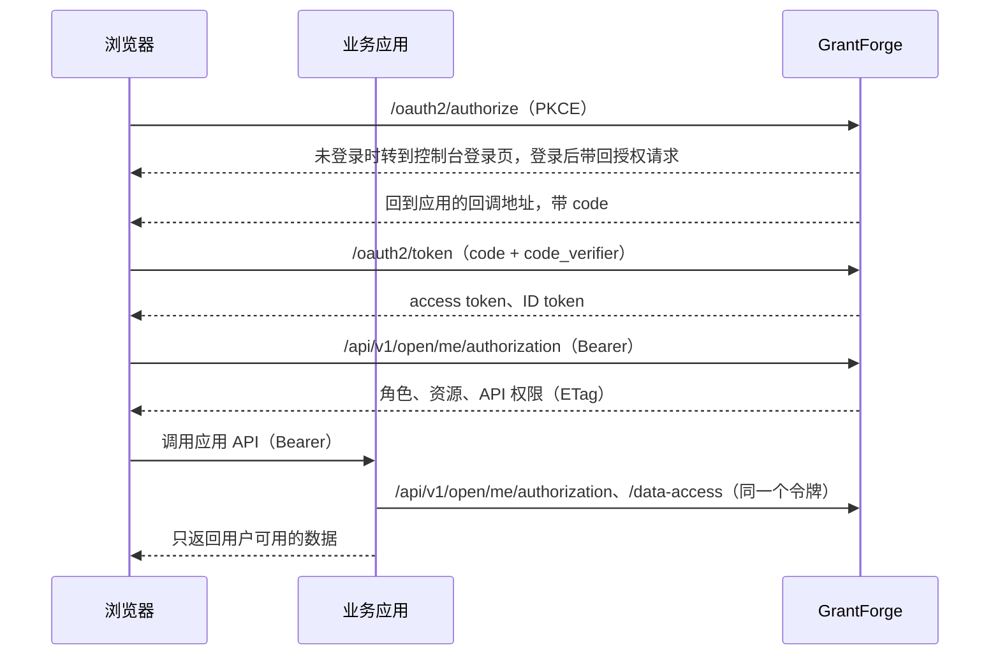

<!--
  Copyright (c) 2026 devlive-community/grantforge

  Licensed under the MIT License. See the LICENSE file in the
  project root for full license text.
-->

GrantForge 既是**授权服务器**（OAuth 2.1 / OpenID Connect），也是**权限中心**。业务应用接入后：

- 用户在 GrantForge 登录，应用拿到令牌（授权码 + PKCE）；
- 应用用令牌询问 GrantForge：这个用户在本应用里有哪些角色、资源（菜单、页面、按钮）和 API 权限；
- 应用把数据实体声明给 GrantForge，GrantForge 的数据策略决定用户能用哪些行，应用按规则过滤自己的查询。

## 概念

| 概念 | 在哪里配置 | 说明 |
| --- | --- | --- |
| 应用 | 平台管理 → 资源目录 | 一个业务系统，例如 `shop`。 |
| 资源 | 资源目录中应用的资源树 | 模块、菜单、页面、按钮、API。页面与按钮控制界面，API 资源就是 API 权限编码（例如 `orders.read`）。 |
| 客户端 | 资源目录 → OAuth 客户端 | 应用登录用户、获取令牌的身份。浏览器应用用**公开客户端**，服务端应用用**机密客户端**。 |
| scope | 客户端设置 | `openid`、`profile`、`email` 用于登录；`permissions` 允许令牌查询权限；`catalog` 允许应用以自身身份声明数据实体。 |
| 角色与授权 | 系统管理 → 角色 | 把应用的资源授给角色，再把角色分配给用户、组、部门或岗位。 |
| 数据策略 | 角色 → 数据权限 | 应用声明的实体（`<应用编码>:<实体>`）与控制台自身实体一样可以配置：全部、本租户、本人、部门、指定部门或条件。 |

租户管理员可以把业务应用的资源授给本租户的角色；控制台自身的权限仍然只能授出自己拥有的部分。

## 流程

## 接入步骤

1. 在**资源目录**新建应用，建好页面、按钮与 API 资源。
2. 为应用注册客户端：浏览器应用选“公开”，服务端应用选“机密”；回调地址填应用的登录回调；scope 至少选 `openid` 与 `permissions`。机密客户端的密钥只显示一次。
3. 建角色、授权、分配给用户。
4. 应用接入 SDK：Java 见 [Java 接入](java.md)，浏览器见 [浏览器与 Vue 接入](javascript.md)，协议细节见 [协议参考](protocol.md)。

仓库里的 `samples/` 有两个完整示例（商店与笔记），并由端到端测试覆盖。
